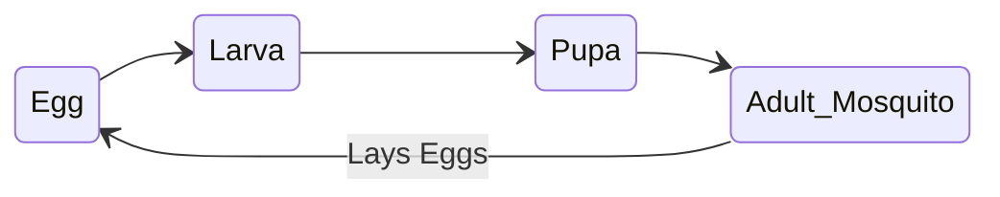
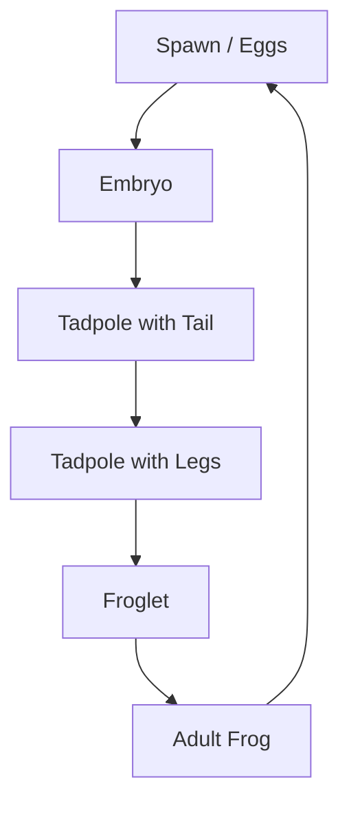

import Callout from '@/components/Callout.astro'

## Animal Life Cycles
While humans and birds are born looking like small versions of adults, some animals undergo drastic changes in shape and structure during their life. This is called **Metamorphosis**.

## 1. Life Cycle of a Mosquito
Mosquitoes breed in stagnant water.

### Stages
1.  **Egg:** Laid on stagnant water.
2.  **Larva:** Worm-like, active swimmer, comes to surface to breathe.
3.  **Pupa:** Comma-shaped, active but does not feed.
4.  **Adult:** Wings develop, flies away.

<Callout variant="warning">
**Prevention:**
Since larvae and pupae need to breathe air at the water surface, adding a thin layer of **kerosene oil** to stagnant water blocks the air, killing them. This prevents mosquito breeding.
</Callout>

## 2. Life Cycle of a Frog
Frogs show a transition from living in water (aquatic) to living on land and water (amphibian).

### Stages
1.  **Spawn (Eggs):** Cluster of jelly-like eggs in water.
2.  **Embryo:** Developing inside the egg.
3.  **Tadpole (Early):** Has a **tail** for swimming, breathes through gills. No legs. Herbivore.
4.  **Tadpole (Late):** Develops hind legs.
5.  **Froglet:** Tail shrinks, lungs develop, front legs appear.
6.  **Adult Frog:** Tail disappears completely. Lives on land/water.

### Key Differences
*   **Tadpole:** Aquatic, has tail, no legs (initially), breathes via gills.
*   **Frog:** Amphibious, no tail, strong legs for jumping, breathes via lungs/skin.
