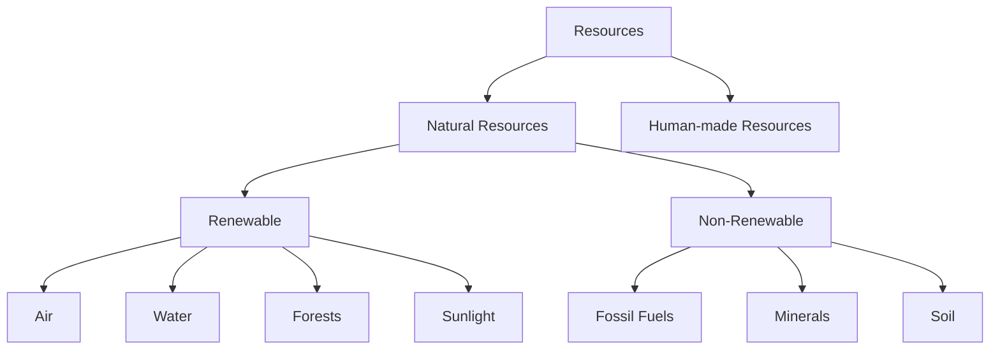
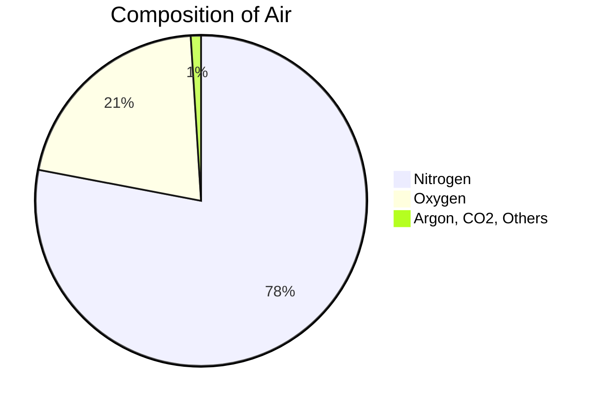
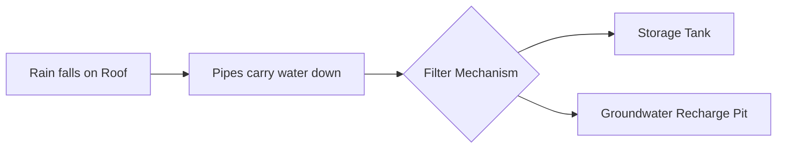
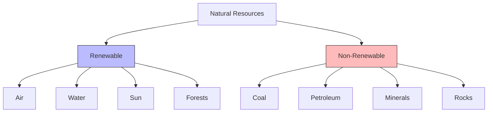
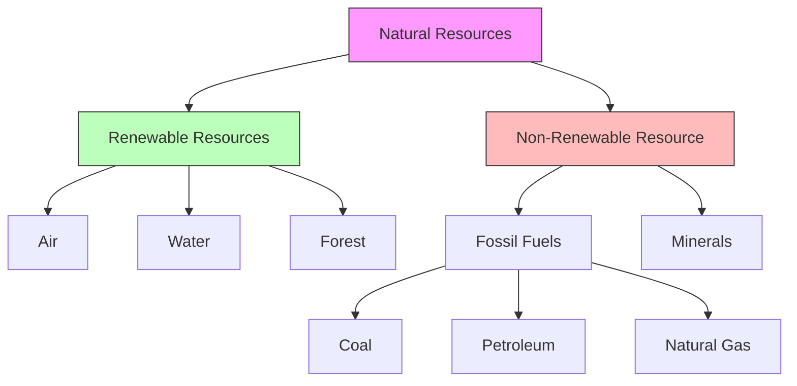

<<<FILE_START: index.mdx>>>
---
title: "Nature's Treasures"
description: "Chapter 11 overview: Exploring air, water, sun, forests, soil, and the classification of natural resources."
date: 2024-04-10
tags: ["science", "grade-6", "natural-resources", "sustainability"]
order: 1
draft: false
---

import Callout from '@/components/Callout.astro'

# Nature's Treasures

Welcome to Chapter 11! In this chapter, we explore the essential gifts nature provides us—Air, Water, Sunlight, Forests, and Minerals. We will learn how these resources support life on Earth and why it is crucial to use them sustainably.

## Chapter Overview

Nature's treasures are the resources found in our environment that enrich our lives. From the air we breathe to the fossil fuels powering our vehicles, everything originates from nature.

### Key Topics Covered

1.  **Air**: Composition, importance of oxygen, and wind energy.
2.  **Water**: Sources, conservation, and rainwater harvesting.
3.  **Sun**: The ultimate source of energy for all living beings.
4.  **Forests**: Biodiversity, conservation movements like Chipko, and Van Mahotsav.
5.  **Soil, Rocks, and Minerals**: Formation of soil and uses of minerals.
6.  **Fossil Fuels**: Coal, petroleum, and natural gas.
7.  **Resource Classification**: Renewable vs. Non-renewable resources.

<Callout variant="tip">
**Core Definition:** **Natural Resources** are materials provided by nature that are essential for the survival of living beings. Examples include air, water, soil, sunlight, forests, and minerals.
</Callout>

## Quick Reference: Resource Classification

## Learning Objectives
By the end of this chapter, you will be able to:
*   Identify the composition of air.
*   Explain the water cycle and methods of water conservation.
*   Understand the flow of energy from the Sun to plants and animals.
*   Distinguish between renewable and non-renewable resources.
*   Suggest ways to reduce pollution and conserve natural treasures.
<<<FILE_END>>>

<<<FILE_START: topics/01-air.mdx>>>
---
title: "11.1 Air and Wind"
description: "Understanding the composition of air, the importance of oxygen, and wind energy."
date: 2024-04-10
tags: ["air", "wind", "oxygen", "composition"]
order: 2
draft: false
---

import Callout from '@/components/Callout.astro'

## The Importance of Air

Air surrounds the Earth and is essential for the survival of all living beings. We cannot see air, but we can feel it when it moves. Moving air is called **wind**.

### Breathing and Oxygen
All living beings need oxygen to survive.
*   When we breathe in, we take in oxygen.
*   Our body uses this oxygen to perform vital functions.
*   Holding breath for a long time is impossible because the body gets deprived of oxygen.

<Callout variant="warning">
**Caution:** Do not hold your breath for so long that you start feeling uncomfortable.
</Callout>

## Composition of Air

Air is a mixture of various gases. If we imagine air as 100 parts:
*   **78 parts** are Nitrogen.
*   **21 parts** are Oxygen.
*   **1 part** consists of Argon, Carbon dioxide, and other gases.

## Wind Energy
When air moves, it has energy. This moving air (wind) can be used to do work.
*   **Firki (Pinwheel):** Rotates due to moving air.
*   **Windmills:** Large structures with blades that rotate due to wind.
    *   They are used to run flour mills.
    *   They pump water from wells.
    *   **Modern Use:** Windmills in large numbers (Wind Farms) generate **electricity**.

<Callout variant="info">
**Did You Know?** Muppandal Wind Farm in Tamil Nadu and Jaisalmer Wind Park in Rajasthan are some of the leading windmill farms in India.
</Callout>
<<<FILE_END>>>

<<<FILE_START: topics/02-water.mdx>>>
---
title: "11.2 Water"
description: "Sources of water, freshwater vs. saline water, and conservation techniques like rainwater harvesting."
date: 2024-04-10
tags: ["water", "conservation", "rainwater-harvesting"]
order: 3
draft: false
---

import Callout from '@/components/Callout.astro'

## Water: A Precious Resource

Water covers about two-thirds of the Earth's surface. However, not all of it is usable for humans.

### Saline vs. Freshwater
*   **Saline Water:** Found in oceans and seas. It is salty and not fit for drinking, agriculture, or industrial use.
*   **Freshwater:** Found in ice sheets, rivers, lakes, and underground. This is the water we use daily.
    *   **Scarcity:** Only a very small fraction of freshwater is easily accessible.

### Water Conservation
Since freshwater is limited, we must use it judiciously. Wastage occurs during:
1.  Leaking taps.
2.  Leaving the tap running while brushing teeth.
3.  Washing cars with hoses instead of buckets.

**Ways to save water:**
*   Turn off taps when not in use.
*   Fix leaks immediately.
*   Recycle water (e.g., using kitchen rinse water for plants).
*   **Rainwater Harvesting.**

## Rainwater Harvesting

This is a method of collecting rainwater and storing it for future use.

### Traditional Methods
In India, traditional structures were built to harvest water.
*   **Bawadi / Vav (Stepwells):** Found in Rajasthan and Gujarat. These are deep wells with steps reaching down to the water level. They store rainwater and seepage from nearby water bodies.

### Modern Methods
Rooftop rainwater harvesting involves collecting rain from the roof and directing it into a storage tank or an underground pit to recharge groundwater.

<<<FILE_END>>>

<<<FILE_START: topics/03-sun-energy.mdx>>>
---
title: "11.3 Energy from the Sun"
description: "How the Sun acts as the ultimate source of energy for life on Earth."
date: 2024-04-10
tags: ["sun", "solar-energy", "photosynthesis"]
order: 4
draft: false
---

import Callout from '@/components/Callout.astro'

## The Ultimate Source of Energy

The Sun provides heat and light, which are essential for life on Earth.

### Dependence on the Sun
1.  **Plants:** Use sunlight to make food (Photosynthesis).
2.  **Herbivores (e.g., Cows):** Eat plants to get energy.
3.  **Carnivores/Humans:** Eat plants or animals.

Even if an animal eats only meat, the energy originally came from the plants that the prey ate. Therefore, **the Sun is the main source of energy for all living beings.**

### Solar Energy Applications
We can capture the Sun's energy using technology:
*   **Solar Panels:** Convert sunlight directly into electricity. Seen on rooftops, street lights, and traffic signals.
*   **Solar Cookers:** Use trapped heat to cook food.
*   **Solar Water Heaters:** Heat water for bathing and cleaning.

<Callout variant="tip">
**Cultural Note:** In many Indian households, water is offered to the Sun early in the morning as an expression of gratitude.
</Callout>
<<<FILE_END>>>

<<<FILE_START: topics/04-forests.mdx>>>
---
title: "11.4 Forests"
description: "The role of forests in biodiversity, soil conservation, and historical movements like Chipko."
date: 2024-04-10
tags: ["forests", "biodiversity", "conservation", "chipko"]
order: 5
draft: false
---

import Callout from '@/components/Callout.astro'

## What are Forests?

Forests are large areas with dense growth of various types of plants (herbs, shrubs, and trees). They act as a home for wild animals, birds, and insects.

### Benefits of Forests
1.  **Habitat:** Provide food and shelter to animals.
2.  **Soil Conservation:** Roots hold the soil, preventing it from washing away (soil erosion).
3.  **Nutrient Cycle:** Fallen leaves decay and turn into humus, enriching the soil for new plants.
4.  **Resources:** Provide wood, fruits (like *nellikai* or gooseberry), medicines, and more.

## Conservation of Forests

Deforestation (cutting down trees) destroys habitats and reduces air quality. It takes many years for a forest to regenerate.

### Van Mahotsav
*   A week-long forest festival celebrated in **July** in India.
*   New plants and trees are planted across the country to increase green cover.

### The Chipko Movement
A famous effort to save forests started in the early **1970s in Uttarakhand**.
*   **Action:** Local women actively participated by encircling and "hugging" (Chipko) trees to protect them from woodcutters.
*   **Significance:** It highlighted the importance of forests for local communities and the environment.

<Callout variant="info">
**Sacred Groves:** India has a long tradition of protecting forest patches as "Sacred Groves," showing a deep cultural respect for nature.
</Callout>
<<<FILE_END>>>

<<<FILE_START: topics/05-soil-rocks-minerals.mdx>>>
---
title: "11.5 Soil, Rocks, and Minerals"
description: "Formation of soil, types of rocks, and the extraction of minerals."
date: 2024-04-10
tags: ["soil", "rocks", "minerals", "geology"]
order: 6
draft: false
---

import Callout from '@/components/Callout.astro'

## Soil

Soil is the upper layer of the Earth where plants grow.
*   **Composition:** Contains small pebbles, sand, clay, organic matter (decayed plants/animals), air, water, and living organisms like earthworms.
*   **Formation:** Formed by the disintegration (breaking apart) of rocks by the Sun, water, wind, and living organisms over thousands of years.
*   **Earthworms:** Known as "natural agents" that loosen the soil, allowing air to penetrate to the roots.

## Rocks

Rocks are hard solid materials found in nature.
*   **Uses:** Construction of houses, temples, dams, and roads.
*   **Examples:**
    *   **Granite, Sandstone, Marble:** Building materials.
    *   **Slate:** Roofing.
    *   **Laterite:** Making bricks.
*   **Historical Use:** Early humans made tools like hand axes and arrowheads from stone.

## Minerals

Rocks are made up of minerals. We extract valuable metals from these minerals.
*   **Examples:** Gold, Silver, Copper, Iron, Aluminum.
*   **Uses:**
    *   **Electronics:** Mobile phones contain gold, silver, copper, and cobalt.
    *   **Transportation:** Aluminum is used in airplanes; Iron/Steel in cars.
    *   **Daily Life:** Jewelry, cosmetics, electrical wires.

<Callout variant="warning">
**Resource Alert:** It takes millions of years to form rocks and minerals. They must be used responsibly.
</Callout>
<<<FILE_END>>>

<<<FILE_START: topics/06-fossil-fuels.mdx>>>
---
title: "11.6 Fossil Fuels"
description: "Formation, types, and environmental impact of fossil fuels."
date: 2024-04-10
tags: ["fossil-fuels", "coal", "petroleum", "pollution"]
order: 7
draft: false
---

import Callout from '@/components/Callout.astro'

## What are Fossil Fuels?

Fossil fuels are energy sources formed from the remains of microorganisms and plants buried deep inside the Earth millions of years ago.

### Types of Fossil Fuels
1.  **Coal:**
    *   Used for generating electricity.
    *   Historically used for cooking.
2.  **Petroleum:**
    *   Refined to produce **Petrol** and **Diesel** (for vehicles) and **Kerosene**.
    *   Essential for transportation.
3.  **Natural Gas:**
    *   **CNG (Compressed Natural Gas):** Cleaner fuel for vehicles.
    *   **LPG (Liquefied Petroleum Gas):** Used for cooking in homes.

## Issues with Fossil Fuels
1.  **Limited Supply:** They are non-renewable. Once used, they cannot be replaced quickly.
2.  **Pollution:** Burning fossil fuels releases smoke and Carbon Dioxide, causing air pollution and climate change.

### Alternatives
To reduce pollution and conserve fossil fuels:
*   Use electric vehicles (EVs).
*   Walk or cycle for short distances.
*   Use public transport.
<<<FILE_END>>>

<<<FILE_START: topics/07-classification-resources.mdx>>>
---
title: "11.7 Natural Resources Classification"
description: "Differentiating between Renewable and Non-renewable resources."
date: 2024-04-10
tags: ["renewable", "non-renewable", "resources"]
order: 8
draft: false
---

import Callout from '@/components/Callout.astro'

## Natural vs. Human-Made

*   **Natural Resources:** Provided by nature. (Air, Water, Soil, Minerals, Sunlight).
*   **Human-Made Resources:** Created by humans using natural resources. (Buildings, Machines, Electricity, Plastic).

## Renewable vs. Non-Renewable

Natural resources are classified based on their ability to replenish.

### 1. Renewable Resources
Resources that get renewed, replenished, or restored by natural processes within a reasonable period.
*   **Examples:**
    *   **Air & Sunlight:** Available continuously.
    *   **Water:** Replenished via the water cycle.
    *   **Forests/Plants:** Can grow back (if not destroyed faster than they grow).

### 2. Non-Renewable Resources
Resources that exist in limited quantities and take millions of years to form. Once exhausted, they are gone forever (in human timescales).
*   **Examples:**
    *   **Fossil Fuels:** Coal, Petroleum, Natural Gas.
    *   **Minerals:** Iron, Copper, Gold.
    *   **Soil:** While technically renewable, it takes thousands of years to form a few centimeters, so it is often treated as non-renewable in terms of conservation.

<Callout variant="tip">
**Sustainable Development:** We must use natural resources judiciously to meet our present needs without compromising the ability of future generations to meet their own needs.
</Callout>
<<<FILE_END>>>

<<<FILE_START: solutions/ex-11.1.mdx>>>
---
title: "Chapter 11 Exercises"
description: "Solutions for 'Let us enhance our learning' and other chapter questions."
date: 2024-04-10
tags: ["solutions", "exercises", "grade-6"]
order: 9
draft: false
---

import Callout from '@/components/Callout.astro'

## Let us enhance our learning

### Q1. Match items with jumbled names
**Problem:** Identify the items in Fig 11.9, unscramble the names, and classify as renewable or non-renewable.

**Solution:**

| Image Item | Jumbled Name | Correct Name | Renewable / Non-Renewable |
| :--- | :--- | :--- | :--- |
| Tap Water | atwre | **Water** | Renewable |
| Windmill | ndiw | **Wind** | Renewable |
| Forest | refost | **Forest** | Renewable |
| Mineral/Rock | ocrk | **Rock** | Non-Renewable |

---

### Q2. True or False
State whether the following statements are True [T] or False [F]. If False, correct them.

**(i) Nature has all the resources to meet human needs.**
*   **Answer:** **[T]** (Note: Gandhi said Earth provides enough for need, not greed.)

**(ii) Machines are a resource found in nature.**
*   **Answer:** **[F]**
*   **Correction:** Machines are **human-made resources**, made using natural resources.

**(iii) Natural gas is a non-renewable resource.**
*   **Answer:** **[T]**

**(iv) Air is a renewable resource.**
*   **Answer:** **[T]**

---

### Q3. Fill in the blanks (Multiple Choice)

**(i) A fuel that is commonly used in two wheelers like scooters or bikes is...**
*   (a) Kerosene
*   (b) Petrol
*   (c) Diesel
*   (d) LPG
*   **Answer:** **(b) Petrol**

**(ii) An example of a renewable resource is...**
*   (a) Coal
*   (b) Water
*   (c) Natural gas
*   (d) Petrol
*   **Answer:** **(b) Water**

---

### Q4. Classify as renewable or non-renewable
**Items:** Coal, natural gas, forests, minerals.

*   **Renewable:** Forests.
*   **Non-Renewable:** Coal, Natural gas, Minerals.

---

### Q5. Why is petroleum a non-renewable resource?
**Answer:** Petroleum is formed from the remains of ancient marine organisms buried deep underground over millions of years. Since it takes such a long time to form and the available quantity is limited, it cannot be replenished quickly once used. Thus, it is non-renewable.

---

### Q6. "It is difficult to regrow forests." Justify.
**Answer:** A forest is a complex ecosystem that takes many years to develop. While individual trees can be planted, restoring the full biodiversity, soil quality, and habitat balance of a natural forest takes decades or even centuries. Large-scale deforestation often leads to soil erosion, making it even harder for new forests to grow back.

---

### Q7. Daily activities using natural resources and how to reduce use.

| Activity | Resource Used | Way to Reduce/Conserve |
| :--- | :--- | :--- |
| Brushing teeth | Water | Turn off tap while brushing. |
| Commuting to school | Fossil Fuels (Petrol) | Walk, cycle, or take the bus. |
| Studying at night | Electricity (Coal) | Use energy-efficient LED bulbs. |
| Writing in notebook | Forest (Paper) | Use both sides of the paper. |
| Eating lunch | Soil/Sun (Food) | Do not waste food. |

---

### Q8. Four activities possible due to air.
**Answer:**
1.  Breathing (survival of living beings).
2.  Burning (Oxygen supports combustion).
3.  Flying (Birds and airplanes use air lift).
4.  Generating electricity (Windmills).

---

### Q9. Actions to enhance green cover in your locality.
**Answer:**
1.  Plant local/native trees during Van Mahotsav.
2.  Adopt a tree and water it regularly.
3.  Do not damage existing small plants or pluck leaves unnecessarily.
4.  Create awareness about the importance of trees among neighbors.

---

### Q10. Solar Cooking Illustration Analysis
**(i) What type of energy is being used for cooking?**
*   **Answer:** Solar Energy (Heat from the Sun).

**(ii) Name one benefit and one drawback.**
*   **Benefit:** It does not produce smoke or pollution; the fuel (sunlight) is free.
*   **Drawback:** It cannot work at night or on cloudy days; cooking takes longer than gas stoves.

---

### Q11. Why does cutting trees impact soil quality?
**Answer:** Tree roots bind the soil particles together. When trees are cut, the soil becomes loose. Wind and rain can easily wash the top fertile layer of soil away (soil erosion), leaving behind infertile, rocky ground. Additionally, trees provide organic matter (fallen leaves) that enriches the soil.

---

### Q12. Human activities polluting air and solutions.
**Activities:**
1.  Burning fossil fuels in vehicles (releasing smoke).
2.  Burning crackers or garbage.

**Proposed Action:**
Use public transport or bicycles to reduce vehicle smoke. Stop burning garbage and compost it instead.

---

### Q13. What if there was no sunlight for a week?
**Answer:**
*   **Electricity:** The solar panels would not generate electricity.
*   **Water:** The windmill might still work if there is wind (though wind is driven by uneven heating from the Sun, it might persist for a bit).
*   **Food:** Plants would stop photosynthesis. Eventually, plants would die, affecting the food supply for animals and humans.
*   **Temperature:** Earth would become extremely cold.

---

### Q14. Complete the Resource Map
**Terms:** Fossil fuels, forest, air, petroleum, coal, water, non-renewable resource, natural gas.

*(Note: Based on the visual structure in the PDF, "Natural gas" was a leaf node under Fossil Fuels alongside Coal and Petroleum.)*

---

### Q15. Is felling trees for housing/industry justified?
**Answer:** No, it is not fully justified because forests are the "lungs" of the Earth. While development is necessary, it should not come at the cost of total forest destruction. Sustainable practices, replanting trees (afforestation), and building vertically instead of expanding horizontally should be adopted to balance needs.

---

### Q16. Plan to use less water in school.
**Plan:**
1.  **Audit:** Check all taps for leaks and fix them.
2.  **Sensors:** Install push-taps that close automatically.
3.  **Garden:** Use drip irrigation for school plants instead of hoses.
4.  **Rainwater:** Install a simple rainwater harvesting system for the school garden.

**Benefit:** This saves freshwater, lowers the school's water bill, and teaches students responsibility toward the environment.
<<<FILE_END>>>

<<<FILE_START: practice/solved-examples.mdx>>>
---
title: "Solved Examples & Activities"
description: "Practical examples and additional solved questions to reinforce concepts."
date: 2024-04-10
tags: ["practice", "solved-examples", "activities"]
order: 10
draft: false
---

import Callout from '@/components/Callout.astro'

## Example 1: Understanding Air Composition

**Question:** If you have a room filled with 100 balloons representing the air molecules, how many balloons would be Nitrogen and how many would be Oxygen?

**Solution:**
Based on the composition of air:
*   Nitrogen constitutes **78%**.
*   Oxygen constitutes **21%**.
*   Other gases constitute **1%**.

Therefore:
*   **78 balloons** would be Nitrogen.
*   **21 balloons** would be Oxygen.
*   **1 balloon** would represent Argon, Carbon Dioxide, and others.

---

## Example 2: Soil Analysis

**Activity:** A student collected three soil samples:
1.  Sample A: Sandy and dry.
2.  Sample B: Dark, damp, and contains rotting leaves.
3.  Sample C: Hard and lumpy.

**Analysis:**
*   **Sample A:** likely from a desert or playground (low nutrient, low water retention).
*   **Sample B:** likely forest or garden soil (High in humus/nutrients, good for plants).
*   **Sample C:** likely clay or construction site soil (Compact, holds water but no air).

**Conclusion:** Sample B is best for growing the vegetables mentioned in the chapter because it contains humus (rotting leaves) and moisture.

---

## Example 3: Energy Conversion

**Question:** Trace the energy transformation when a girl rides a bicycle.

**Step-by-Step Flow:**
1.  **Sun:** Provides light/energy to crops (wheat/rice).
2.  **Crops:** Store solar energy as chemical energy (food).
3.  **Girl:** Eats the food. Her body converts chemical energy to muscular energy.
4.  **Bicycle:** The girl uses muscular energy to pedal, creating mechanical (kinetic) energy to move the bike.

---

## Example 4: Calculating Wastage

**Problem:** A dripping tap wastes 10 ml of water every minute. How much water is wasted in 1 hour? How much in 1 day?

**Solution:**
*   **Wastage per minute:** 10 ml.
*   **Wastage in 1 hour (60 minutes):**
    $$ 10 \text{ ml} \times 60 = 600 \text{ ml} $$
*   **Wastage in 1 day (24 hours):**
    $$ 600 \text{ ml} \times 24 = 14,400 \text{ ml} $$

**Conclusion:** A single dripping tap can waste **14.4 Liters** of water in a day! This highlights why fixing leaks is crucial.
<<<FILE_END>>>
