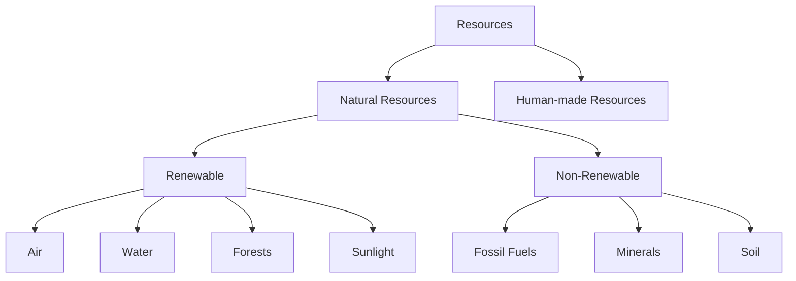

import Callout from '@/components/Callout.astro'

# Nature's Treasures

Welcome to Chapter 11! In this chapter, we explore the essential gifts nature provides us—Air, Water, Sunlight, Forests, and Minerals. We will learn how these resources support life on Earth and why it is crucial to use them sustainably.

## Chapter Overview

Nature's treasures are the resources found in our environment that enrich our lives. From the air we breathe to the fossil fuels powering our vehicles, everything originates from nature.

### Key Topics Covered

1.  **Air**: Composition, importance of oxygen, and wind energy.
2.  **Water**: Sources, conservation, and rainwater harvesting.
3.  **Sun**: The ultimate source of energy for all living beings.
4.  **Forests**: Biodiversity, conservation movements like Chipko, and Van Mahotsav.
5.  **Soil, Rocks, and Minerals**: Formation of soil and uses of minerals.
6.  **Fossil Fuels**: Coal, petroleum, and natural gas.
7.  **Resource Classification**: Renewable vs. Non-renewable resources.

<Callout variant="tip">
**Core Definition:** **Natural Resources** are materials provided by nature that are essential for the survival of living beings. Examples include air, water, soil, sunlight, forests, and minerals.
</Callout>

## Quick Reference: Resource Classification

## Learning Objectives
By the end of this chapter, you will be able to:
*   Identify the composition of air.
*   Explain the water cycle and methods of water conservation.
*   Understand the flow of energy from the Sun to plants and animals.
*   Distinguish between renewable and non-renewable resources.
*   Suggest ways to reduce pollution and conserve natural treasures.