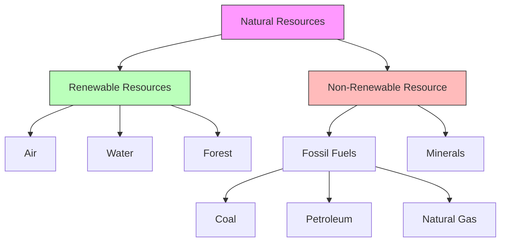

import Callout from '@/components/Callout.astro'

## Let us enhance our learning

### Q1. Match items with jumbled names
**Problem:** Identify the items in Fig 11.9, unscramble the names, and classify as renewable or non-renewable.

**Solution:**

| Image Item | Jumbled Name | Correct Name | Renewable / Non-Renewable |
| :--- | :--- | :--- | :--- |
| Tap Water | atwre | **Water** | Renewable |
| Windmill | ndiw | **Wind** | Renewable |
| Forest | refost | **Forest** | Renewable |
| Mineral/Rock | ocrk | **Rock** | Non-Renewable |

---

### Q2. True or False
State whether the following statements are True [T] or False [F]. If False, correct them.

**(i) Nature has all the resources to meet human needs.**
*   **Answer:** **[T]** (Note: Gandhi said Earth provides enough for need, not greed.)

**(ii) Machines are a resource found in nature.**
*   **Answer:** **[F]**
*   **Correction:** Machines are **human-made resources**, made using natural resources.

**(iii) Natural gas is a non-renewable resource.**
*   **Answer:** **[T]**

**(iv) Air is a renewable resource.**
*   **Answer:** **[T]**

---

### Q3. Fill in the blanks (Multiple Choice)

**(i) A fuel that is commonly used in two wheelers like scooters or bikes is...**
*   (a) Kerosene
*   (b) Petrol
*   (c) Diesel
*   (d) LPG
*   **Answer:** **(b) Petrol**

**(ii) An example of a renewable resource is...**
*   (a) Coal
*   (b) Water
*   (c) Natural gas
*   (d) Petrol
*   **Answer:** **(b) Water**

---

### Q4. Classify as renewable or non-renewable
**Items:** Coal, natural gas, forests, minerals.

*   **Renewable:** Forests.
*   **Non-Renewable:** Coal, Natural gas, Minerals.

---

### Q5. Why is petroleum a non-renewable resource?
**Answer:** Petroleum is formed from the remains of ancient marine organisms buried deep underground over millions of years. Since it takes such a long time to form and the available quantity is limited, it cannot be replenished quickly once used. Thus, it is non-renewable.

---

### Q6. "It is difficult to regrow forests." Justify.
**Answer:** A forest is a complex ecosystem that takes many years to develop. While individual trees can be planted, restoring the full biodiversity, soil quality, and habitat balance of a natural forest takes decades or even centuries. Large-scale deforestation often leads to soil erosion, making it even harder for new forests to grow back.

---

### Q7. Daily activities using natural resources and how to reduce use.

| Activity | Resource Used | Way to Reduce/Conserve |
| :--- | :--- | :--- |
| Brushing teeth | Water | Turn off tap while brushing. |
| Commuting to school | Fossil Fuels (Petrol) | Walk, cycle, or take the bus. |
| Studying at night | Electricity (Coal) | Use energy-efficient LED bulbs. |
| Writing in notebook | Forest (Paper) | Use both sides of the paper. |
| Eating lunch | Soil/Sun (Food) | Do not waste food. |

---

### Q8. Four activities possible due to air.
**Answer:**
1.  Breathing (survival of living beings).
2.  Burning (Oxygen supports combustion).
3.  Flying (Birds and airplanes use air lift).
4.  Generating electricity (Windmills).

---

### Q9. Actions to enhance green cover in your locality.
**Answer:**
1.  Plant local/native trees during Van Mahotsav.
2.  Adopt a tree and water it regularly.
3.  Do not damage existing small plants or pluck leaves unnecessarily.
4.  Create awareness about the importance of trees among neighbors.

---

### Q10. Solar Cooking Illustration Analysis
**(i) What type of energy is being used for cooking?**
*   **Answer:** Solar Energy (Heat from the Sun).

**(ii) Name one benefit and one drawback.**
*   **Benefit:** It does not produce smoke or pollution; the fuel (sunlight) is free.
*   **Drawback:** It cannot work at night or on cloudy days; cooking takes longer than gas stoves.

---

### Q11. Why does cutting trees impact soil quality?
**Answer:** Tree roots bind the soil particles together. When trees are cut, the soil becomes loose. Wind and rain can easily wash the top fertile layer of soil away (soil erosion), leaving behind infertile, rocky ground. Additionally, trees provide organic matter (fallen leaves) that enriches the soil.

---

### Q12. Human activities polluting air and solutions.
**Activities:**
1.  Burning fossil fuels in vehicles (releasing smoke).
2.  Burning crackers or garbage.

**Proposed Action:**
Use public transport or bicycles to reduce vehicle smoke. Stop burning garbage and compost it instead.

---

### Q13. What if there was no sunlight for a week?
**Answer:**
*   **Electricity:** The solar panels would not generate electricity.
*   **Water:** The windmill might still work if there is wind (though wind is driven by uneven heating from the Sun, it might persist for a bit).
*   **Food:** Plants would stop photosynthesis. Eventually, plants would die, affecting the food supply for animals and humans.
*   **Temperature:** Earth would become extremely cold.

---

### Q14. Complete the Resource Map
**Terms:** Fossil fuels, forest, air, petroleum, coal, water, non-renewable resource, natural gas.

*(Note: Based on the visual structure in the PDF, "Natural gas" was a leaf node under Fossil Fuels alongside Coal and Petroleum.)*

---

### Q15. Is felling trees for housing/industry justified?
**Answer:** No, it is not fully justified because forests are the "lungs" of the Earth. While development is necessary, it should not come at the cost of total forest destruction. Sustainable practices, replanting trees (afforestation), and building vertically instead of expanding horizontally should be adopted to balance needs.

---

### Q16. Plan to use less water in school.
**Plan:**
1.  **Audit:** Check all taps for leaks and fix them.
2.  **Sensors:** Install push-taps that close automatically.
3.  **Garden:** Use drip irrigation for school plants instead of hoses.
4.  **Rainwater:** Install a simple rainwater harvesting system for the school garden.

**Benefit:** This saves freshwater, lowers the school's water bill, and teaches students responsibility toward the environment.