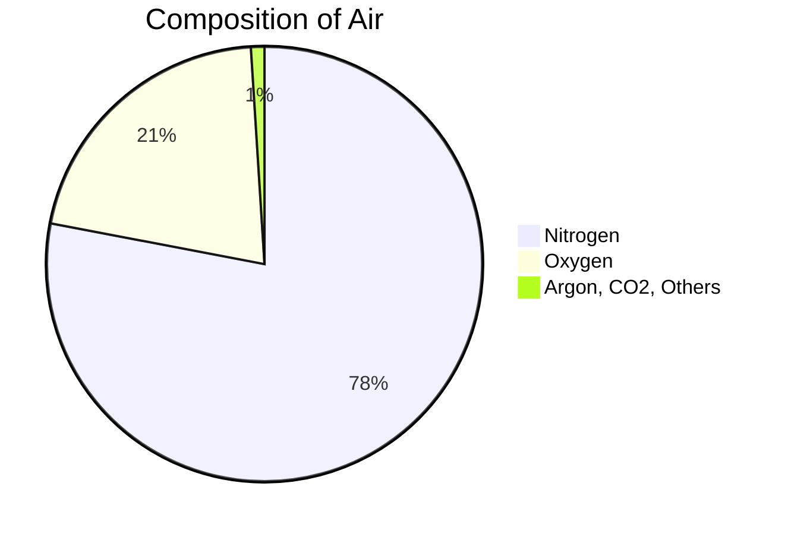

import Callout from '@/components/Callout.astro'

## The Importance of Air

Air surrounds the Earth and is essential for the survival of all living beings. We cannot see air, but we can feel it when it moves. Moving air is called **wind**.

### Breathing and Oxygen
All living beings need oxygen to survive.
*   When we breathe in, we take in oxygen.
*   Our body uses this oxygen to perform vital functions.
*   Holding breath for a long time is impossible because the body gets deprived of oxygen.

<Callout variant="warning">
**Caution:** Do not hold your breath for so long that you start feeling uncomfortable.
</Callout>

## Composition of Air

Air is a mixture of various gases. If we imagine air as 100 parts:
*   **78 parts** are Nitrogen.
*   **21 parts** are Oxygen.
*   **1 part** consists of Argon, Carbon dioxide, and other gases.

## Wind Energy
When air moves, it has energy. This moving air (wind) can be used to do work.
*   **Firki (Pinwheel):** Rotates due to moving air.
*   **Windmills:** Large structures with blades that rotate due to wind.
    *   They are used to run flour mills.
    *   They pump water from wells.
    *   **Modern Use:** Windmills in large numbers (Wind Farms) generate **electricity**.

<Callout variant="info">
**Did You Know?** Muppandal Wind Farm in Tamil Nadu and Jaisalmer Wind Park in Rajasthan are some of the leading windmill farms in India.
</Callout>