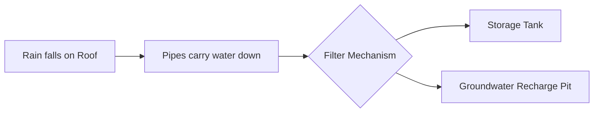

import Callout from '@/components/Callout.astro'

## Water: A Precious Resource

Water covers about two-thirds of the Earth's surface. However, not all of it is usable for humans.

### Saline vs. Freshwater
*   **Saline Water:** Found in oceans and seas. It is salty and not fit for drinking, agriculture, or industrial use.
*   **Freshwater:** Found in ice sheets, rivers, lakes, and underground. This is the water we use daily.
    *   **Scarcity:** Only a very small fraction of freshwater is easily accessible.

### Water Conservation
Since freshwater is limited, we must use it judiciously. Wastage occurs during:
1.  Leaking taps.
2.  Leaving the tap running while brushing teeth.
3.  Washing cars with hoses instead of buckets.

**Ways to save water:**
*   Turn off taps when not in use.
*   Fix leaks immediately.
*   Recycle water (e.g., using kitchen rinse water for plants).
*   **Rainwater Harvesting.**

## Rainwater Harvesting

This is a method of collecting rainwater and storing it for future use.

### Traditional Methods
In India, traditional structures were built to harvest water.
*   **Bawadi / Vav (Stepwells):** Found in Rajasthan and Gujarat. These are deep wells with steps reaching down to the water level. They store rainwater and seepage from nearby water bodies.

### Modern Methods
Rooftop rainwater harvesting involves collecting rain from the roof and directing it into a storage tank or an underground pit to recharge groundwater.

