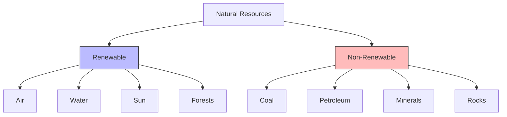

import Callout from '@/components/Callout.astro'

## Natural vs. Human-Made

*   **Natural Resources:** Provided by nature. (Air, Water, Soil, Minerals, Sunlight).
*   **Human-Made Resources:** Created by humans using natural resources. (Buildings, Machines, Electricity, Plastic).

## Renewable vs. Non-Renewable

Natural resources are classified based on their ability to replenish.

### 1. Renewable Resources
Resources that get renewed, replenished, or restored by natural processes within a reasonable period.
*   **Examples:**
    *   **Air & Sunlight:** Available continuously.
    *   **Water:** Replenished via the water cycle.
    *   **Forests/Plants:** Can grow back (if not destroyed faster than they grow).

### 2. Non-Renewable Resources
Resources that exist in limited quantities and take millions of years to form. Once exhausted, they are gone forever (in human timescales).
*   **Examples:**
    *   **Fossil Fuels:** Coal, Petroleum, Natural Gas.
    *   **Minerals:** Iron, Copper, Gold.
    *   **Soil:** While technically renewable, it takes thousands of years to form a few centimeters, so it is often treated as non-renewable in terms of conservation.

<Callout variant="tip">
**Sustainable Development:** We must use natural resources judiciously to meet our present needs without compromising the ability of future generations to meet their own needs.
</Callout>