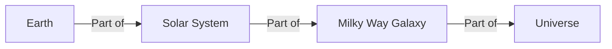

import Callout from '@/components/Callout.astro'

## Conceptual Questions

### Question 1: Why is Venus hotter than Mercury?
**Question:** Mercury is the closest planet to the Sun, yet Venus is the hottest planet in the Solar System. Why?

**Answer:**
Mercury has a very thin atmosphere that cannot hold heat. Venus, however, has a very thick atmosphere made mostly of carbon dioxide. This atmosphere acts like a blanket, trapping the Sun's heat (Greenhouse Effect), making Venus hotter than Mercury.

### Question 2: How can we distinguish a planet from a star in the night sky?
**Answer:**
1.  **Twinkling:** Stars usually twinkle due to the atmosphere, while planets shine with a steady light.
2.  **Movement:** Planets change their position relative to the stars over days or weeks (they wander), while stars keep their fixed patterns (constellations).

### Question 3: Why do we see phases of the Moon?
**Answer:**
We see different shapes of the Moon (phases) because the Moon does not have its own light; it reflects sunlight. As the Moon revolves around the Earth, we see different portions of its sunlit side.

## Solar System Facts Review

**Fill in the blanks:**

1.  The path a planet takes around the Sun is called its \_\_\_\_\_\_\_\_. (**Orbit**)
2.  The Indian name for the Milky Way galaxy is \_\_\_\_\_\_\_\_. (**Akasha Ganga**)
3.  \_\_\_\_\_\_\_\_ are also known as "shooting stars" though they are not stars. (**Meteors**)
4.  The planet known as the "Red Planet" is \_\_\_\_\_\_\_\_. (**Mars**)

## Diagram Practice: Solar System Hierarchy

Can you visualize the order of our cosmic address?

## Critical Thinking

**Scenario:** You are stranded on an island without a compass. It is a clear night. How can you find the North direction?

**Solution:**
1.  Look for the **Big Dipper** constellation (shaped like a large spoon).
2.  Identify the two "pointer stars" at the outer edge of the spoon's bowl.
3.  Trace an imaginary line through them.
4.  This line points to a moderately bright star, the **Pole Star (Polaris)**.
5.  Face the Pole Star. You are now facing **North**.