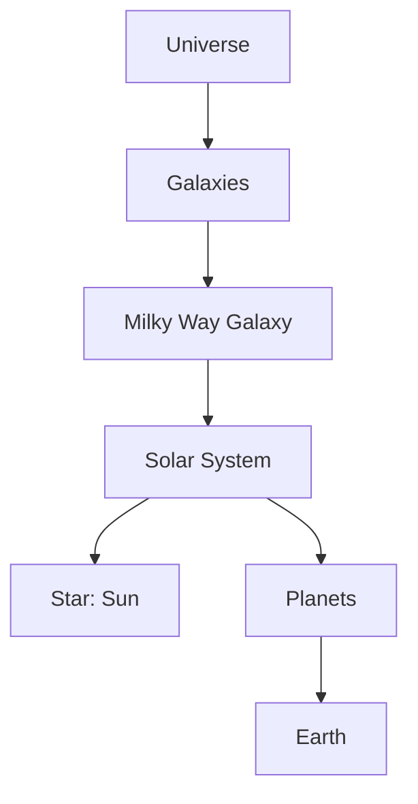

import Callout from '@/components/Callout.astro'

## The Milky Way Galaxy
A **galaxy** is a massive system of billions of stars, gas, and dust held together by gravity.
*   **Our Galaxy:** Our Solar System belongs to the **Milky Way Galaxy** (known as *Ākāśha Gangā* in Hindi).
*   **Appearance:** From a dark location on Earth, it looks like a faint, milky band of light stretching across the sky.

## The Universe
The **Universe** contains everything that exists—all matter, energy, planets, stars, and galaxies.
*   It contains billions of galaxies.
*   Scientists are constantly studying the universe to understand its origin and size.

### Hierarchy of the Cosmos

## Are we alone?
Scientists are searching for **Exoplanets** (planets orbiting other stars) to see if life exists elsewhere. While no life has been found yet, the search continues using powerful telescopes.