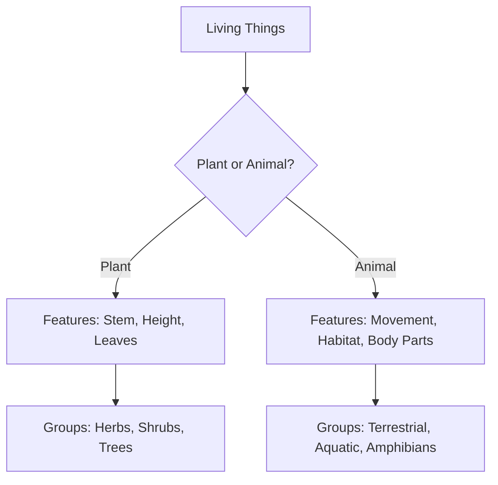
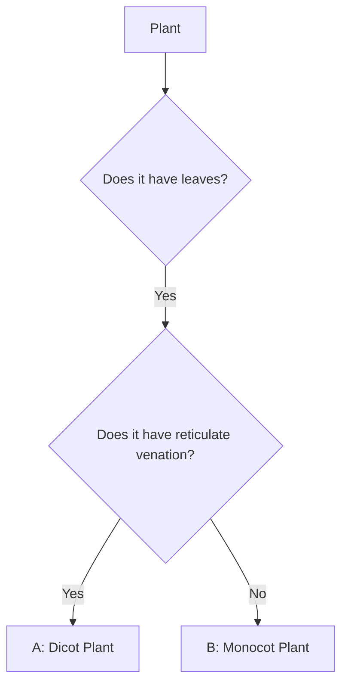

<<<FILE_START: index.mdx>>>
---
title: "Diversity in the Living World"
description: "An overview of Chapter 2: Diversity in the Living World, covering plant classification, animal movements, habitats, and adaptations."
date: 2025-01-15
tags: ["biology", "diversity", "plants", "animals", "grade-6"]
order: 1
draft: false
---

import Callout from '@/components/Callout.astro'

## Chapter Overview

This chapter explores the immense variety of life forms—**Biodiversity**—that surrounds us. We learn how to observe, record, and group plants and animals based on specific features. By understanding these groupings, we discover relationships between different parts of a plant (leaves, roots, seeds) and how animals adapt to their specific habitats.

### Key Concepts

| Term | Definition |
| :--- | :--- |
| **Biodiversity** | The variety of plants and animals found in a particular region. |
| **Habitat** | The natural home or environment of an animal, plant, or other organism. |
| **Adaptation** | Special features that enable a plant or animal to live and survive in a particular place. |
| **Venation** | The arrangement of veins in a leaf (Reticulate or Parallel). |
| **Cotyledons** | The seed leaves within a seed (Monocots have 1, Dicots have 2). |

### Key Relationships (The "Golden Rule" of Plant Biology)

There is a consistent relationship between a plant's leaf venation, root system, and seed type:

$$
\text{Reticulate Venation} \iff \text{Taproot System} \iff \text{Dicot Seed}
$$

$$
\text{Parallel Venation} \iff \text{Fibrous Root System} \iff \text{Monocot Seed}
$$

### List of Topics

1.  **Diversity and Grouping**: Why and how we classify living things.
2.  **Plant Classification**: Herbs, Shrubs, and Trees.
3.  **Plant Structure Relations**: Connecting leaves, roots, and seeds.
4.  **Animal Diversity**: Grouping by movement and body parts.
5.  **Adaptations & Habitats**: How organisms survive in deserts, mountains, and water.

<<<FILE_END>>>
<<<FILE_START: topics/01-diversity-and-grouping.mdx>>>
---
title: "Diversity and the Need for Grouping"
description: "Understanding biodiversity and the importance of classifying living organisms."
date: 2025-01-15
tags: ["biodiversity", "grouping", "observation"]
order: 2
draft: false
---

import Callout from '@/components/Callout.astro'

## Observing Nature

When we step outside for a nature walk, we observe a vast variety of life. From tiny ants to tall trees, every living thing is unique.
-   **Plants:** Vary in height, stem type, leaf shape, and flower color.
-   **Animals:** Vary in size, food habits, habitats, and movement.

This variety of life in a specific region is called **Biodiversity**.

## Why Do We Group Things?

Imagine a library where books are thrown in a pile. It would be impossible to find a specific book. Similarly, with millions of living organisms, studying them one by one is difficult.

<Callout variant="tip">
**Definition:** **Grouping** (or Classification) is the method of arranging things into categories based on their common features (similarities) and differences.
</Callout>

**Benefits of Grouping:**
1.  Makes it easier to study organisms.
2.  Helps us understand relationships between different groups.
3.  Allows us to predict features of an organism if we know its group.

### Criteria for Grouping

We can group plants and animals based on simple observable features:

*   **Plants:** Height (tall/short), Stem (hard/soft), Presence of flowers.
*   **Animals:** Habitat (Land/Water), Food (Herbivore/Carnivore), Movement (Walk/Fly/Swim).

<<<FILE_END>>>
<<<FILE_START: topics/02-plant-classification.mdx>>>
---
title: "Classification of Plants"
description: "Grouping plants into Herbs, Shrubs, and Trees based on their stem and branching patterns."
date: 2025-01-15
tags: ["herbs", "shrubs", "trees", "stems"]
order: 3
draft: false
---

import Callout from '@/components/Callout.astro'

## Grouping by Height and Stem

Plants are commonly classified into three main categories based on their height, the nature of their stem, and where their branches appear.

### 1. Herbs
*   **Stem:** Green, tender (soft), and thin.
*   **Height:** Usually short.
*   **Branching:** May not have many branches.
*   **Examples:** Tomato, Mustard, Wheat, Grass.

### 2. Shrubs
*   **Stem:** Hard but not very thick.
*   **Height:** Medium (bushy appearance).
*   **Branching:** Branches arise **near the base** of the stem (close to the ground).
*   **Examples:** Rose, Hibiscus (Gudhal), Lemon.

### 3. Trees
*   **Stem:** Hard, thick, and brown (often called a trunk).
*   **Height:** Tall.
*   **Branching:** Branches appear **higher up** on the stem, far above the ground.
*   **Examples:** Mango, Neem, Peepal, Deodar.

### Comparison Table

| Feature | Herb | Shrub | Tree |
| :--- | :--- | :--- | :--- |
| **Stem Color** | Green | Brown | Brown |
| **Stem Hardness** | Tender/Soft | Hard | Hard & Woody |
| **Stem Thickness** | Thin | Medium | Thick |
| **Branching** | Little/None | Near Base | High up |

### Other Plant Types
*   **Creepers:** Plants with weak stems that cannot stand upright and spread on the ground (e.g., Pumpkin, Watermelon).
*   **Climbers:** Plants with weak stems that take support of neighboring structures to climb up (e.g., Money plant, Pea plant, Grapevine).

  <svg width="400" height="200" viewBox="0 0 400 200" fill="none" xmlns="http://www.w3.org/2000/svg">
    <!-- Herb -->
    <path d="M50 180 L50 120" stroke="currentColor" stroke-width="2" />
    <circle cx="50" cy="120" r="10" stroke="currentColor" fill="none" />
    <path d="M50 120 L40 100 M50 120 L60 100" stroke="currentColor" />
    <text x="35" y="195" fill="currentColor" fontSize="12">Herb</text>

    <!-- Shrub -->
    <path d="M150 180 L150 150" stroke="currentColor" stroke-width="3" />
    <path d="M150 170 L130 140 M150 170 L170 140 M150 160 L140 130" stroke="currentColor" stroke-width="2" />
    <circle cx="150" cy="130" r="20" stroke="currentColor" fill="none" stroke-dasharray="4 2"/>
    <text x="130" y="195" fill="currentColor" fontSize="12">Shrub (Base branching)</text>

    <!-- Tree -->
    <path d="M300 180 L300 100" stroke="currentColor" stroke-width="6" />
    <path d="M300 120 L260 80 M300 120 L340 80" stroke="currentColor" stroke-width="3" />
    <path d="M250 80 Q300 30 350 80 Q300 130 250 80" stroke="currentColor" fill="none" />
    <text x="285" y="195" fill="currentColor" fontSize="12">Tree (High branching)</text>
  </svg>

<<<FILE_END>>>
<<<FILE_START: topics/03-structure-and-relationships.mdx>>>
---
title: "Plant Relationships: Leaves, Roots, and Seeds"
description: "Understanding the connection between leaf venation, root systems, and seed types."
date: 2025-01-15
tags: ["venation", "roots", "seeds", "monocot", "dicot"]
order: 4
draft: false
---

import Callout from '@/components/Callout.astro'

## 1. Leaf Venation
Leaves have lines on them called **veins**. The pattern of these veins is called **venation**.

*   **Reticulate Venation:** Veins form a net-like design on both sides of a midrib.
    *   *Examples:* Hibiscus, Rose, Peepal, Mango.
*   **Parallel Venation:** Veins run parallel to one another.
    *   *Examples:* Grass, Banana, Wheat, Maize.

  <svg width="400" height="200" viewBox="0 0 400 200" xmlns="http://www.w3.org/2000/svg">
    <!-- Reticulate Leaf -->
    <path d="M100 180 Q40 100 100 20 Q160 100 100 180" fill="none" stroke="currentColor" stroke-width="2"/>
    <line x1="100" y1="180" x2="100" y2="20" stroke="currentColor" stroke-width="2"/>
    <path d="M100 140 L70 120 M100 140 L130 120 M100 100 L60 80 M100 100 L140 80" stroke="currentColor"/>
    <text x="50" y="195" fill="currentColor">Reticulate (Net-like)</text>

    <!-- Parallel Leaf -->
    <path d="M300 180 Q260 100 300 20 Q340 100 300 180" fill="none" stroke="currentColor" stroke-width="2"/>
    <line x1="300" y1="180" x2="300" y2="20" stroke="currentColor" stroke-width="2"/>
    <path d="M290 180 Q250 100 290 20" fill="none" stroke="currentColor"/>
    <path d="M310 180 Q350 100 310 20" fill="none" stroke="currentColor"/>
    <text x="250" y="195" fill="currentColor">Parallel</text>
  </svg>

## 2. Root Systems
Plants anchor themselves using roots. There are two main types:

*   **Taproot System:** One main thick root grows deep into the soil, with smaller lateral roots branching off.
    *   *Examples:* Mustard, Hibiscus, Carrot.
*   **Fibrous Root System:** No main root. A bunch of similar-sized thin roots arise from the base of the stem.
    *   *Examples:* Grass, Wheat, Maize.

## 3. Seeds (Cotyledons)
Seeds contain the future plant. The part that stores food for the baby plant is called the **cotyledon** (seed leaf).

*   **Dicots (Dicotyledons):** Seeds with **two** cotyledons (can be split into two halves).
    *   *Examples:* Gram (Chana), Beans, Peas, Mango.
*   **Monocots (Monocotyledons):** Seeds with **one** cotyledon (cannot be split easily).
    *   *Examples:* Maize, Wheat, Rice.

## The Key Relationship

Nature shows a beautiful pattern connecting these three features. If you know one feature, you can guess the others!

| Leaf Venation | Root System | Seed Type | Examples |
| :--- | :--- | :--- | :--- |
| **Reticulate** | **Taproot** | **Dicot** | Rose, Mango, Beans, Hibiscus |
| **Parallel** | **Fibrous** | **Monocot** | Grass, Wheat, Maize, Banana |

<Callout variant="tip">
**Activity:** Dig up a weed (wild herb). If its leaves have a net design, it will likely have a long main taproot. If its leaves look like grass (parallel veins), it will have a bunch of fibrous roots.
</Callout>

<<<FILE_END>>>
<<<FILE_START: topics/04-animal-diversity-habitat.mdx>>>
---
title: "Animal Diversity: Movement and Habitat"
description: "Grouping animals based on how they move and where they live."
date: 2025-01-15
tags: ["animals", "movement", "habitat"]
order: 5
draft: false
---

import Callout from '@/components/Callout.astro'

## Grouping by Movement

Animals move in various ways to find food, shelter, or escape enemies. The body parts they use depend on their method of movement.

| Animal | Mode of Movement | Body Part Used |
| :--- | :--- | :--- |
| **Human/Cow** | Walk, Run | Legs |
| **Bird (Pigeon)** | Fly, Walk | Wings, Legs |
| **Fish** | Swim | Fins, Tail, Streamlined Body |
| **Snake** | Slither/Crawl | Whole body (muscles/scales) |
| **Insect (Ant)** | Crawl/Walk | Legs |
| **Frog** | Jump, Swim | Strong hind legs, Webbed feet |

## Grouping by Habitat

The place where an organism lives is called its **Habitat**. The habitat provides food, water, air, and shelter.

### 1. Terrestrial Habitat (Land)
Animals that live on land.
*   **Deserts:** Hot and dry. (e.g., Camel, Rattlesnake).
*   **Mountains:** Cold and windy. (e.g., Yak, Mountain Goat, Snow Leopard).
*   **Forests/Grasslands:** Moderate climate. (e.g., Lion, Deer).

### 2. Aquatic Habitat (Water)
Animals that live in water.
*   **Oceans (Marine):** Salty water. (e.g., Whale, Shark, Octopus).
*   **Freshwater:** Ponds, lakes, rivers. (e.g., Rohu fish, Lotus).

### 3. Amphibians
Animals that can live **both** on land and in water.
*   *Examples:* Frog, Toad, Salamander.

<Callout variant="info">
**Know a Scientist:** **Salim Ali** (1896–1987) was a famous Indian ornithologist known as the "Birdman of India". He traveled across India observing bird diversity and habitats.
</Callout>

<<<FILE_END>>>
<<<FILE_START: topics/05-adaptations.mdx>>>
---
title: "Adaptations and Survival"
description: "How specific features help plants and animals survive in their unique habitats."
date: 2025-01-15
tags: ["adaptation", "desert", "mountains", "aquatic", "conservation"]
order: 6
draft: false
---

import Callout from '@/components/Callout.astro'

## What is Adaptation?

**Adaptations** are special features or habits that help an organism survive in its specific habitat. These changes happen over a very long period.

### 1. Adaptation in Deserts (Hot & Dry)

**The Camel:**
*   **Long legs:** Keep the body away from the hot sand.
*   **Hump:** Stores food (fat) to survive when food is scarce.
*   **Broad hooves:** Prevent sinking into loose sand.
*   **Physiology:** Excretes dry dung, very little urine, and does not sweat to save water.

**Desert Plants (Cactus):**
*   **Leaves:** Reduced to **spines** to prevent water loss.
*   **Stem:** Green and fleshy to perform photosynthesis and store water.
*   **Roots:** Go very deep to find water.

### 2. Adaptation in Mountains (Cold & Windy)

**Mountain Trees (Deodar, Pine):**
*   **Shape:** Conical (cone-shaped).
*   **Branches:** Sloping, so snow slides off easily.
*   **Leaves:** Needle-like to reduce water loss and withstand wind.

**Mountain Animals (Snow Leopard, Yak, Goat):**
*   **Thick fur/skin:** Protects from extreme cold.
*   **Strong hooves:** Help in running up rocky slopes (Mountain Goat).

### 3. Adaptation in Water (Aquatic)

**Fish:**
*   **Streamlined body:** Shape tapers at both ends (like a boat) to cut through water easily.
*   **Fins & Tail:** Help in balance and changing direction.
*   **Gills:** To breathe oxygen dissolved in water.
*   **Scales:** Slippery scales protect the body.

## Biodiversity Conservation

Human activities like cutting forests and polluting water destroy habitats. This leads to a loss of biodiversity.

*   **Sacred Groves:** Traditionally protected forest patches in India (e.g., in Western Ghats) where no cutting or hunting is allowed.
*   **Project Tiger (1973):** Launched by the Govt. of India to protect the Bengal Tiger.
*   **Cheetah Reintroduction (2022):** Bringing Cheetahs back to India.

<Callout variant="warning">
**Save Nature:** We must protect habitats to ensure plants and animals do not become extinct like the Dodo.
</Callout>

<<<FILE_END>>>
<<<FILE_START: solutions/ex-1.1.mdx>>>
---
title: "Let Us Enhance Our Learning"
description: "Detailed solutions to the end-of-chapter exercises for Chapter 2."
date: 2025-01-15
tags: ["solutions", "exercises", "grade-6"]
order: 7
draft: false
---

import Callout from '@/components/Callout.astro'

## Questions and Solutions

### Q1. Here are two types of seeds. What differences do you find among the roots and leaf venation of their plants?
*(Images provided: (a) Wheat, (b) Kidney beans)*

**Solution:**

*   **(a) Wheat Seed:**
    *   **Type of Seed:** It is a **Monocot** (has a single cotyledon).
    *   **Root System:** Monocots typically have a **Fibrous root system**.
    *   **Leaf Venation:** Leaves of monocots show **Parallel venation**.

*   **(b) Kidney Bean (Rajma) Seed:**
    *   **Type of Seed:** It is a **Dicot** (has two cotyledons).
    *   **Root System:** Dicots typically have a **Taproot system**.
    *   **Leaf Venation:** Leaves of dicots show **Reticulate venation**.

---

### Q2. Names of some animals are given below. Group them based on their habitats.
**List:** Horse, Dolphin, Frog, Sheep, Crocodile, Squirrel, Whale, Earthworm, Pigeon, Tortoise.
**Task:** Place them in the Venn diagram (A=Aquatic, B=Terrestrial, C=Both).

**Solution:**

*   **Region A (Aquatic - Water only):** Dolphin, Whale.
*   **Region B (Terrestrial - Land only):** Horse, Sheep, Squirrel, Earthworm, Pigeon.
*   **Region C (Amphibious - Both Land & Water):** Frog, Crocodile, Tortoise.

  <svg width="400" height="250" viewBox="0 0 400 250" xmlns="http://www.w3.org/2000/svg">
    <!-- Circle A -->
    <circle cx="140" cy="125" r="100" fill="none" stroke="currentColor" stroke-width="2" />
    <text x="70" y="80" fill="currentColor" fontWeight="bold">A (Aquatic)</text>
    <text x="80" y="110" fill="currentColor" fontSize="12">Dolphin</text>
    <text x="80" y="130" fill="currentColor" fontSize="12">Whale</text>

    <!-- Circle B -->
    <circle cx="260" cy="125" r="100" fill="none" stroke="currentColor" stroke-width="2" />
    <text x="270" y="80" fill="currentColor" fontWeight="bold">B (Terrestrial)</text>
    <text x="280" y="100" fill="currentColor" fontSize="12">Horse, Sheep</text>
    <text x="280" y="120" fill="currentColor" fontSize="12">Squirrel, Pigeon</text>
    <text x="280" y="140" fill="currentColor" fontSize="12">Earthworm</text>

    <!-- Region C (Intersection) -->
    <text x="185" y="115" fill="currentColor" fontWeight="bold">C</text>
    <text x="170" y="135" fill="currentColor" fontSize="12">Frog</text>
    <text x="160" y="150" fill="currentColor" fontSize="12">Crocodile</text>
    <text x="170" y="165" fill="currentColor" fontSize="12">Tortoise</text>
  </svg>

---

### Q3. Manu’s mother maintains a kitchen garden. One day, she was digging out radish from the soil. She told Manu that radish is a kind of root. Examine a radish and write what type of root it is. What type of venation would you observe in the leaves of radish plant?

**Solution:**
1.  **Type of Root:** A radish is a thick, single main root that grows vertically downward. This is a modified **Taproot**.
2.  **Type of Venation:** Since the radish plant has a taproot, it follows the biological rule that plants with taproots have **Reticulate venation** in their leaves.

---

### Q4. Look at the image of a mountain goat and a goat found in the plains. Point out the similarities and differences between them. What are the reasons for these differences?

**Solution:**

*   **Similarities:** Both have four legs, hooves, and eat plants (herbivores).
*   **Differences:**
    *   **Mountain Goat:** Has thick, white/grey fur to protect against cold. Has very strong hooves adapted for climbing rocky slopes.
    *   **Plains Goat:** Has thinner fur or hair. Hooves are adapted for flat ground.
*   **Reason:** These differences are **adaptations**. The mountain goat has adapted to the cold, rocky environment, while the plains goat is adapted to a warmer, flatter environment.

---

### Q5. Group the following animals into two groups based on any feature other than those discussed in the chapter.
**Animals:** cow, cockroach, pigeon, bat, tortoise, whale, fish, grasshopper, lizard.

**Solution:**
We can group them based on **"Presence of Wings (Flight)"**:

*   **Group 1 (Can Fly/Have Wings):** Pigeon, Bat, Cockroach, Grasshopper.
*   **Group 2 (Cannot Fly/No Wings):** Cow, Tortoise, Whale, Fish, Lizard.

*(Alternative grouping: Vertebrates vs Invertebrates, or Egg-laying vs Live-birth)*

---

### Q6. As the population grows and people want more comfortable lives, forests are being cut down to meet various needs. How can this affect our surroundings? How do you think we can address this challenge?

**Solution:**
*   **Effects:**
    1.  **Loss of Habitat:** Animals lose their homes, leading to extinction.
    2.  **Biodiversity Loss:** Variety of plants and animals decreases.
    3.  **Climate Change:** Less trees mean less oxygen and more carbon dioxide, causing warming.
*   **Addressing the Challenge:**
    1.  **Reforestation:** Planting more trees.
    2.  **Protected Areas:** Creating national parks and wildlife sanctuaries.
    3.  **Sustainable Living:** Using fewer resources and recycling (Reduce, Reuse, Recycle).

---

### Q7. Analyse the flowchart. What can be examples of ‘A’ and ‘B’?

**Solution:**
*   **Logic:**
    *   A plant with leaves AND reticulate venation is a **Dicot**.
    *   A plant with leaves but NO reticulate venation (implies Parallel venation) is a **Monocot**.
*   **Example for A:** Hibiscus, Rose, Mango, Peepal.
*   **Example for B:** Grass, Maize, Wheat, Banana.

---

### Q8. Raj argues with his friend Sanjay that “Gudhal (hibiscus) plant is a shrub.” What questions can Sanjay ask for clarification?

**Solution:**
Sanjay should ask questions related to the definition of a shrub:
1.  "Is the stem very thick like a tree trunk, or just hard?" (Shrubs have hard but thin stems).
2.  "Where do the branches start? Do they start near the ground or high up?" (Shrubs branch near the base).
3.  "Is the plant very tall or medium height?" (Shrubs are medium height).

---

### Q9. Based on the information in the table, find out examples of these plants for each group.

| Group | Type of Seed | Type of Root | Examples |
| :--- | :--- | :--- | :--- |
| **A** | Dicot | Taproot | *Examples needed* |
| **B** | Monocot | Fibrous | *Examples needed* |

**Solution:**
*   **Examples for Group A (Dicot/Taproot):** Gram (Chickpea), Pea, Mango, Mustard, Hibiscus.
*   **Examples for Group B (Monocot/Fibrous):** Maize, Wheat, Rice, Grass, Sugarcane.

**(a) What other similarities do plants of group A have?**
*   They have **Reticulate Venation** in leaves.

**(b) What other similarities do plants of group B have?**
*   They have **Parallel Venation** in leaves.

---

### Q10. Observe the labeled part of a duck in the picture... What differences do you observe in the feet of the duck compared to the other birds? Which activity would the duck be able to perform using this part?

**Solution:**
*   **Observation:** The duck has skin connecting its toes. These are called **webbed feet**.
*   **Difference:** Other birds (like pigeons) have separated toes for gripping branches (perching). Ducks have webbed feet.
*   **Activity:** Webbed feet act like paddles/oars, helping the duck to **swim** efficiently in water.

<<<FILE_END>>>
<<<FILE_START: practice/solved-examples.mdx>>>
---
title: "Practice Questions & Solved Examples"
description: "Additional solved examples to master plant classification and adaptations."
date: 2025-01-15
tags: ["practice", "examples", "biology"]
order: 8
draft: false
---

import Callout from '@/components/Callout.astro'

## Example 1: Identifying Plant Types

**Problem:** You are given three plants: Tomato, Lemon, and Neem. Classify them into Herb, Shrub, and Tree and give one reason for each.

**Solution:**
1.  **Tomato:**
    *   *Classification:* **Herb**.
    *   *Reason:* It has a soft, green, and tender stem.
2.  **Lemon:**
    *   *Classification:* **Shrub**.
    *   *Reason:* It has a hard stem that branches out near the base (close to the ground).
3.  **Neem:**
    *   *Classification:* **Tree**.
    *   *Reason:* It has a thick, hard, brown trunk and branches appear high up from the ground.

## Example 2: Adaptation Match

**Problem:** Match the organism with its adaptive feature and function.

| Organism | Feature | Function |
| :--- | :--- | :--- |
| 1. Fish | A. Spines | i. Prevent water loss |
| 2. Cactus | B. Thick Fur | ii. Swim in water |
| 3. Yak | C. Fins | iii. Protect from cold |

**Solution:**
1.  **Fish** $\rightarrow$ **C. Fins** $\rightarrow$ **ii. Swim in water**.
2.  **Cactus** $\rightarrow$ **A. Spines** $\rightarrow$ **i. Prevent water loss**.
3.  **Yak** $\rightarrow$ **B. Thick Fur** $\rightarrow$ **iii. Protect from cold**.

## Example 3: Logical Reasoning

**Problem:** A plant has leaves with parallel venation. What kind of roots does it likely have? Can you name two seeds that would produce such a plant?

**Step-by-Step Logic:**
1.  **Identify Rule:** Parallel Venation $\leftrightarrow$ Fibrous Roots $\leftrightarrow$ Monocot Seeds.
2.  **Determine Roots:** Since venation is parallel, the roots are **Fibrous Roots**.
3.  **Determine Seeds:** The seeds must be **Monocots**.
4.  **Examples:** Maize, Wheat, Rice.

## Example 4: Habitat Analysis

**Problem:** Why can't a lotus plant survive in a desert, and why can't a cactus survive in a pond?

**Solution:**
*   **Lotus in Desert:** A lotus is adapted for **aquatic life**. It has a weak stem (supported by water) and stomata on the upper surface of leaves. In a desert, it would dry out immediately because it cannot store water or prevent water loss like a cactus.
*   **Cactus in Pond:** A cactus is adapted for **desert life**. Its roots need air (aerated soil). If placed in a pond, the roots would rot due to excess water, and the plant would die.

<<<FILE_END>>>
