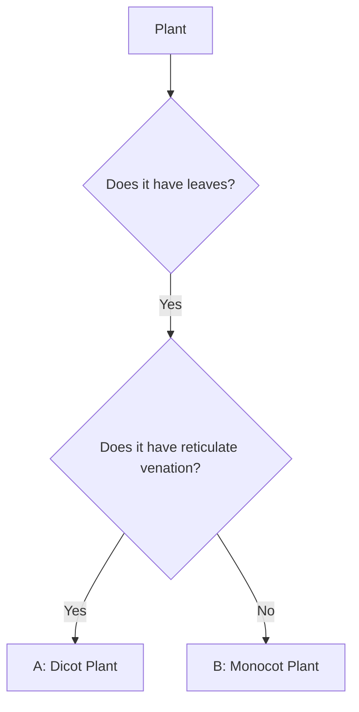

import Callout from '@/components/Callout.astro'

## Questions and Solutions

### Q1. Here are two types of seeds. What differences do you find among the roots and leaf venation of their plants?
*(Images provided: (a) Wheat, (b) Kidney beans)*

**Solution:**

*   **(a) Wheat Seed:**
    *   **Type of Seed:** It is a **Monocot** (has a single cotyledon).
    *   **Root System:** Monocots typically have a **Fibrous root system**.
    *   **Leaf Venation:** Leaves of monocots show **Parallel venation**.

*   **(b) Kidney Bean (Rajma) Seed:**
    *   **Type of Seed:** It is a **Dicot** (has two cotyledons).
    *   **Root System:** Dicots typically have a **Taproot system**.
    *   **Leaf Venation:** Leaves of dicots show **Reticulate venation**.

---

### Q2. Names of some animals are given below. Group them based on their habitats.
**List:** Horse, Dolphin, Frog, Sheep, Crocodile, Squirrel, Whale, Earthworm, Pigeon, Tortoise.
**Task:** Place them in the Venn diagram (A=Aquatic, B=Terrestrial, C=Both).

**Solution:**

*   **Region A (Aquatic - Water only):** Dolphin, Whale.
*   **Region B (Terrestrial - Land only):** Horse, Sheep, Squirrel, Earthworm, Pigeon.
*   **Region C (Amphibious - Both Land & Water):** Frog, Crocodile, Tortoise.

  <svg width="400" height="250" viewBox="0 0 400 250" xmlns="http://www.w3.org/2000/svg">
    {/* Circle A */}
    <circle cx="140" cy="125" r="100" fill="none" stroke="currentColor" stroke-width="2" />
    <text x="70" y="80" fill="currentColor" fontWeight="bold">A (Aquatic)</text>
    <text x="80" y="110" fill="currentColor" fontSize="12">Dolphin</text>
    <text x="80" y="130" fill="currentColor" fontSize="12">Whale</text>

    {/* Circle B */}
    <circle cx="260" cy="125" r="100" fill="none" stroke="currentColor" stroke-width="2" />
    <text x="270" y="80" fill="currentColor" fontWeight="bold">B (Terrestrial)</text>
    <text x="280" y="100" fill="currentColor" fontSize="12">Horse, Sheep</text>
    <text x="280" y="120" fill="currentColor" fontSize="12">Squirrel, Pigeon</text>
    <text x="280" y="140" fill="currentColor" fontSize="12">Earthworm</text>

    {/* Region C (Intersection) */}
    <text x="185" y="115" fill="currentColor" fontWeight="bold">C</text>
    <text x="170" y="135" fill="currentColor" fontSize="12">Frog</text>
    <text x="160" y="150" fill="currentColor" fontSize="12">Crocodile</text>
    <text x="170" y="165" fill="currentColor" fontSize="12">Tortoise</text>
  </svg>

---

### Q3. Manu’s mother maintains a kitchen garden. One day, she was digging out radish from the soil. She told Manu that radish is a kind of root. Examine a radish and write what type of root it is. What type of venation would you observe in the leaves of radish plant?

**Solution:**
1.  **Type of Root:** A radish is a thick, single main root that grows vertically downward. This is a modified **Taproot**.
2.  **Type of Venation:** Since the radish plant has a taproot, it follows the biological rule that plants with taproots have **Reticulate venation** in their leaves.

---

### Q4. Look at the image of a mountain goat and a goat found in the plains. Point out the similarities and differences between them. What are the reasons for these differences?

**Solution:**

*   **Similarities:** Both have four legs, hooves, and eat plants (herbivores).
*   **Differences:**
    *   **Mountain Goat:** Has thick, white/grey fur to protect against cold. Has very strong hooves adapted for climbing rocky slopes.
    *   **Plains Goat:** Has thinner fur or hair. Hooves are adapted for flat ground.
*   **Reason:** These differences are **adaptations**. The mountain goat has adapted to the cold, rocky environment, while the plains goat is adapted to a warmer, flatter environment.

---

### Q5. Group the following animals into two groups based on any feature other than those discussed in the chapter.
**Animals:** cow, cockroach, pigeon, bat, tortoise, whale, fish, grasshopper, lizard.

**Solution:**
We can group them based on **"Presence of Wings (Flight)"**:

*   **Group 1 (Can Fly/Have Wings):** Pigeon, Bat, Cockroach, Grasshopper.
*   **Group 2 (Cannot Fly/No Wings):** Cow, Tortoise, Whale, Fish, Lizard.

*(Alternative grouping: Vertebrates vs Invertebrates, or Egg-laying vs Live-birth)*

---

### Q6. As the population grows and people want more comfortable lives, forests are being cut down to meet various needs. How can this affect our surroundings? How do you think we can address this challenge?

**Solution:**
*   **Effects:**
    1.  **Loss of Habitat:** Animals lose their homes, leading to extinction.
    2.  **Biodiversity Loss:** Variety of plants and animals decreases.
    3.  **Climate Change:** Less trees mean less oxygen and more carbon dioxide, causing warming.
*   **Addressing the Challenge:**
    1.  **Reforestation:** Planting more trees.
    2.  **Protected Areas:** Creating national parks and wildlife sanctuaries.
    3.  **Sustainable Living:** Using fewer resources and recycling (Reduce, Reuse, Recycle).

---

### Q7. Analyse the flowchart. What can be examples of ‘A’ and ‘B’?

**Solution:**
*   **Logic:**
    *   A plant with leaves AND reticulate venation is a **Dicot**.
    *   A plant with leaves but NO reticulate venation (implies Parallel venation) is a **Monocot**.
*   **Example for A:** Hibiscus, Rose, Mango, Peepal.
*   **Example for B:** Grass, Maize, Wheat, Banana.

---

### Q8. Raj argues with his friend Sanjay that “Gudhal (hibiscus) plant is a shrub.” What questions can Sanjay ask for clarification?

**Solution:**
Sanjay should ask questions related to the definition of a shrub:
1.  "Is the stem very thick like a tree trunk, or just hard?" (Shrubs have hard but thin stems).
2.  "Where do the branches start? Do they start near the ground or high up?" (Shrubs branch near the base).
3.  "Is the plant very tall or medium height?" (Shrubs are medium height).

---

### Q9. Based on the information in the table, find out examples of these plants for each group.

| Group | Type of Seed | Type of Root | Examples |
| :--- | :--- | :--- | :--- |
| **A** | Dicot | Taproot | *Examples needed* |
| **B** | Monocot | Fibrous | *Examples needed* |

**Solution:**
*   **Examples for Group A (Dicot/Taproot):** Gram (Chickpea), Pea, Mango, Mustard, Hibiscus.
*   **Examples for Group B (Monocot/Fibrous):** Maize, Wheat, Rice, Grass, Sugarcane.

**(a) What other similarities do plants of group A have?**
*   They have **Reticulate Venation** in leaves.

**(b) What other similarities do plants of group B have?**
*   They have **Parallel Venation** in leaves.

---

### Q10. Observe the labeled part of a duck in the picture... What differences do you observe in the feet of the duck compared to the other birds? Which activity would the duck be able to perform using this part?

**Solution:**
*   **Observation:** The duck has skin connecting its toes. These are called **webbed feet**.
*   **Difference:** Other birds (like pigeons) have separated toes for gripping branches (perching). Ducks have webbed feet.
*   **Activity:** Webbed feet act like paddles/oars, helping the duck to **swim** efficiently in water.
