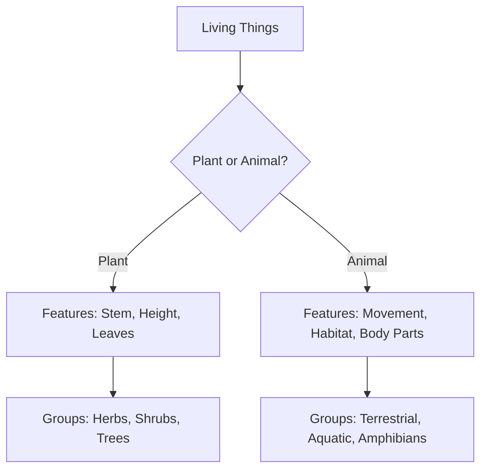

import Callout from '@/components/Callout.astro'

## Observing Nature

When we step outside for a nature walk, we observe a vast variety of life. From tiny ants to tall trees, every living thing is unique.
-   **Plants:** Vary in height, stem type, leaf shape, and flower color.
-   **Animals:** Vary in size, food habits, habitats, and movement.

This variety of life in a specific region is called **Biodiversity**.

## Why Do We Group Things?

Imagine a library where books are thrown in a pile. It would be impossible to find a specific book. Similarly, with millions of living organisms, studying them one by one is difficult.

<Callout variant="tip">
**Definition:** **Grouping** (or Classification) is the method of arranging things into categories based on their common features (similarities) and differences.
</Callout>

**Benefits of Grouping:**
1.  Makes it easier to study organisms.
2.  Helps us understand relationships between different groups.
3.  Allows us to predict features of an organism if we know its group.

### Criteria for Grouping

We can group plants and animals based on simple observable features:

*   **Plants:** Height (tall/short), Stem (hard/soft), Presence of flowers.
*   **Animals:** Habitat (Land/Water), Food (Herbivore/Carnivore), Movement (Walk/Fly/Swim).

