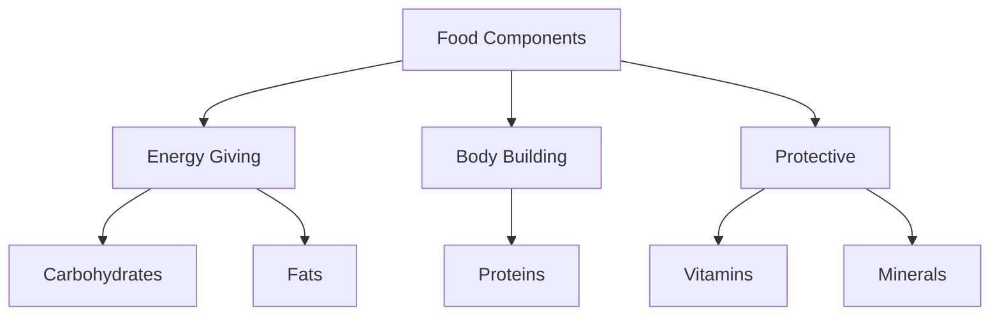

import Callout from '@/components/Callout.astro'

# Mindful Eating: A Path to a Healthy Body

Welcome to Chapter 3. In this chapter, we explore the fundamental question: **"What do we eat and why?"** We will journey through the diversity of food across India, understand the science of nutrients, learn how to test for them, and discover the journey of food from the farm to our plates.

## Introduction

The chapter begins with a profound Sanskrit saying:

> **"Annena jātāni jivanti"**  
> *(Food gives life to living beings)*

Food is not just about taste; it is the fuel for our body, a part of our culture, and a result of hard work by farmers.

### Chapter Roadmap

We have organized this chapter into the following key topics:

1.  **Food Diversity & Regions**: Understanding how geography influences what we eat.
2.  **Culinary Practices**: How cooking methods have evolved from traditional to modern times.
3.  **Components of Food**: A deep dive into Carbohydrates, Fats, Proteins, Vitamins, and Minerals.
4.  **Testing Nutrients**: Practical laboratory methods to detect Starch, Proteins, and Fats.
5.  **Balanced Diet**: The importance of eating right and the role of Millets.
6.  **Food Miles**: Tracing the journey of food and understanding its environmental impact.

<Callout variant="tip">
**Core Concept:** "Health is the Ultimate Wealth." (Dr. Poshita). Eating wholesome food in moderate quantities, appropriate for the season and place, is the key to good health.
</Callout>

## Formula Sheet & Key Definitions

| Term | Definition |
| :--- | :--- |
| **Nutrients** | Components of food that provide energy, support growth, repair tissues, and protect from diseases. |
| **Carbohydrates** | Primary source of energy (e.g., cereals, potatoes, sugar). |
| **Fats** | Source of stored energy; provides warmth (e.g., ghee, oil, nuts). |
| **Proteins** | Body-building foods required for growth and repair (e.g., pulses, milk, meat). |
| **Vitamins & Minerals** | Protective nutrients needed in small amounts to fight diseases. |
| **Roughage** | Dietary fibres that help in digestion and bowel movement. |
| **Balanced Diet** | A diet containing all essential nutrients, roughage, and water in the right amounts. |
| **Food Miles** | The distance food travels from the producer (farm) to the consumer (plate). |
| **Fortification** | Adding extra nutrients to food during processing to improve nutritional quality (e.g., Iodised salt). |

## Quick Logic: Nutrient Function

