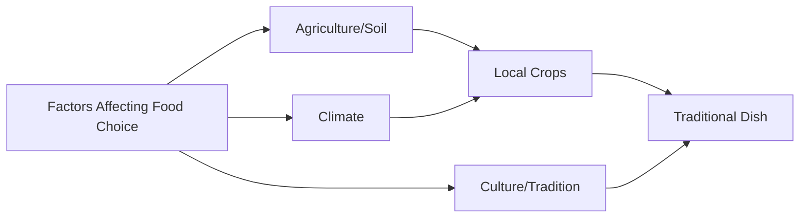

import Callout from '@/components/Callout.astro'

## Food in Different Regions

India is a vast country with diverse soil types, climates, and cultures. This diversity is reflected in the food we eat. Have you noticed that your friend's tiffin might contain *Idli* while yours has *Paratha*?

### Why does food vary?
The traditional food of a state is usually based on the **crops grown in that state**.
*   **Geography:** Coastal areas eat more rice and fish.
*   **Climate:** Areas with less rain might consume more millets like Bajra.
*   **Culture:** Festivals and traditions influence special dishes.

### Regional Food Map

Below is a compilation of traditional foods from various states (based on Table 3.2 in your textbook).

| State | Locally Grown Crops | Traditional Food Items | Beverages |
| :--- | :--- | :--- | :--- |
| **Punjab** | Maize, Wheat, Chickpea | *Makki di roti, Sarson da saag, Chhole bhature* | Lassi, Chhach |
| **Karnataka** | Rice, Ragi, Urad, Coconut | *Idli, Dosa, Ragi mudde, Palya, Rasam* | Buttermilk, Coffee |
| **Manipur** | Rice, Bamboo, Soybean | *Eromba, Utti, Singju, Kangsoi* | Black Tea |
| **Gujarat** | Bajra, Wheat, Cotton | *Thepla, Dhokla, Undhiyu* | Chaas |
| **West Bengal** | Rice, Jute, Mustard | *Maach Bhaat (Fish curry), Rosogolla* | Tea |

<Callout variant="tip">
**Activity Insight:** When you analyze the food habits, you will find that **staple foods** (like rice or wheat) are common across many states, but the *way* they are cooked and the side dishes vary significantly.
</Callout>

### Factors Influencing Food Choices
1.  **Cultivation:** What grows locally is eaten locally.
2.  **Taste Preferences:** Developed over generations.
3.  **Economy:** Availability and cost of ingredients.
4.  **Traditions:** Religious or cultural dietary rules.

