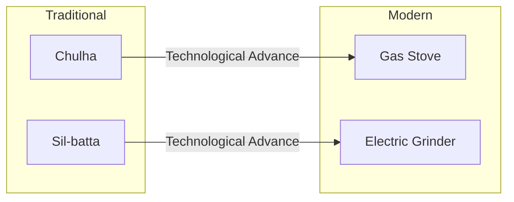

import Callout from '@/components/Callout.astro'

## Evolution of Cooking

**Culinary practices** refer to the art and practice of cooking. Just as the food we eat has changed, the way we prepare it has also evolved. This change is driven by technological development, lifestyle changes, and convenience.

### Traditional vs. Modern Methods

We can observe a significant shift in tools and techniques.

| Aspect | Traditional Method | Modern Method | Impact |
| :--- | :--- | :--- | :--- |
| **Cooking Heat** | **Chulha** (Wood/Coal fire) | **Gas Stove / Induction** | Modern is faster, less smoky, and cleaner. |
| **Grinding** | **Sil-batta** (Stone grinder) | **Electrical Grinder/Mixer** | Modern saves immense physical effort and time. |
| **Preservation** | Drying, Salting, Pickling | Refrigeration, Canning | Modern allows food to last longer without high salt/oil. |

### Why have these changes occurred?
1.  **Technology:** Invention of electricity and gas distribution.
2.  **Time:** Modern life is faster; people need quick cooking solutions.
3.  **Communication:** We learn recipes from all over the world via the internet/TV.
4.  **Transportation:** Ingredients from far away are now available locally.

<Callout variant="warning">
**Critical Thinking:** While modern methods are convenient, some traditional methods (like slow cooking in clay pots) are believed to retain more nutrients. It is important to balance convenience with health.
</Callout>

### Diagram: The Shift in Cooking Tools

