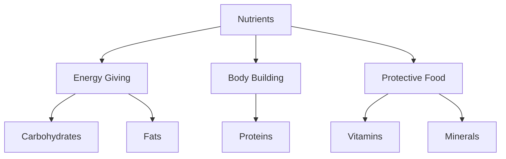

import Callout from '@/components/Callout.astro'

## What are Nutrients?

Food components that provide energy, support growth, help repair tissues, and protect our body from diseases are called **nutrients**.

The major nutrients are:
1.  **Carbohydrates**
2.  **Fats**
3.  **Proteins**
4.  **Vitamins**
5.  **Minerals**

In addition to these, our body needs **Dietary Fibres (Roughage)** and **Water**.

---

### 1. Carbohydrates (Energy-Giving Food)
*   **Function:** Provide instant energy to the body.
*   **Types:** Sugar (Simple) and Starch (Complex).
*   **Sources:**
    *   *Cereals:* Wheat, Rice, Maize, Bajra.
    *   *Vegetables:* Potato, Sweet potato.
    *   *Fruits:* Banana, Mango, Sugarcane.
    *   *Others:* Sugar, Honey/Jaggery.

<Callout variant="tip">
**Did you know?** Glucose is a simple carbohydrate that provides *instant* energy. This is why marathon runners drink glucose water.
</Callout>

---

### 2. Fats (Energy-Giving Food)
*   **Function:** Provide stored energy and keep the body warm. They provide *more* energy than carbohydrates for the same amount.
*   **Sources:**
    *   *Plant sources:* Groundnuts, nuts (walnut, almond), coconut oil, sunflower oil, mustard oil.
    *   *Animal sources:* Ghee, butter, milk, cream, meat, fish, eggs.

---

### 3. Proteins (Body-Building Food)
*   **Function:** Essential for the growth and repair of body tissues.
*   **Sources:**
    *   *Plant sources:* Pulses (Gram, Moong, Tur dal), Beans, Soyabean, Peas.
    *   *Animal sources:* Meat, Fish, Eggs, Milk, Paneer.

---

### 4. Vitamins & Minerals (Protective Food)
These are required in small quantities but are crucial for protecting the body against diseases and maintaining healthy eyes, bones, teeth, and gums.

#### Vitamin & Mineral Deficiency Chart

| Nutrient | Function | Sources | Deficiency Disease | Symptoms |
| :--- | :--- | :--- | :--- | :--- |
| **Vitamin A** | Keeps eyes/skin healthy | Papaya, Carrot, Milk | **Night Blindness** | Poor vision, loss of vision in darkness. |
| **Vitamin B1** | Heart & nerve function | Whole grains, Nuts | **Beriberi** | Weak muscles, little energy to work. |
| **Vitamin C** | Fights diseases | Citrus fruits (Amla, Lemon) | **Scurvy** | Bleeding gums, wounds take longer to heal. |
| **Vitamin D** | Helps absorb Calcium | Sunlight, Milk, Fish | **Rickets** | Soft and bent bones. |
| **Calcium** | Bone & tooth health | Milk, Eggs | **Bone & Tooth Decay** | Weak bones, tooth decay. |
| **Iodine** | Thyroid function | Iodised salt, Seafood | **Goitre** | Swollen gland in neck. |
| **Iron** | Blood formation | Spinach, Apple, Liver | **Anaemia** | Weakness. |

---

### 5. Roughage (Dietary Fibres)
*   **Function:** Does not provide nutrients but adds bulk to food. It helps the body get rid of undigested food (prevents constipation).
*   **Sources:** Whole grains, pulses, fresh fruits, vegetables (potatoes).

### 6. Water
*   **Function:** Helps absorb nutrients from food and excrete waste as urine and sweat.

---

### Case Studies from History
*   **Scurvy:** Sailors used to get bleeding gums due to lack of fresh fruits. James Lind discovered lemons/oranges (Vit C) cured it.
*   **Goitre:** People in Himalayan regions suffered from swollen necks due to low iodine in soil. Iodised salt solved this problem.

