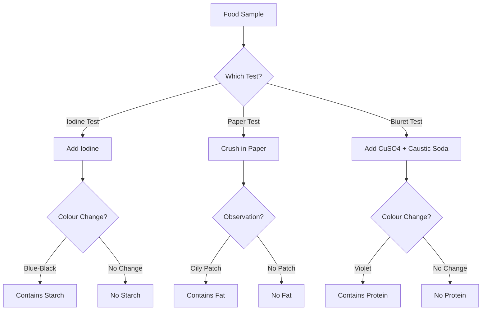

import Callout from '@/components/Callout.astro'

## Testing Food Components

We can scientifically verify which nutrients are present in food using simple chemical tests.

<Callout variant="warning">
**Safety First:** Do not taste chemicals. Handle acids and glass with care under teacher supervision.
</Callout>

### 1. Test for Starch (Carbohydrate)
Starch turns blue-black when it reacts with Iodine.

*   **Materials:** Dilute Iodine solution, dropper, food sample (e.g., potato).
*   **Procedure:**
    1.  Take a small quantity of the food item.
    2.  Add 2-3 drops of dilute **Iodine solution** to it.
    3.  Observe the colour change.
*   **Observation:** If the food turns **Blue-Black**, it contains Starch.

### 2. Test for Fats
Fats leave an oily stain on paper.

*   **Materials:** Paper, food sample (e.g., peanut).
*   **Procedure:**
    1.  Wrap the food item in a piece of paper and crush it (don't tear the paper).
    2.  Straighten the paper and hold it against the light.
*   **Observation:** An **oily transparent patch** indicates the presence of Fat. (If the paper is just wet from water, let it dry; water evaporates, oil does not).

### 3. Test for Proteins
Proteins react with Copper Sulphate and Caustic Soda to turn Violet.

*   **Materials:** Copper Sulphate solution, Caustic Soda solution, test tube, dropper, food paste (e.g., mashed dal).
*   **Procedure:**
    1.  Make a paste of the food item and put it in a test tube with some water. Shake well.
    2.  Add **2 drops** of Copper Sulphate solution.
    3.  Add **10 drops** of Caustic Soda solution.
    4.  Shake well and let it stand.
*   **Observation:** A **Violet** colour indicates the presence of Protein.

### Logic Flow for Testing

