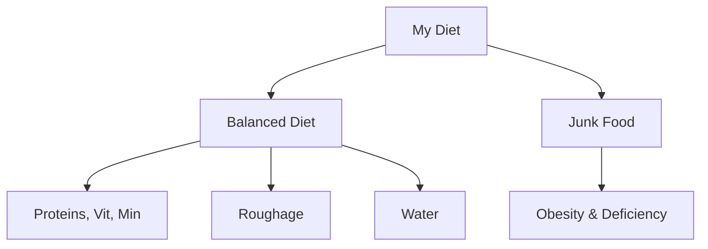

import Callout from '@/components/Callout.astro'

## What is a Balanced Diet?

A **Balanced Diet** is a diet that contains all the essential nutrients (Carbohydrates, Fats, Proteins, Vitamins, Minerals), roughage, and water in the **right quantities** required for the proper growth and functioning of the body.

*   **Age Factor:** A growing child needs more protein than an elderly person.
*   **Activity Factor:** A labourer needs more carbohydrates (energy) than someone working in an office.

### Junk Food vs. Healthy Food

**Junk Food** (e.g., potato chips, burgers, sodas) is often:
*   High in calories (Sugar & Fats).
*   Low in nutrients (Proteins, Vitamins, Fibres).
*   **Consequence:** Frequent consumption leads to obesity and health issues.

**Healthy Food** (e.g., Roasted Chana, Fruits, Sprouts) is:
*   Nutrient-dense.
*   Supports immunity and energy.

<Callout variant="tip">
**Comparison Activity:** 
*   **Potato Wafers:** 536 kcal, 35g Fat, 4.8g Fibre. (High Fat/Energy, Low Fibre)
*   **Roasted Chana:** 355 kcal, 6.26g Fat, 16.8g Fibre. (Lower Fat, High Protein/Fibre)
*   **Verdict:** Roasted Chana is the healthier snack!
</Callout>

## Millets: The Super Nutri-Cereals

Millets are native Indian crops that have regained popularity. Examples include **Jowar, Bajra, Ragi, and Sanwa**.

### Why eat Millets?
1.  **Nutritious:** Rich in Iron, Calcium, and Fibre.
2.  **Environment Friendly:** They grow easily in dry regions and need less water than rice.
3.  **Gluten-free:** Good for digestion.

### Fortification
Sometimes nutrients are added to food artificially to prevent public health issues.
*   **Iodised Salt:** Iodine is added to salt to prevent Goitre.
*   **Fortified Oil/Milk:** Vitamins A and D are often added.

Look for the **FSSAI** logo +F mark on packets!

