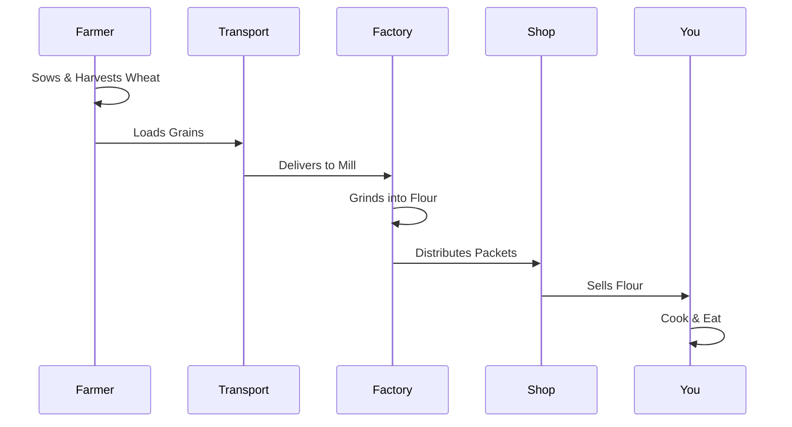

import Callout from '@/components/Callout.astro'

## The Journey of a Chapati

Have you ever thought about the effort behind a single chapati? The journey involves many steps and many people.

### Steps in Agriculture (Story of Wheat)
1.  **Sowing:** Farmer plants the seeds.
2.  **Growing:** Months of care, watering, and protecting crops.
3.  **Harvesting:** Cutting the mature crop.
4.  **Threshing & Winnowing:** Separating grains from chaff.
5.  **Storage:** Keeping grains safe from pests.
6.  **Transport:** Moving grains to markets/factories.
7.  **Processing:** Grinding wheat into flour (Atta).
8.  **Retail:** Selling to the consumer.
9.  **Cooking:** Making the chapati.

### What are Food Miles?

**Food Miles** refer to the total distance a food item travels from the place of production (farm) to the consumer (your plate).

*   **High Food Miles:** Apples from another country. (More pollution from transport).
*   **Low Food Miles:** Vegetables from a local farmer. (Fresher, less pollution).

### Why reduce Food Miles?
1.  **Environment:** Less fuel burnt during transport reduces pollution.
2.  **Economy:** Supports local farmers.
3.  **Health:** Food is fresher and has fewer preservatives.

<Callout variant="tip">
**Respect Food:** Given the immense effort by farmers and the environmental cost, we should never waste food. "Eat healthy, share, and respect food."
</Callout>

