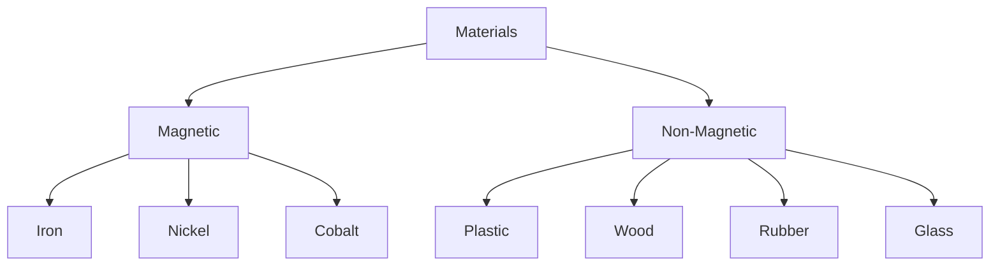

import Callout from '@/components/Callout.astro'

## Classification of Materials

Not all materials react to magnets in the same way. Based on their behavior when brought near a magnet, materials are classified into two groups.

### 1. Magnetic Materials
These are materials that get **attracted** towards a magnet.
*   **Examples:** Iron, Nickel, Cobalt.
*   **Common Objects:** Iron nails, sewing needles, paper clips, keys.

### 2. Non-magnetic Materials
These are materials that are **not attracted** towards a magnet.
*   **Examples:** Plastic, Wood, Rubber, Glass, Paper, Cloth, Aluminum, Copper.
*   **Common Objects:** Pencils (wood), Erasers (rubber), Plastic bottles, Gold rings.

<Callout variant="warning">
**Note:** Some metals like Gold, Silver, Aluminum, and Copper are **non-magnetic**. Only specific metals like Iron, Nickel, and Cobalt are magnetic.
</Callout>

### Concept Map

## Activity: Testing Materials

If you bring a magnet near various objects, you can predict and observe the results:

| Object | Material | Attracted? (Yes/No) |
| :--- | :--- | :--- |
| Iron Nail | Iron | **Yes** |
| Scale | Plastic | **No** |
| Shoe | Leather | **No** |
| Key | Steel (Iron alloy) | **Yes** |
| Coin (Modern) | Stainless Steel (Ferritic) | **Yes** (Some are magnetic) |

### Magnetic Force Through Materials
Interestingly, magnetic force can pass through non-magnetic materials.
*   If you place a paper clip in a glass of water and move a magnet on the outside of the glass, the clip will move.
*   A magnet can influence iron filings through a sheet of paper or a plastic board.