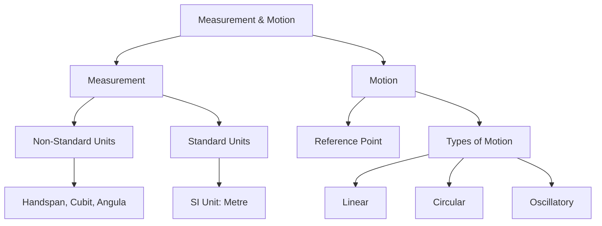
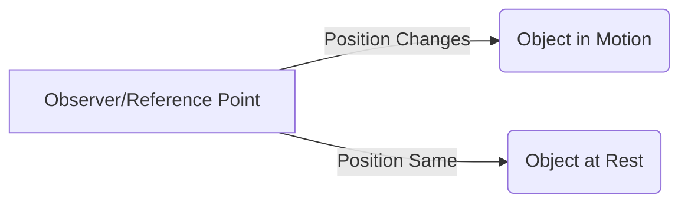

<<<FILE_START: index.mdx>>>
---
title: "Measurement of Length and Motion"
description: "Chapter 5 overview: Understanding standard units of measurement, correct measuring techniques, and the concepts of rest and motion."
date: 2025-01-20
tags: ["science", "class-6", "measurement", "motion", "physics"]
order: 1
draft: false
---

import Callout from '@/components/Callout.astro'

# Measurement of Length and Motion

Welcome to Chapter 5! In this chapter, we explore how humans moved from estimating lengths with body parts to using precise international standards. We also dive into the physics of motion, learning how to describe the position of objects and the different ways they move.

## 🧮 Formula Sheet

Key conversions you must remember for this chapter:

$$
\begin{aligned}
1 \text{ kilometre (km)} &= 1000 \text{ metres (m)} \\
1 \text{ metre (m)} &= 100 \text{ centimetres (cm)} \\
1 \text{ centimetre (cm)} &= 10 \text{ millimetres (mm)}
\end{aligned}
$$

**Quick Reference:**
*   **SI Unit of Length:** Metre (m)
*   **Small lengths:** Measured in cm or mm.
*   **Large distances:** Measured in km.

## 📚 Topics Covered

1.  **[Need for Measurement & History](/topics/01-need-for-measurement)** - Why handspans don't work and the story of measurement.
2.  **[Standard Units of Length](/topics/02-standard-units)** - Understanding the Metric System (SI Units).
3.  **[Measuring Techniques](/topics/03-measuring-techniques)** - How to use a scale correctly and measure curved lines.
4.  **[Rest and Motion](/topics/04-rest-and-motion)** - Reference points and defining motion.
5.  **[Types of Motion](/topics/05-types-of-motion)** - Linear, Circular, and Oscillatory motion.

## 🧬 Concept Map

<<<FILE_END>>>

<<<FILE_START: topics/01-need-for-measurement.mdx>>>
---
title: "Need for Measurement & History"
description: "From body parts to standard scales: Why we need a unified system of measurement."
date: 2025-01-20
tags: ["history", "measurement", "units"]
order: 1
draft: false
---

import Callout from '@/components/Callout.astro'

## The Confusion of Body Parts

Imagine trying to buy cloth for a uniform. If you ask for "two arm-lengths" of cloth, whose arm should be used? Yours? The shopkeeper's?

In ancient times, people used body parts for measurement:
*   **Handspan (Balisht):** The distance between the tip of the thumb and the little finger when stretched.
*   **Cubit:** Length from the elbow to the fingertips.
*   **Angula:** The width of a finger.
*   **Fist:** The width of a closed palm.
*   **Pace/Stride:** The length of a step.

### Why did this fail?
As Deepa and her friends discovered in the classroom activity, everyone's body parts are of different sizes. A table might be **13 handspans** long for one student but **14 handspans** long for another.

<Callout variant="warning">
**Problem:** Measurements using body parts differ from person to person. This causes confusion in trade, construction, and daily life. Thus, there is a need for a **Standard Unit** that remains the same for everyone.
</Callout>

## Historical Context: India

India has a rich history of measurement. Ancient texts mention units like:
*   **Angula:** Finger width.
*   **Dhanusa:** A bow length.
*   **Yojana:** A long distance measure.

Excavations from the **Harappan Civilisation** have revealed objects with ruled markings, suggesting they used precise scales thousands of years ago!

## What is a Unit?

Measurement consists of two parts:
1.  **A Number:** The quantity (e.g., 5, 10, 100).
2.  **A Unit:** The fixed quantity used as a standard (e.g., metre, foot).

$$
\text{Measurement} = \text{Number} \times \text{Unit}
$$

*Example: If a table is 2 metres long, '2' is the number and 'metre' is the unit.*
<<<FILE_END>>>

<<<FILE_START: topics/02-standard-units.mdx>>>
---
title: "Standard Units of Length"
description: "Understanding the International System of Units (SI) and metric conversions."
date: 2025-01-20
tags: ["SI units", "metric system", "conversions"]
order: 2
draft: false
---

import Callout from '@/components/Callout.astro'

## The International System of Units (SI)

To solve the confusion caused by local units (like inches, feet, or handspans), countries across the world adopted a standard set of units known as the **International System of Units** (SI Units).

<Callout variant="tip">
**Key Definition:** The SI unit of length is the **Metre**. Its symbol is **m**.
</Callout>

### Sub-units of the Metre

Ideally, we use different units depending on the size of the object we are measuring.

1.  **Millimetre (mm):** Used for very small lengths (e.g., thickness of a coin, tip of a pencil).
    *   $1 \text{ cm} = 10 \text{ mm}$
    *   $1 \text{ mm} = 0.1 \text{ cm}$

2.  **Centimetre (cm):** Used for medium-small lengths (e.g., length of a pencil, notebook, mobile phone).
    *   $1 \text{ m} = 100 \text{ cm}$

3.  **Kilometre (km):** Used for long distances (e.g., distance between two cities).
    *   $1 \text{ km} = 1000 \text{ m}$

## Conversion Visualization

  <svg width="600" height="150" viewBox="0 0 600 150" xmlns="http://www.w3.org/2000/svg">
    <!-- Main Line -->
    <line x1="50" y1="75" x2="550" y2="75" stroke="currentColor" stroke-width="2" />
    
    <!-- Nodes -->
    <circle cx="100" cy="75" r="5" fill="currentColor" />
    <circle cx="300" cy="75" r="5" fill="currentColor" />
    <circle cx="500" cy="75" r="5" fill="currentColor" />
    
    <!-- Labels -->
    <text x="100" y="50" text-anchor="middle" fill="currentColor" font-weight="bold">km</text>
    <text x="300" y="50" text-anchor="middle" fill="currentColor" font-weight="bold">m</text>
    <text x="500" y="50" text-anchor="middle" fill="currentColor" font-weight="bold">cm</text>
    
    <!-- Arrows for conversion -->
    <path d="M 110 85 Q 200 120 290 85" fill="none" stroke="currentColor" stroke-dasharray="4"/>
    <text x="200" y="110" text-anchor="middle" fill="currentColor" font-size="12">x 1000</text>
    
    <path d="M 310 85 Q 400 120 490 85" fill="none" stroke="currentColor" stroke-dasharray="4"/>
    <text x="400" y="110" text-anchor="middle" fill="currentColor" font-size="12">x 100</text>
  </svg>

## Rules for Writing Units

1.  **Lowercase:** Units are usually written in lowercase (e.g., metre, not Metre), unless at the start of a sentence.
2.  **Symbols:** Symbols are lowercase (km, m, cm).
3.  **No Plurals:** Never add an 's' to the symbol.
    *   *Correct:* 50 kg, 10 cm.
    *   *Incorrect:* 50 kgs, 10 cms.
4.  **No Full Stop:** Do not put a dot after the symbol unless it is the end of a sentence.
5.  **Spacing:** Always leave a space between the number and the unit (e.g., $15 \text{ cm}$).
<<<FILE_END>>>

<<<FILE_START: topics/03-measuring-techniques.mdx>>>
---
title: "Correct Measuring Techniques"
description: "How to use a ruler correctly, handle broken scales, and measure curved lines."
date: 2025-01-20
tags: ["measurement", "technique", "practical"]
order: 3
draft: false
---

import Callout from '@/components/Callout.astro'

## How to Use a Scale Correctly

Measuring length seems simple, but small errors can lead to wrong results. Follow these three rules:

### 1. Placement of the Scale
Place the scale **in contact** with the object along its length.
*   Do not tilt the scale.
*   Align the zero mark exactly with one end of the object.

### 2. Correct Eye Position (Parallax Error)
Your eye must be exactly in front of the point where the measurement is to be taken. If you look from the left or right, the reading will be incorrect. This is called **Parallax Error**.

  <svg width="400" height="200" viewBox="0 0 400 200" xmlns="http://www.w3.org/2000/svg">
    <!-- Object -->
    <rect x="50" y="150" width="300" height="20" fill="#ddd" stroke="currentColor" />
    
    <!-- Eye Positions -->
    <!-- Center (Correct) -->
    <g transform="translate(200, 50)">
      <circle cx="0" cy="0" r="15" fill="none" stroke="currentColor"/>
      <circle cx="0" cy="0" r="5" fill="currentColor"/>
      <line x1="0" y1="20" x2="0" y2="100" stroke="currentColor" stroke-dasharray="4" />
      <text x="0" y="-20" text-anchor="middle" fill="currentColor" font-weight="bold">Correct</text>
    </g>
    
    <!-- Left (Incorrect) -->
    <g transform="translate(100, 50)">
      <circle cx="0" cy="0" r="15" fill="none" stroke="#ff0000" opacity="0.5"/>
      <line x1="0" y1="20" x2="100" y2="100" stroke="#ff0000" stroke-dasharray="4" opacity="0.5"/>
      <text x="0" y="-20" text-anchor="middle" fill="currentColor">Wrong</text>
    </g>

    <!-- Right (Incorrect) -->
    <g transform="translate(300, 50)">
      <circle cx="0" cy="0" r="15" fill="none" stroke="#ff0000" opacity="0.5"/>
      <line x1="0" y1="20" x2="-100" y2="100" stroke="#ff0000" stroke-dasharray="4" opacity="0.5"/>
      <text x="0" y="-20" text-anchor="middle" fill="currentColor">Wrong</text>
    </g>
  </svg>

### 3. Measuring with a Broken Scale
If the zero mark is broken or invisible:
1.  Start from a full mark (e.g., $1.0 \text{ cm}$).
2.  Note the reading at the other end.
3.  **Subtract** the starting mark from the final reading.

**Formula:**
$$
\text{Actual Length} = \text{Final Reading} - \text{Initial Reading}
$$

*Example:* Start at $1.0 \text{ cm}$, end at $10.4 \text{ cm}$.
Length = $10.4 - 1.0 = 9.4 \text{ cm}$.

## Measuring a Curved Line
You cannot measure a curved line directly with a straight ruler.

**Method:**
1.  Use a **thread** or string.
2.  Place the thread along the curved line carefully, matching every curve.
3.  Mark the start and end points on the thread.
4.  Straighten the thread and measure the distance between the marks using a meter scale.
<<<FILE_END>>>

<<<FILE_START: topics/04-rest-and-motion.mdx>>>
---
title: "Motion and Rest"
description: "Defining motion, rest, and the importance of a reference point."
date: 2025-01-20
tags: ["physics", "motion", "rest", "reference point"]
order: 4
draft: false
---

import Callout from '@/components/Callout.astro'

## What is Motion?

Look around you. A flying bird, a moving car, blood flowing in veins—these are in motion. A table, a house, or a tree are at rest. But how do we define this scientifically?

<Callout variant="tip">
**Definition:** An object is in **motion** if its position changes with respect to a **reference point** with time.
</Callout>

If the position does *not* change with respect to the reference point, the object is said to be at **rest**.

## The Importance of a Reference Point

Motion is relative. Whether an object is moving depends on who is looking at it (the observer) or what point we compare it to (the reference point).

**The Bus Example:**
Imagine Deepa is sitting in a moving bus.
1.  **With respect to the bus (Reference Point):** Deepa is not changing her position. She is at **rest** relative to the seat.
2.  **With respect to a tree outside (Reference Point):** Deepa's position is changing. She is in **motion** relative to the tree.

**The Kilometre Stone Example:**
When Padma travels to Delhi, she sees milestones: "Delhi 70 km", then "Delhi 60 km".
*   **Reference Point:** Delhi.
*   **Observation:** Her distance from Delhi is changing. Therefore, she is in motion.

## Conceptual Diagram

<<<FILE_END>>>

<<<FILE_START: topics/05-types-of-motion.mdx>>>
---
title: "Types of Motion"
description: "Explaining Linear, Circular, Oscillatory, and Periodic motion with examples."
date: 2025-01-20
tags: ["linear", "circular", "oscillatory", "periodic"]
order: 5
draft: false
---

import Callout from '@/components/Callout.astro'

## 1. Linear Motion (Rectilinear Motion)
When an object moves along a **straight line**, it is called linear motion.

*   **Examples:**
    *   A car moving on a straight road.
    *   Soldiers marching in a parade.
    *   A stone falling freely from a roof.
    *   A sprinter running a 100m race on a straight track.

## 2. Circular Motion
When an object moves along a **circular path**, keeping a fixed distance from a central point.

*   **Examples:**
    *   A stone tied to a thread and whirled around.
    *   Hands of a clock.
    *   Blades of a fan.
    *   A merry-go-round.

<Callout variant="info">
**Note:** In circular motion, the *position* of the object changes, but its *distance* from the center remains constant.
</Callout>

## 3. Oscillatory Motion
When an object moves **to and fro** (back and forth) about a fixed position (mean position), it is called oscillatory motion.

*   **Examples:**
    *   A swing moving back and forth.
    *   The pendulum of a clock.
    *   The string of a guitar when plucked.
    *   A metal strip pressed and released.

## 4. Periodic Motion
If an object repeats its motion after a fixed interval of time, it is called periodic motion.
*   **Note:** Both circular motion (like a fan) and oscillatory motion (like a pendulum) are often periodic.

## Comparison Chart

| Type of Motion | Path | Examples |
| :--- | :--- | :--- |
| **Linear** | Straight Line | Dropping a coin |
| **Circular** | Circle | Moon orbiting Earth |
| **Oscillatory** | To and Fro | Ringing of a bell |

## Visualizing Motion Paths

  <!-- Linear -->
  <svg width="100" height="100" viewBox="0 0 100 100">
    <text x="50" y="20" text-anchor="middle" fill="currentColor" font-size="12">Linear</text>
    <line x1="20" y1="50" x2="80" y2="50" stroke="currentColor" stroke-width="2" marker-end="url(#arrow)" />
  </svg>

  <!-- Circular -->
  <svg width="100" height="100" viewBox="0 0 100 100">
    <text x="50" y="20" text-anchor="middle" fill="currentColor" font-size="12">Circular</text>
    <circle cx="50" cy="60" r="30" fill="none" stroke="currentColor" stroke-dasharray="4" />
    <circle cx="50" cy="60" r="3" fill="currentColor" />
    <circle cx="50" cy="30" r="4" fill="currentColor" />
  </svg>

  <!-- Oscillatory -->
  <svg width="100" height="100" viewBox="0 0 100 100">
    <text x="50" y="20" text-anchor="middle" fill="currentColor" font-size="12">Oscillatory</text>
    <path d="M 20 50 Q 50 80 80 50" fill="none" stroke="currentColor" stroke-width="2" />
    <path d="M 80 50 Q 50 20 20 50" fill="none" stroke="currentColor" stroke-width="2" stroke-dasharray="2" />
    <line x1="50" y1="50" x2="50" y2="80" stroke="currentColor" />
    <circle cx="50" cy="80" r="5" fill="currentColor" />
  </svg>

<<<FILE_END>>>

<<<FILE_START: solutions/textbook-exercises.mdx>>>
---
title: "Textbook Exercises: Let us Enhance our Learning"
description: "Complete solutions for Chapter 5 exercises."
date: 2025-01-20
tags: ["solutions", "exercises", "chapter-5"]
order: 1
draft: false
---

import Callout from '@/components/Callout.astro'

## Q1. Match the lengths with suitable units

**Column I (Length)** vs **Column II (Unit)**

| Column I | Answer (Column II) | Reason |
| :--- | :--- | :--- |
| Distance between Delhi and Lucknow | **kilometre** | Large distance between cities. |
| Thickness of a coin | **millimetre** | Very small length. |
| Length of an eraser | **centimetre** | Small object measuring a few cm. |
| Length of school ground | **metre** | Medium large area, best measured in metres. |

---

## Q2. True or False

(i) The motion of a car moving on a straight road is an example of linear motion.
**Answer: True**

(ii) Any object which is changing its position with respect to a reference point with time is said to be in motion.
**Answer: True**

(iii) 1 km = 100 cm.
**Answer: False**
*Correction:* $1 \text{ km} = 1000 \text{ m}$ and $1 \text{ m} = 100 \text{ cm}$. So, $1 \text{ km} = 100,000 \text{ cm}$.

---

## Q3. Which is NOT a standard unit of measuring length?
(i) millimetre
(ii) centimetre
(iii) kilometre
(iv) handspan

**Answer: (iv) handspan**
*Reason:* Handspan is a non-standard unit because it varies from person to person.

---

## Q4. Smallest value on different scales
*This is an activity-based question. Typical results:*
*   **15cm Plastic Scale:** The smallest division is usually **1 mm** (0.1 cm).
*   **Tailor's Tape:** Often marked in inches or cm. Smallest division is usually **1 mm** or 1/8 inch.

---

## Q5. Conversion Problem
**Suppose the distance between your school and home is 1.5 km. Express it in metres.**

**Solution:**
We know that:
$$ 1 \text{ km} = 1000 \text{ metres} $$

Given distance = $1.5 \text{ km}$
$$
\begin{aligned}
\text{Distance in metres} &= 1.5 \times 1000 \\
&= 1500 \text{ metres}
\end{aligned}
$$

**Answer:** 1500 m.

---

## Q6 - Q8. Practical Activities
*   **Q6 (Curved base):** Use a thread to wrap around the base, then measure the thread length on a scale.
*   **Q7 (Height):** Use a measuring tape.
    *   Example: Height = 150 cm.
    *   In metres: 1.50 m.
    *   In mm: 1500 mm.
*   **Q8 (Coin Estimate):**
    *   *Step 1:* Place coins edge-to-edge along the notebook side. Count them (e.g., 10 coins).
    *   *Step 2:* Measure notebook side with scale (e.g., 20 cm).
    *   *Step 3:* Measure coin diameter (e.g., 2 cm).
    *   *Verification:* $10 \text{ coins} \times 2 \text{ cm/coin} = 20 \text{ cm}$. Matches!

---

## Q9. Examples of Motion

1.  **Linear Motion:**
    *   An apple falling from a tree.
    *   A striker hitting a coin on a carrom board.
2.  **Circular Motion:**
    *   Tip of the second hand of a clock.
    *   A cyclist moving on a circular track.
3.  **Oscillatory Motion:**
    *   Motion of a needle in a sewing machine.
    *   Motion of a cradle.

---

## Q10. Sizes of Objects (Table 5.6)
*   **mm:** Thickness of ID card, tip of pen, ant.
*   **cm:** Pencil box, water bottle, mobile phone.
*   **m:** Length of classroom, height of a door, saree length.

---

## Q11. Rollercoaster Track Analysis
*Refer to Fig 5.19 in textbook.*

*   **Section A to B (Straight down):** **Linear Motion** (mostly straight path downwards).
*   **Loop (C to D to E):** **Circular Motion** (The ball travels in a circle/loop).
*   **Exit (E to F):** **Linear Motion** (Moving straight out).

---

## Q12. Tasneem's Scale Material
**Question:** Tasneem wants to make a metre scale. Materials considered: plywood, paper, cloth, stretchable rubber, steel. Which should she NOT use?

**Answer:** She should **not** use **stretchable rubber** (and arguably cloth if it stretches).

**Reason:** A standard measuring device must have a **fixed length**. Stretchable rubber changes its length when pulled, so the markings (cm/mm) would expand, giving inaccurate measurements. Plywood and steel are rigid and good for scales.

---

## Q13. Card Game
*Activity for students to design cards matching units (e.g., Card A: "1000 m", Card B: "1 km").*
<<<FILE_END>>>

<<<FILE_START: practice/solved-examples.mdx>>>
---
title: "Solved Examples & Extra Practice"
description: "Additional problems on unit conversion and identifying motion types."
date: 2025-01-20
tags: ["practice", "math", "physics"]
order: 1
draft: false
---

import Callout from '@/components/Callout.astro'

## Unit Conversion Practice

### Example 1: Converting Large Units
**Question:** The height of a building is 3250 cm. Express this height in metres.

**Solution:**
We know that:
$$ 100 \text{ cm} = 1 \text{ m} $$
So, to convert cm to m, we divide by 100.

$$
\text{Height} = \frac{3250}{100} \text{ m}
$$
$$
\text{Height} = 32.5 \text{ m}
$$

### Example 2: Converting to Small Units
**Question:** A pencil is 0.12 m long. What is its length in mm?

**Solution:**
First, convert metres to centimetres:
$$ 0.12 \text{ m} \times 100 = 12 \text{ cm} $$

Next, convert centimetres to millimetres:
$$ 1 \text{ cm} = 10 \text{ mm} $$
$$ 12 \text{ cm} \times 10 = 120 \text{ mm} $$

**Answer:** 120 mm.

## Identifying Motion Types

### Example 3: Mixed Motion
**Question:** A bicycle is moving on a straight road. What types of motion are exhibited by the bicycle?

**Solution:**
There are multiple types of motion happening simultaneously:
1.  **Linear Motion:** The bicycle as a whole is moving forward in a straight line.
2.  **Circular Motion:** The wheels and the pedals are rotating in circles around their axles.

### Example 4: The Sewing Machine
**Question:** Observe a sewing machine in use. Identify the motions.

**Solution:**
1.  **Wheel:** Undergoes **Circular Motion**.
2.  **Needle:** Undergoes **Oscillatory (Periodic) Motion** as it moves up and down rapidly.

## Critical Thinking

### Example 5: Broken Scale
**Question:** You have a ruler where the tip is broken. You start measuring an eraser from the mark $3.0 \text{ cm}$ and the eraser ends at the mark $7.6 \text{ cm}$. What is the length of the eraser?

**Solution:**
$$
\begin{aligned}
\text{Start Reading} &= 3.0 \text{ cm} \\
\text{End Reading} &= 7.6 \text{ cm} \\
\text{Length} &= \text{End} - \text{Start} \\
&= 7.6 - 3.0 \\
&= 4.6 \text{ cm}
\end{aligned}
$$
<<<FILE_END>>>
