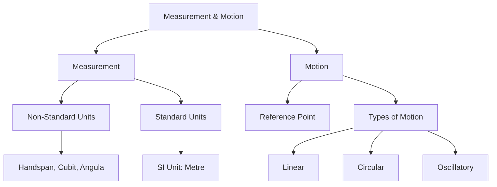

import Callout from '@/components/Callout.astro'

# Measurement of Length and Motion

Welcome to Chapter 5! In this chapter, we explore how humans moved from estimating lengths with body parts to using precise international standards. We also dive into the physics of motion, learning how to describe the position of objects and the different ways they move.

## 🧮 Formula Sheet

Key conversions you must remember for this chapter:

$$
\begin{aligned}
1 \text{ kilometre (km)} &= 1000 \text{ metres (m)} \\
1 \text{ metre (m)} &= 100 \text{ centimetres (cm)} \\
1 \text{ centimetre (cm)} &= 10 \text{ millimetres (mm)}
\end{aligned}
$$

**Quick Reference:**
*   **SI Unit of Length:** Metre (m)
*   **Small lengths:** Measured in cm or mm.
*   **Large distances:** Measured in km.

## 📚 Topics Covered

1.  **[Need for Measurement & History](/topics/01-need-for-measurement)** - Why handspans don't work and the story of measurement.
2.  **[Standard Units of Length](/topics/02-standard-units)** - Understanding the Metric System (SI Units).
3.  **[Measuring Techniques](/topics/03-measuring-techniques)** - How to use a scale correctly and measure curved lines.
4.  **[Rest and Motion](/topics/04-rest-and-motion)** - Reference points and defining motion.
5.  **[Types of Motion](/topics/05-types-of-motion)** - Linear, Circular, and Oscillatory motion.

## 🧬 Concept Map

