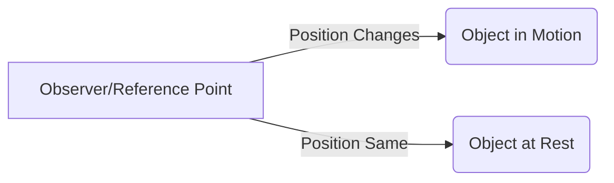

import Callout from '@/components/Callout.astro'

## What is Motion?

Look around you. A flying bird, a moving car, blood flowing in veins—these are in motion. A table, a house, or a tree are at rest. But how do we define this scientifically?

<Callout variant="tip">
**Definition:** An object is in **motion** if its position changes with respect to a **reference point** with time.
</Callout>

If the position does *not* change with respect to the reference point, the object is said to be at **rest**.

## The Importance of a Reference Point

Motion is relative. Whether an object is moving depends on who is looking at it (the observer) or what point we compare it to (the reference point).

**The Bus Example:**
Imagine Deepa is sitting in a moving bus.
1.  **With respect to the bus (Reference Point):** Deepa is not changing her position. She is at **rest** relative to the seat.
2.  **With respect to a tree outside (Reference Point):** Deepa's position is changing. She is in **motion** relative to the tree.

**The Kilometre Stone Example:**
When Padma travels to Delhi, she sees milestones: "Delhi 70 km", then "Delhi 60 km".
*   **Reference Point:** Delhi.
*   **Observation:** Her distance from Delhi is changing. Therefore, she is in motion.

## Conceptual Diagram

