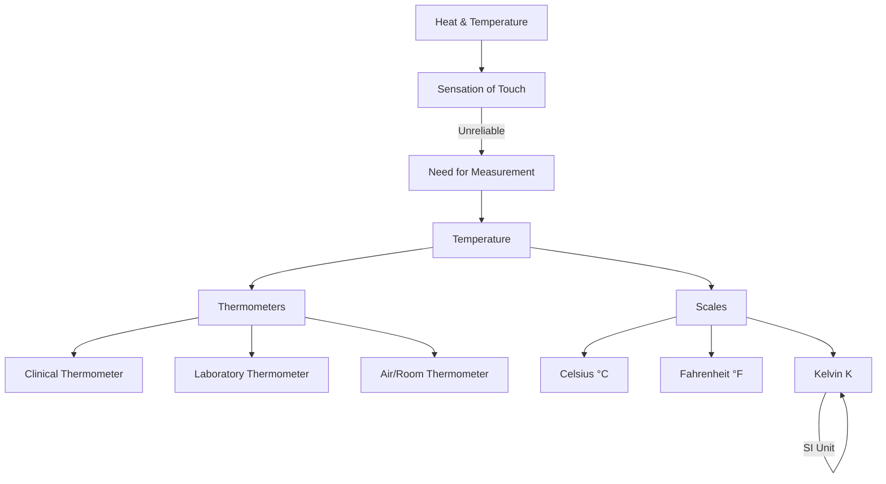

<<<FILE_START: index.mdx>>>
---
title: "Temperature and its Measurement"
description: "Chapter 7: Understanding hotness, coldness, thermometers, and temperature scales."
date: 2025-01-15
tags: ["physics", "temperature", "grade-6", "science"]
order: 1
draft: false
---

import Callout from '@/components/Callout.astro'

## Introduction

We use terms like "hot" and "cold" every day. But how do we measure exactly *how* hot or cold something is? In this chapter, we explore the concept of **temperature**, the devices used to measure it (**thermometers**), and the different scales used scientifically.

### Chapter Overview

1.  **Sensation of Heat:** Why our sense of touch isn't always reliable.
2.  **Temperature:** The scientific definition.
3.  **Measuring Devices:** Clinical and Laboratory thermometers.
4.  **Scales:** Celsius, Fahrenheit, and Kelvin.

## Key Formulas & Constants

<Callout variant="tip">
**Important Conversions**
The relationship between the Celsius scale ($^{\circ}\text{C}$) and the Kelvin scale ($\text{K}$) is:

$$
\text{Temperature in Kelvin (K)} = \text{Temperature in Celsius (}^{\circ}\text{C)} + 273.15
$$
</Callout>

### Standard Values

| Parameter | Value |
| :--- | :--- |
| **Normal Human Body Temperature** | $37.0^{\circ}\text{C}$ or $98.6^{\circ}\text{F}$ |
| **Freezing Point of Water** | $0^{\circ}\text{C}$ |
| **Boiling Point of Water** | $100^{\circ}\text{C}$ |
| **Laboratory Thermometer Range** | Typically $-10^{\circ}\text{C}$ to $110^{\circ}\text{C}$ |
| **SI Unit of Temperature** | Kelvin ($\text{K}$) |

---

### Concept Map

<<<FILE_END>>>

<<<FILE_START: topics/01-hot-and-cold.mdx>>>
---
title: "Hot or Cold?"
description: "Understanding the limitations of our sense of touch in judging temperature."
date: 2025-01-15
tags: ["sensation", "introduction"]
order: 2
draft: false
---

import Callout from '@/components/Callout.astro'

## Reliability of Touch

We know from experience that some bodies are hotter than others. Ice is cold, while boiling water is hot. We often use our sense of touch to judge this. However, is our sense of touch always reliable?

### Activity: The Three Containers

To test this, imagine an experiment with three containers:

*   **Container A:** Warm water
*   **Container B:** Tap water (room temperature)
*   **Container C:** Ice-cold water

**Procedure:**
1.  Dip your **right hand** in Container A (Warm).
2.  Dip your **left hand** in Container C (Cold).
3.  Keep them there for 1–2 minutes.
4.  Now, dip **both hands** simultaneously into Container B.

  <svg width="500" height="200" viewBox="0 0 500 200" xmlns="http://www.w3.org/2000/svg">
    <!-- Container A -->
    <rect x="50" y="50" width="100" height="120" rx="10" fill="none" stroke="currentColor" stroke-width="2"/>
    <text x="100" y="190" font-family="Arial" font-size="14" text-anchor="middle" fill="currentColor">Container A</text>
    <text x="100" y="110" font-family="Arial" font-size="12" text-anchor="middle" fill="currentColor">Warm Water</text>
    <path d="M55 70 Q100 60 145 70" fill="none" stroke="currentColor" stroke-dasharray="4"/>

    <!-- Container B -->
    <rect x="200" y="50" width="100" height="120" rx="10" fill="none" stroke="currentColor" stroke-width="2"/>
    <text x="250" y="190" font-family="Arial" font-size="14" text-anchor="middle" fill="currentColor">Container B</text>
    <text x="250" y="110" font-family="Arial" font-size="12" text-anchor="middle" fill="currentColor">Tap Water</text>
    <path d="M205 70 Q250 60 295 70" fill="none" stroke="currentColor" stroke-dasharray="4"/>

    <!-- Container C -->
    <rect x="350" y="50" width="100" height="120" rx="10" fill="none" stroke="currentColor" stroke-width="2"/>
    <text x="400" y="190" font-family="Arial" font-size="14" text-anchor="middle" fill="currentColor">Container C</text>
    <text x="400" y="110" font-family="Arial" font-size="12" text-anchor="middle" fill="currentColor">Ice Cold</text>
    <path d="M355 70 Q400 60 445 70" fill="none" stroke="currentColor" stroke-dasharray="4"/>
  </svg>

**Observation:**
*   Your **right hand** (coming from warm water) will feel the tap water is **cool**.
*   Your **left hand** (coming from cold water) will feel the same tap water is **warm**.

<Callout variant="warning">
**Conclusion:** We cannot always rely on our sense of touch to decide correctly whether a body is hot or cold. It is subjective and relative.
</Callout>
<<<FILE_END>>>

<<<FILE_START: topics/02-temperature-and-scales.mdx>>>
---
title: "Temperature and Scales"
description: "Defining temperature and understanding Celsius, Fahrenheit, and Kelvin scales."
date: 2025-01-15
tags: ["scales", "kelvin", "celsius", "definitions"]
order: 3
draft: false
---

import Callout from '@/components/Callout.astro'

## What is Temperature?

A reliable measure of the hotness (or coldness) of a body is its **temperature**.
*   A hotter body has a higher temperature.
*   A colder body has a lower temperature.
*   The device used to measure temperature is called a **thermometer**.

## Temperature Scales

There are three common scales used to measure temperature.

### 1. Celsius Scale ($^{\circ}\text{C}$)
*   Unit: **degree Celsius**.
*   Most commonly used scale for clinical and laboratory work.
*   Water freezes at $0^{\circ}\text{C}$ and boils at $100^{\circ}\text{C}$.

### 2. Fahrenheit Scale ($^{\circ}\text{F}$)
*   Unit: **degree Fahrenheit**.
*   Previously used in clinical thermometers.
*   Normal human body temperature: $98.6^{\circ}\text{F}$.
*   Relationship: $37.0^{\circ}\text{C} = 98.6^{\circ}\text{F}$.

### 3. Kelvin Scale ($\text{K}$)
*   Unit: **kelvin** (Note: small 'k' for the unit name, capital 'K' for the symbol).
*   **Important:** No degree sign ($^{\circ}$) is used with Kelvin.
*   This is the **SI unit** of temperature used in scientific work.
*   **Absolute Zero:** $0\text{ K}$ is approximately $-273.15^{\circ}\text{C}$, the lowest possible temperature.

<Callout variant="tip">
**Conversion Formula**

To convert from Celsius to Kelvin:
$$
\text{Temperature (K)} = \text{Temperature (}^{\circ}\text{C)} + 273.15
$$
</Callout>

### Writing Conventions
*   **Capitalization:** Names of scales start with a capital letter (Celsius, Kelvin). Units start with lowercase (degree Celsius, kelvin). Symbols are capital ($^{\circ}\text{C}$, $\text{K}$).
*   **Formatting:** Leave a space between the number and the unit (e.g., $37 \text{ }^{\circ}\text{C}$, not $37^{\circ}\text{C}$).
<<<FILE_END>>>

<<<FILE_START: topics/03-clinical-thermometer.mdx>>>
---
title: "The Clinical Thermometer"
description: "Measuring human body temperature correctly."
date: 2025-01-15
tags: ["thermometer", "clinical", "health"]
order: 4
draft: false
---

import Callout from '@/components/Callout.astro'

## Purpose
A **clinical thermometer** is designed specifically to measure human body temperature.

### Digital vs. Mercury
*   **Mercury Thermometers:** Formerly used. They contain mercury, a toxic liquid that is difficult to dispose of if the glass breaks.
*   **Digital Thermometers:** Now preferred. They use heat sensors and display the temperature on a screen. They are safe and easy to read.

<Callout variant="info">
**Did you know?**
There are also **Infrared Thermometers** (non-contact) which became popular during the COVID-19 pandemic. They measure temperature from a distance, reducing infection risk.
</Callout>

## Normal Body Temperature
The normal temperature of a healthy human body is taken to be **$37.0^{\circ}\text{C}$**.
*   Note: This is an average. A healthy person might have a temperature slightly higher or lower.
*   Safe range: Human temperature usually stays between $35^{\circ}\text{C}$ and $42^{\circ}\text{C}$.

## How to Use a Digital Clinical Thermometer

1.  **Wash** the tip with soap and water.
2.  **Reset** the thermometer (press the button).
3.  **Place** the tip under the tongue and close your mouth.
4.  **Wait** for the beep/flash.
5.  **Read** the value on the display.
6.  **Clean** and dry before storing.

### Precautions
*   Read the instruction manual.
*   Do not submerge the digital display part in water (unless waterproof).
*   Do not hold the thermometer by the tip (sensor).
<<<FILE_END>>>

<<<FILE_START: topics/04-laboratory-thermometer.mdx>>>
---
title: "The Laboratory Thermometer"
description: "Measuring temperature in scientific experiments."
date: 2025-01-15
tags: ["laboratory", "experiments", "measurement"]
order: 5
draft: false
---

import Callout from '@/components/Callout.astro'

## Structure
A **laboratory thermometer** consists of a long, narrow, uniform glass tube with a **bulb** at one end.
*   **Liquid:** Generally alcohol (colored red) or mercury.
*   **Scale:** Celsius scale is marked along the tube.

### Range
Typically, a laboratory thermometer measures from **$-10^{\circ}\text{C}$ to $110^{\circ}\text{C}$**.

  <svg width="600" height="150" viewBox="0 0 600 150" xmlns="http://www.w3.org/2000/svg">
    <!-- Glass Tube -->
    <rect x="50" y="60" width="500" height="30" rx="15" fill="none" stroke="currentColor" stroke-width="2"/>
    <!-- Liquid Column -->
    <rect x="55" y="65" width="200" height="20" rx="10" fill="currentColor" opacity="0.5"/>
    <!-- Bulb -->
    <circle cx="40" cy="75" r="15" fill="currentColor" opacity="0.7"/>
    
    <!-- Markings -->
    <line x1="100" y1="60" x2="100" y2="90" stroke="currentColor" stroke-width="2"/>
    <text x="100" y="50" font-family="Arial" font-size="12" text-anchor="middle" fill="currentColor">-10</text>
    
    <line x1="150" y1="60" x2="150" y2="90" stroke="currentColor" stroke-width="2"/>
    <text x="150" y="50" font-family="Arial" font-size="12" text-anchor="middle" fill="currentColor">0</text>
    
    <line x1="200" y1="60" x2="200" y2="90" stroke="currentColor" stroke-width="2"/>
    <text x="200" y="50" font-family="Arial" font-size="12" text-anchor="middle" fill="currentColor">10</text>
    
    <line x1="500" y1="60" x2="500" y2="90" stroke="currentColor" stroke-width="2"/>
    <text x="500" y="50" font-family="Arial" font-size="12" text-anchor="middle" fill="currentColor">110</text>
    
    <!-- Small divisions example between 0 and 10 -->
    <line x1="155" y1="60" x2="155" y2="75" stroke="currentColor" stroke-width="1"/>
    <line x1="160" y1="60" x2="160" y2="75" stroke="currentColor" stroke-width="1"/>
    <line x1="165" y1="60" x2="165" y2="75" stroke="currentColor" stroke-width="1"/>
    <line x1="170" y1="60" x2="170" y2="75" stroke="currentColor" stroke-width="1"/>
    <line x1="175" y1="60" x2="175" y2="80" stroke="currentColor" stroke-width="1.5"/> <!-- Middle mark -->
    <line x1="180" y1="60" x2="180" y2="75" stroke="currentColor" stroke-width="1"/>
    <line x1="185" y1="60" x2="185" y2="75" stroke="currentColor" stroke-width="1"/>
    <line x1="190" y1="60" x2="190" y2="75" stroke="currentColor" stroke-width="1"/>
    <line x1="195" y1="60" x2="195" y2="75" stroke="currentColor" stroke-width="1"/>
  </svg>

## Calculating Least Count (Smallest Value)
To read a thermometer accurately, you must know the value of the smallest division.
1.  Find the difference between two bigger marks (e.g., $10 - 0 = 10^{\circ}\text{C}$).
2.  Count the number of divisions between them (e.g., 10 divisions).
3.  Divide the difference by the number of divisions.

$$
\text{Value of one small division} = \frac{10^{\circ}\text{C}}{10} = 1^{\circ}\text{C}
$$

## Correct Usage
When measuring the temperature of water or other substances:
1.  **Immerse:** The bulb should be surrounded by the substance.
2.  **Do Not Touch:** The bulb should **not** touch the bottom or sides of the container.
3.  **Hold Vertically:** Keep the thermometer upright.
4.  **Read While Immersed:** Do not take the thermometer out of the liquid to read it. The level will fall immediately.
5.  **Eye Level:** Your eye must be in line with the top level of the liquid column to avoid parallax error.

<Callout variant="warning">
**Caution:** Laboratory thermometers are NOT used for body temperature because the liquid level falls as soon as it is removed from the body. Clinical thermometers have a "kink" or digital memory to hold the reading.
</Callout>
<<<FILE_END>>>

<<<FILE_START: topics/05-air-temperature.mdx>>>
---
title: "Air Temperature"
description: "How we measure weather temperature."
date: 2025-01-15
tags: ["weather", "meteorology"]
order: 6
draft: false
---

import Callout from '@/components/Callout.astro'

## Weather Reporting
You often see weather reports mentioning the **Maximum** and **Minimum** temperature of the day.
*   Air temperature is a key weather parameter.
*   It changes throughout the day and across seasons.
*   **Anna Mani**, known as the 'Weather Woman of India', invented many weather measurement instruments.

## Room Thermometer
These are simple thermometers hung on walls to measure the ambient temperature of a room or school laboratory.

## Activity: Analyzing Weather Data
If you track weather reports for 10 days, you will notice:
*   Temperatures vary daily.
*   Temperature rises towards summer and falls in winter.
<<<FILE_END>>>

<<<FILE_START: solutions/ex-7.1.mdx>>>
---
title: "Chapter Exercises: Let us Enhance our Learning"
description: "Detailed solutions to the questions at the end of the chapter."
date: 2025-01-15
tags: ["solutions", "exercises", "chapter-7"]
order: 7
draft: false
---

import Callout from '@/components/Callout.astro'

## Multiple Choice & Short Answer Questions

### 1. Normal Human Temperature
The normal temperature of a healthy human being is close to:
(i) $98.6^{\circ}\text{C}$
(ii) $37.0^{\circ}\text{C}$
(iii) $32.0^{\circ}\text{C}$
(iv) $27.0^{\circ}\text{C}$

**Answer:** (ii) **$37.0^{\circ}\text{C}$**
> **Explanation:** The normal human body temperature is defined as $37.0^{\circ}\text{C}$ on the Celsius scale. Option (i) is the value in Fahrenheit, but the unit shown is Celsius, which would be fatal.

### 2. Celsius to Fahrenheit
$37^{\circ}\text{C}$ is the same temperature as:
(i) $97.4^{\circ}\text{F}$
(ii) $97.6^{\circ}\text{F}$
(iii) $98.4^{\circ}\text{F}$
(iv) $98.6^{\circ}\text{F}$

**Answer:** (iv) **$98.6^{\circ}\text{F}$**
> **Explanation:** This is the standard conversion for normal body temperature.

### 3. Fill in the Blanks
(i) The hotness or coldness of a system is determined by its **temperature**.
(ii) The temperature of ice-cold water cannot be measured by a **clinical** thermometer.
> *Reason: A clinical thermometer typically ranges from $35^{\circ}\text{C}$ to $42^{\circ}\text{C}$, while ice-cold water is near $0^{\circ}\text{C}$.*
(iii) The unit of temperature is degree **Celsius** (or Fahrenheit). *Note: The SI unit is kelvin, but the blank includes the word 'degree', implying Celsius or Fahrenheit.*

### 4. Laboratory Thermometer Range
The range of a laboratory thermometer is usually:
(i) $10^{\circ}\text{C}$ to $100^{\circ}\text{C}$
(ii) $-10^{\circ}\text{C}$ to $110^{\circ}\text{C}$
(iii) $32^{\circ}\text{C}$ to $45^{\circ}\text{C}$
(iv) $35^{\circ}\text{C}$ to $42^{\circ}\text{C}$

**Answer:** (ii) **$-10^{\circ}\text{C}$ to $110^{\circ}\text{C}$**

### 5. Correct Usage Diagram
*Reference to Fig 7.6 in textbook showing 4 students measuring water temperature.*
*   Student 1: Holds it diagonally, touching the side.
*   Student 2: Bulb touches the bottom.
*   Student 3: Bulb suspended in water, held vertically.
*   Student 4: Bulb not fully immersed.

**Question:** Who followed the correct way?
**Answer:** (iii) **Student 3**
> **Explanation:** The thermometer must be held vertically and the bulb must be immersed in the water without touching the bottom or sides of the container.

### 6. Coloring the Thermometer
*This is a visual activity.*
*   **$14^{\circ}\text{C}$**: Mark 4 small divisions above 10.
*   **$17^{\circ}\text{C}$**: Mark 7 small divisions above 10.
*   **$7.5^{\circ}\text{C}$**: Mark exactly between the 7th and 8th division above 0 (assuming 1 division = 1 degree).

### 7. Reading the Thermometer (Fig 7.8)
(i) **Type:** This is a **Laboratory Thermometer** (based on the markings typically shown in such diagrams).
(ii) **Reading:** *Assuming the image shows a specific level.* If the level is at the 2nd small mark after 20, it is $22^{\circ}\text{C}$.
(iii) **Smallest Value:** Look at the divisions. If there are 10 divisions between $0$ and $10$, the smallest value is $1^{\circ}\text{C}$.

### 8. Lab Thermometer for Body Temp?
**Question:** A laboratory thermometer is not used to measure our body temperature. Give a reason.
**Answer:**
A laboratory thermometer does not have a "kink" or constriction near the bulb. Therefore, as soon as it is taken out of the mouth (or armpit), the liquid level falls due to cooling. This makes it impossible to get an accurate reading of the body temperature outside the body.

### 9. Vaishnavi's Temperature Record
**Table Data Analysis:**
*   Day 1 High: $40.0^{\circ}\text{C}$ (7pm)
*   Day 2 High: $39.0^{\circ}\text{C}$ (1pm, 4pm, 7pm)
*   Day 3 High: $37.6^{\circ}\text{C}$ (7am)

(i) **Highest recorded:** **$40.0^{\circ}\text{C}$**.
(ii) **When:** **Day One at 7 pm**.
(iii) **Return to normal:** On **Day Three**, the temperature dropped to $37.0^{\circ}\text{C}$ at 4 pm and continued to drop/stabilize. $37.0^{\circ}\text{C}$ is normal.

### 10. Choosing a Thermometer for $22.5^{\circ}\text{C}$
Three thermometers shown in Fig 7.9 (presumably with different Least Counts).
*   (a) Divisions of 1 degree ($0, 1, 2...$). Can read $22$ or $23$.
*   (b) Divisions of 0.5 degrees ($0, 0.5, 1...$). Can read $22.5$.
*   (c) Divisions of 2 degrees ($0, 2, 4...$). Hard to read $22.5$.

**Answer:** Thermometer **(b)**.
> **Reason:** To measure $22.5^{\circ}\text{C}$ accurately, we need a thermometer with a **least count** (smallest division) of at least **$0.5^{\circ}\text{C}$**.

### 11. Reading Fig 7.10
*Image typically shows marks between 20 and 30.*
If there are 10 divisions between 20 and 30, each is $1^{\circ}\text{C}$.
If the reading is at the 6th mark after 20: $26^{\circ}\text{C}$.
*Looking at the options provided in the text question:* (i) 28.0 (ii) 27.5 (iii) 26.5 (iv) 25.3.
Without the exact image, we check the scale. If the scale is between 20 and 30 with 2 degree increments? Or 0.5?
*Let's assume the question implies reading between marks.*
If the specific answer key points to **27.5°C**, the liquid must be exactly halfway between 27 and 28.

### 12. Least Count Calculation
**Given:** 50 divisions between $0^{\circ}\text{C}$ and $100^{\circ}\text{C}$.
**Calculation:**
$$ \text{Value of 1 division} = \frac{\text{Total Range}}{\text{Number of Divisions}} $$
$$ \text{Value} = \frac{100 - 0}{50} = \frac{100}{50} = 2^{\circ}\text{C} $$
**Answer:** Each division measures **$2^{\circ}\text{C}$**.

### 13. Drawing a Scale
**Task:** Draw scale between $10^{\circ}\text{C}$ and $20^{\circ}\text{C}$ with smallest division $0.5^{\circ}\text{C}$.
**Description:**
Between 10 and 11, there should be one mark in the middle (representing 10.5).
So between 10 and 20 (a gap of 10), there should be $10 \times 2 = 20$ divisions total.

### 14. Komal's Fever
**Question:** Komal has a fever of 101 degrees. Celsius or Fahrenheit?
**Answer:** She means **Fahrenheit ($^{\circ}\text{F}$)**.
> **Reason:** $101^{\circ}\text{C}$ is above the boiling point of water; a human would not survive. $101^{\circ}\text{F}$ is a common fever temperature (approx $38.3^{\circ}\text{C}$).
<<<FILE_END>>>

<<<FILE_START: practice/solved-examples.mdx>>>
---
title: "Practice: Solved Examples"
description: "Additional problems on temperature scales and thermometer readings."
date: 2025-01-15
tags: ["practice", "math", "conversion"]
order: 8
draft: false
---

import Callout from '@/components/Callout.astro'

## Example 1: Least Count

A thermometer has markings at $10^{\circ}\text{C}$ and $20^{\circ}\text{C}$. There are 5 divisions between these two marks. What is the smallest reading (Least Count) of this thermometer?

**Solution:**
1.  **Temperature Difference:** $20^{\circ}\text{C} - 10^{\circ}\text{C} = 10^{\circ}\text{C}$.
2.  **Number of Divisions:** $5$.
3.  **Value of 1 Division:**
    $$
    \frac{10^{\circ}\text{C}}{5} = 2^{\circ}\text{C}
    $$

**Answer:** The smallest reading this thermometer can take is **$2^{\circ}\text{C}$**.

## Example 2: Kelvin Conversion

The room temperature is $25^{\circ}\text{C}$. What is this temperature in the Kelvin scale?

**Solution:**
1.  **Formula:** $K = C + 273.15$
2.  **Substitute value:** $K = 25 + 273.15$
3.  **Calculate:** $K = 298.15$

**Answer:** The room temperature is **$298.15 \text{ K}$**.

## Example 3: Identifying Errors

Rahul tries to measure the temperature of boiling water using a Clinical Thermometer. Why is this dangerous?

**Solution:**
*   **Range Limit:** A clinical thermometer usually has a maximum range of $42^{\circ}\text{C}$.
*   **Boiling Point:** Water boils at $100^{\circ}\text{C}$.
*   **Consequence:** The mercury or alcohol will expand beyond the capacity of the tube, causing the thermometer to break or explode.

**Answer:** Never use a clinical thermometer for boiling water; always use a **Laboratory Thermometer** which goes up to $110^{\circ}\text{C}$.
<<<FILE_END>>>
