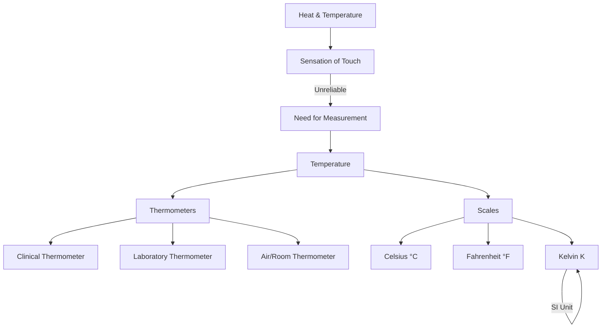

import Callout from '@/components/Callout.astro'

## Introduction

We use terms like "hot" and "cold" every day. But how do we measure exactly *how* hot or cold something is? In this chapter, we explore the concept of **temperature**, the devices used to measure it (**thermometers**), and the different scales used scientifically.

### Chapter Overview

1.  **Sensation of Heat:** Why our sense of touch isn't always reliable.
2.  **Temperature:** The scientific definition.
3.  **Measuring Devices:** Clinical and Laboratory thermometers.
4.  **Scales:** Celsius, Fahrenheit, and Kelvin.

## Key Formulas & Constants

<Callout variant="tip">
**Important Conversions**
The relationship between the Celsius scale ($^{\circ}\text{C}$) and the Kelvin scale ($\text{K}$) is:

$$
\text{Temperature in Kelvin (K)} = \text{Temperature in Celsius (}^{\circ}\text{C)} + 273.15
$$
</Callout>

### Standard Values

| Parameter | Value |
| :--- | :--- |
| **Normal Human Body Temperature** | $37.0^{\circ}\text{C}$ or $98.6^{\circ}\text{F}$ |
| **Freezing Point of Water** | $0^{\circ}\text{C}$ |
| **Boiling Point of Water** | $100^{\circ}\text{C}$ |
| **Laboratory Thermometer Range** | Typically $-10^{\circ}\text{C}$ to $110^{\circ}\text{C}$ |
| **SI Unit of Temperature** | Kelvin ($\text{K}$) |

---

### Concept Map

