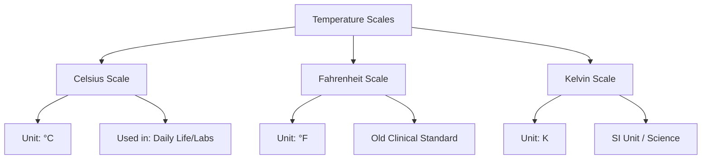

import Callout from '@/components/Callout.astro'

## Definition

<Callout variant="tip">
**Temperature** is a reliable measure of the hotness or coldness of a body.
</Callout>

A hotter body has a higher temperature than a colder body. The device used to measure this is called a **thermometer**.

## Scales of Temperature

Just like we measure length in meters or inches, temperature is measured in different scales.

### 1. Celsius Scale ($^\circ C$)
-   Most commonly used scale for clinical and laboratory work.
-   Unit: **degree Celsius**.
-   Water freezes at $0^\circ C$ and boils at $100^\circ C$.

### 2. Fahrenheit Scale ($^\circ F$)
-   Older scale, still used in some countries.
-   Unit: **degree Fahrenheit**.
-   Normal body temperature: $98.6^\circ F$.
-   Relationship: $37.0^\circ C \approx 98.6^\circ F$.

### 3. Kelvin Scale ($K$)
-   Used in scientific work.
-   Unit: **kelvin** (Note: distinct from degrees, we do not write $^\circ$K, just K).
-   **This is the SI Unit of temperature.**

<Callout variant="warning">
**Writing Tip:**
-   **Celsius/Fahrenheit:** Start with capital letters. Units written as degrees ($^\circ C, ^\circ F$).
-   **kelvin:** The unit starts with a lowercase 'k' when written in full, but the symbol is capital **K**. No degree sign is used.
</Callout>

### Comparison of Scales

$$
\text{Temperature in Kelvin} = \text{Temperature in Celsius} + 273.15
$$
