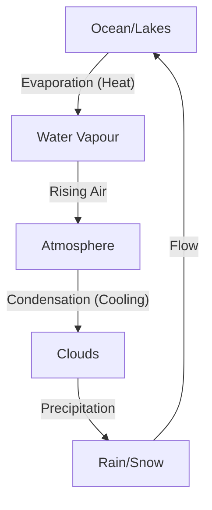

<<<FILE_START: index.mdx>>>
---
title: "A Journey through States of Water"
description: "Explore the three states of water, how they change from one to another, and the natural water cycle."
date: 2024-04-10
tags: ["science", "water", "states-of-matter", "grade-6"]
order: 1
draft: false
---

import Callout from '@/components/Callout.astro'

## Introduction

On a bright summer afternoon, enjoying a cold lemonade (*shikanji*) raises a simple question: Is the ice in the glass different from the water? Through observation and experimentation, we discover that **ice and water are the same substance** in different forms, or **states**.

Water is unique because it can exist in three distinct states:
1.  **Solid:** Ice
2.  **Liquid:** Water
3.  **Gas:** Water Vapour

In this chapter, we will investigate how water changes between these states through processes like **evaporation** and **condensation**, leading to the formation of clouds and the **water cycle**.

## Key Concepts & Definitions

<Callout variant="tip">
**Quick Reference Sheet**
</Callout>

| Term | Definition |
| :--- | :--- |
| **Evaporation** | The process of conversion of water into its vapour (gas) state. |
| **Condensation** | The process of conversion of water vapour into its liquid state. |
| **Melting** | The process of conversion of a solid into a liquid state (e.g., Ice to Water). |
| **Freezing** | The process of conversion of a liquid into a solid state (e.g., Water to Ice). |
| **Humidity** | The amount of water vapour present in the air. |
| **Water Cycle** | The continuous circulation of water between the Earth's surface and the atmosphere. |

## Topics Covered

*   **Evaporation:** Why puddles dry up and wet clothes dry.
*   **Condensation:** Why water droplets appear on a cold glass.
*   **Properties of States:** How solids, liquids, and gases behave differently.
*   **Factors Affecting Evaporation:** Surface area, temperature, wind, and humidity.
*   **Cooling Effect:** How earthen pots keep water cool.
*   **The Water Cycle:** How rain is formed and water returns to Earth.

## Initial Observation

When ice melts, it becomes water. This suggests they are the same substance. However, they behave differently:
*   **Ice:** Hard to touch, holds its shape.
*   **Water:** Flows, splashes, takes the shape of the container.

These differences define the **States of Matter**.
<<<FILE_END>>>

<<<FILE_START: topics/01-disappearing-water.mdx>>>
---
title: "Evaporation: The Disappearing Act"
description: "Understanding how water turns into vapour and disappears from puddles and wet surfaces."
date: 2024-04-10
tags: ["evaporation", "water-vapour", "states-of-matter"]
order: 2
draft: false
---

import Callout from '@/components/Callout.astro'

## Where Does the Water Go?

Have you ever noticed puddles disappearing after rain, or water drying up on a washed floor? Does the water seep into the ground, or does it go somewhere else?

### Experiment: Steel Plate Test
If you place a tablespoon of water on a steel plate, it will eventually disappear. Since water cannot seep through steel, it must have changed its form.

<Callout variant="tip">
**Definition:** The process of conversion of water into its vapour state is called **Evaporation**.
</Callout>

This water turns into **water vapour** (a gas), which mixes with the air. Water vapour is usually invisible.

### Everyday Examples
1.  **Boiling Water/Cooking:** When water is sprinkled on a hot pan, it turns into steam immediately. Steam is visible because some of the vapour turns back into tiny liquid droplets.
2.  **Drying Clothes:** Wet clothes dry because the water in the fabric evaporates into the air.
3.  **Sweating:** Sweat dries off our skin due to evaporation.
4.  **Hand Sanitiser:** It disappears quickly when rubbed on hands due to rapid evaporation.

### Conclusion
Water does not just vanish; it changes from a **liquid state** to a **gaseous state**. This process happens continuously, even at room temperature.
<<<FILE_END>>>

<<<FILE_START: topics/02-condensation-mystery.mdx>>>
---
title: "Condensation: The Appearance of Water"
description: "Investigating why water droplets form on the outside of cold containers."
date: 2024-04-10
tags: ["condensation", "experiments", "water-cycle"]
order: 3
draft: false
---

import Callout from '@/components/Callout.astro'

## The Mystery of the Sweating Glass

If you take a glass of cold water containing ice cubes and leave it on a table, you will soon notice tiny water droplets forming on the **outer surface** of the glass.

**Where do these droplets come from?**
1.  Did the water seep through the glass?
2.  Did it spill over?
3.  Or did it come from the air?

### Investigating the Source (Activity 8.4)

To prove where the water comes from, we can perform a weighing experiment.

**Steps:**
1.  Take a glass tumbler with ice water.
2.  Wipe the outside completely dry.
3.  Place it on a digital weighing scale.
4.  Observe the weight over 30 minutes.

**Observation:**
*   Water droplets appear on the outside.
*   The **mass (weight) increases** slightly as water accumulates on the outside.

**Conclusion:**
The water did **not** leak from inside (if it leaked, the total mass wouldn't increase, it would just move from inside to outside). The extra mass comes from the **air surrounding the glass**.

<Callout variant="tip">
**Definition:** The process of conversion of water vapour into its liquid state is called **Condensation**.
</Callout>

**How it works:**
The air around us contains invisible water vapour. When this warm vapour touches the **cold surface** of the glass, it cools down and turns back into liquid water droplets.

### Other Examples of Condensation
*   **Dew Drops:** Water droplets found on leaves and grass in the early morning.
*   **Breath in Winter:** Seeing your breath on a cold day.
*   **Lids on Hot Food:** Water drops on the underside of a plate covering hot food.
<<<FILE_END>>>

<<<FILE_START: topics/03-states-of-water.mdx>>>
---
title: "Properties of the Three States"
description: "Comparing the properties of Ice (Solid), Water (Liquid), and Water Vapour (Gas)."
date: 2024-04-10
tags: ["solid", "liquid", "gas", "properties"]
order: 4
draft: false
---

import Callout from '@/components/Callout.astro'

## Comparing the States

Water exists in three forms. Each form behaves differently regarding shape, flow, and volume.

### 1. Solid State (Ice)
*   **Shape:** Fixed. Retains its shape irrespective of the container.
*   **Flow:** Does not flow.
*   **Spread:** Does not spread.

### 2. Liquid State (Water)
*   **Shape:** Not fixed. Takes the shape of the container holding it.
*   **Flow:** Flows easily (fluid).
*   **Spread:** Spreads on a surface, but maintains a constant volume.

### 3. Gaseous State (Water Vapour)
*   **Shape:** Not fixed.
*   **Flow:** Flows freely in all directions.
*   **Spread:** Spreads out to fill the **entire available space**. It does not have a fixed volume like liquids.

### Comparison Table

| Property | Ice (Solid) | Water (Liquid) | Water Vapour (Gas) |
| :--- | :--- | :--- | :--- |
| **Shape** | Fixed Shape | Takes shape of container | No fixed shape |
| **Ability to Flow** | No | Yes | Yes (in all directions) |
| **Ability to Spread** | No | Yes (on surfaces) | Yes (fills entire space) |
| **Visibility** | Visible | Visible | Invisible (mostly) |

<Callout variant="warning">
**Note:** Steam is often visible as a white cloud, but that white cloud is actually tiny liquid droplets formed by condensation. True water vapour is invisible.
</Callout>
<<<FILE_END>>>

<<<FILE_START: topics/04-changing-states.mdx>>>
---
title: "Changing States: Melting and Freezing"
description: "How heating and cooling cause water to change from one state to another."
date: 2024-04-10
tags: ["melting", "freezing", "phase-change"]
order: 5
draft: false
---

import Callout from '@/components/Callout.astro'

## The Effect of Heat

The state of water can be changed by adding or removing heat (heating or cooling).

### 1. Melting
*   **Process:** Changing from **Solid $\rightarrow$ Liquid**.
*   **Action:** Heating (or absorbing heat from surroundings).
*   **Example:** Ice left out of the freezer turns into water.

### 2. Freezing
*   **Process:** Changing from **Liquid $\rightarrow$ Solid**.
*   **Action:** Cooling (removing heat).
*   **Example:** Putting water in the freezer to make ice.

### 3. Evaporation
*   **Process:** Changing from **Liquid $\rightarrow$ Gas**.
*   **Action:** Heating.

### 4. Condensation
*   **Process:** Changing from **Gas $\rightarrow$ Liquid**.
*   **Action:** Cooling.

### Cycle of States

The diagram below shows how water changes states based on heating and cooling.

```mermaid
graph LR
    A[Ice (Solid)] -- Melting (Heat) --> B[Water (Liquid)]
    B -- Freezing (Cool) --> A
    B -- Evaporation (Heat) --> C[Water Vapour (Gas)]
    C -- Condensation (Cool) --> B
```

### Other Examples in Nature
*   **Wax:** A candle melts (solid to liquid) when lit and solidifies again when cooled.
*   **Coconut Oil:** Often freezes (solidifies) in winter and melts in summer.
<<<FILE_END>>>

<<<FILE_START: topics/05-factors-affecting-evaporation.mdx>>>
---
title: "Factors Affecting Evaporation"
description: "Why clothes dry faster on a sunny, windy day compared to a humid, rainy day."
date: 2024-04-10
tags: ["evaporation", "weather", "experiments"]
order: 6
draft: false
---

import Callout from '@/components/Callout.astro'

## What Makes Water Evaporate Faster?

Evaporation happens all the time, but the **rate** (speed) of evaporation changes based on surrounding conditions.

### 1. Exposed Surface Area
*   **Observation:** Water in a wide plate evaporates faster than water in a small bottle cap.
*   **Reason:** More water molecules are exposed to the air, allowing them to escape faster.
*   **Application:** We spread out wet clothes to dry them.

<div class="flex justify-center my-6">
  <svg width="400" height="150" viewBox="0 0 400 150" xmlns="http://www.w3.org/2000/svg">
    <!-- Bottle Cap -->
    <rect x="50" y="80" width="40" height="20" fill="none" stroke="currentColor" stroke-width="2" />
    <path d="M 55 90 Q 70 95 85 90" fill="none" stroke="currentColor" stroke-width="1.5" />
    <text x="35" y="120" fill="currentColor" font-size="12">Small Area (Slow)</text>

    <!-- Plate -->
    <path d="M 200 80 Q 250 110 300 80" fill="none" stroke="currentColor" stroke-width="2" />
    <path d="M 210 85 Q 250 100 290 85" fill="none" stroke="currentColor" stroke-width="1.5" />
    <text x="210" y="120" fill="currentColor" font-size="12">Large Area (Fast)</text>
    
    <!-- Arrows showing evaporation -->
    <path d="M 70 80 L 70 50" stroke="currentColor" stroke-width="1" stroke-dasharray="4"/>
    <path d="M 220 80 L 220 50" stroke="currentColor" stroke-width="1" stroke-dasharray="4"/>
    <path d="M 250 80 L 250 50" stroke="currentColor" stroke-width="1" stroke-dasharray="4"/>
    <path d="M 280 80 L 280 50" stroke="currentColor" stroke-width="1" stroke-dasharray="4"/>
  </svg>
</div>

### 2. Temperature (Heat)
*   **Observation:** Clothes dry faster in sunlight than in shade.
*   **Reason:** Heat provides energy for water to turn into vapour quickly.

### 3. Wind Speed
*   **Observation:** Clothes dry faster on a windy day.
*   **Reason:** Wind carries away the water vapour surrounding the wet object, allowing more water to evaporate.

### 4. Humidity
*   **Definition:** The amount of water vapour present in the air.
*   **Observation:** Clothes dry slowly on a rainy (humid) day.
*   **Reason:** The air is already full of water vapour, so it cannot accept much more from the wet clothes.

### Summary of Conditions for Fast Evaporation
| Condition | Effect on Evaporation |
| :--- | :--- |
| **High Temperature** | Increases Speed |
| **Large Surface Area** | Increases Speed |
| **Strong Wind** | Increases Speed |
| **High Humidity** | Decreases Speed |
<<<FILE_END>>>

<<<FILE_START: topics/06-cooling-effect.mdx>>>
---
title: "The Cooling Effect of Evaporation"
description: "Why earthen pots keep water cool and why we sweat."
date: 2024-04-10
tags: ["cooling", "evaporation", "applications"]
order: 7
draft: false
---

import Callout from '@/components/Callout.astro'

## How Evaporation Causes Cooling

When water evaporates, it needs **heat energy** to change from liquid to gas. It takes this heat from its surroundings or the surface it is on. As a result, the surface loses heat and becomes **cooler**.

### The Earthen Pot (Matka/Surahi)
In summer, people store water in clay pots (*Matka* or *Surahi*) to keep it cool.

*   **Mechanism:** Earthen pots have tiny **pores** (holes) in their walls.
*   **Process:** Water slowly seeps out through these pores to the outer surface.
*   **Cooling:** This water evaporates using heat from the water inside the pot and the surrounding air. By taking heat away, the remaining water inside the pot cools down.

### Other Examples
1.  **Sweating:** Our body produces sweat. When sweat evaporates, it takes heat from our skin, making us feel cool.
2.  **Hand Sanitiser:** When you rub alcohol-based sanitiser, it evaporates very quickly, absorbing heat from your hand, leaving it feeling cold.
3.  **Sprinkling Water:** In summer, people sprinkle water on roofs or the ground. The evaporation of this water absorbs large amounts of heat, cooling the area.

<Callout variant="tip">
**Activity Idea:** The Pot-in-Pot Cooler.
You can create a simple cooler by placing a small pot inside a large pot, filling the gap with wet sand, and covering it with a wet cloth. The evaporation from the wet sand keeps the inner pot very cold, preserving vegetables!
</Callout>
<<<FILE_END>>>

<<<FILE_START: topics/07-water-cycle.mdx>>>
---
title: "Clouds, Rain, and the Water Cycle"
description: "How water circulates endlessly between the Earth and the atmosphere."
date: 2024-04-10
tags: ["water-cycle", "clouds", "rain", "nature"]
order: 8
draft: false
---

import Callout from '@/components/Callout.astro'

## Cloud Formation

We know that warm air rises. As air moves higher into the atmosphere, it gets **cooler**.

1.  **Evaporation:** Water from oceans, lakes, and rivers evaporates into the air as water vapour.
2.  **Cooling:** As this vapour rises, it reaches high altitudes where the air is cold.
3.  **Condensation:** The cold air causes the water vapour to condense into tiny water droplets.
4.  **Dust Particles:** These droplets usually form around tiny dust particles floating in the air.
5.  **Clouds:** Huge clusters of these tiny droplets float in the air and appear to us as **clouds**.

## Rain and Snow

*   When the tiny droplets in clouds join together, they become larger and heavier.
*   When they become too heavy to float, they fall down as **rain**.
*   If the temperature is extremely cold, the water droplets freeze and fall as **hail** or **snow**.

## The Water Cycle

This continuous journey of water is called the **Water Cycle**. It ensures that water is naturally recycled on Earth.


### The Cycle Steps
1.  **Groundwater/Surface Water:** Water exists in oceans, rivers, and lakes.
2.  **Evaporation:** Sun heats the water; it turns to vapour and rises.
3.  **Condensation:** Vapour cools to form clouds.
4.  **Precipitation:** Water falls back as rain/snow.
5.  **Collection:** Rainwater flows back into rivers and oceans, and the cycle repeats.



<Callout variant="warning">
**Importance:** Only a small portion of Earth's water is fresh and fit for use. The water cycle replenishes freshwater, but we must conserve it and prevent pollution.
</Callout>
<<<FILE_END>>>

<<<FILE_START: solutions/ex-8.1.mdx>>>
---
title: "Let us Enhance our Learning - Solutions"
description: "Detailed solutions to the chapter end exercises."
date: 2024-04-10
tags: ["solutions", "exercises", "grade-6"]
order: 9
draft: false
---

import Callout from '@/components/Callout.astro'

## Questions and Answers

### Q1. Which of the following best describes condensation?
(i) The conversion of water into its vapour state.
(ii) The process of water changing from a liquid into gaseous state.
(iii) The formation of clouds from tiny water droplets.
(iv) The conversion of water vapour into its liquid state.

**Answer:** **(iv) The conversion of water vapour into its liquid state.**
*Explanation:* Options (i) and (ii) describe evaporation. Option (iii) is a result of condensation, but the scientific definition is the change of state from gas to liquid.

---

### Q2. Identify in which of the given processes, evaporation is very important—
(i) Colouring with (a) crayons (b) water colours (c) acrylic colours (d) pencil colours
(ii) Writing on paper with (a) pencil (b) ink pen (c) ball point pen

**Answer:**
**(i) Colouring with (b) water colours and (c) acrylic colours.**
*Explanation:* These paints are wet (liquid based). For the painting to dry and become fixed on the paper, the liquid solvent (water) must evaporate. Crayons and pencils are dry solids.

**(ii) Writing on paper with (b) ink pen and (c) ball point pen.**
*Explanation:* Inks are liquids. They must dry on the paper through evaporation. If they didn't evaporate/dry, the ink would smudge immediately.

---

### Q3. We see green coloured plastic grass at many places these days. Space around natural grass feels cooler than space around the plastic grass. Can you find out why?

**Answer:**
Natural grass is a living plant. Plants release water vapour into the air through a process called **transpiration** (similar to evaporation). As this water evaporates from the surface of the leaves, it absorbs heat from the surroundings, causing a **cooling effect**. Plastic grass does not release water, so no evaporation occurs, and the area remains hotter as plastic absorbs sunlight.

---

### Q4. Give examples of liquids other than water that evaporate.

**Answer:**
1.  **Petrol/Diesel:** You can smell them at fuel stations because they evaporate very quickly.
2.  **Nail Polish Remover (Acetone):** Evaporates rapidly when the bottle is opened.
3.  **Sanitiser (Alcohol):** Evaporates quickly on hands.
4.  **Perfume:** Sprayed as liquid but turns to gas to spread fragrance.

---

### Q5. Fans move air around, creating a cooling sensation. It might seem strange to use a fan to dry wet clothes since fans usually make things cooler, not warmer. Normally, when water evaporates, it requires heat, not cold air. What do you think about this?

**Answer:**
While heat increases evaporation, **wind speed** is also a critical factor.
A fan does not cool the air itself; it moves the air. When wet clothes are placed under a fan:
1.  The moving air quickly blows away the water vapour surrounding the clothes.
2.  This makes space for more water molecules to escape (evaporate) from the wet fabric.
3.  Therefore, even without extra heat, the increased air movement speeds up the evaporation process, drying the clothes faster.

---

### Q6. Usually, when sludge is removed from drains, it is left in heaps next to the drain for 3–4 days. Afterward, it is transported... Reflect upon it and explain how.

**Answer:**
Sludge removed from drains contains a lot of water (it is semi-solid/liquid).
1.  **Drying:** Leaving it in heaps allows the water content to **evaporate** over 3–4 days due to sunlight and wind.
2.  **Weight Reduction:** As water evaporates, the sludge becomes lighter and drier (solid).
3.  **Transport Efficiency:** It is easier, cheaper, and safer to transport dry solid waste than heavy, runny liquid sludge. It also prevents leaking during transport.

---

### Q7. Observe the activities in your house for a day. Identify the activities that involve evaporation.

**Answer:**
*   **Drying Clothes:** Wet clothes on a line.
*   **Mopping:** Wet floors becoming dry.
*   **Cooking:** Steam rising from boiling curry or tea.
*   **Hair Drying:** Wet hair drying naturally or with a dryer.
*   **Salt Making:** (If near the sea) Seawater evaporating to leave salt.
*   **Sweating:** Cooling down after exercise.

---

### Q8. How is water present in the solid state in nature?

**Answer:**
Water is present in the solid state in nature as:
*   **Snow:** On mountains and in polar regions.
*   **Ice:** Frozen lakes, glaciers, and ice caps (Antarctica/Arctic).
*   **Hail:** Ice balls falling during storms.
*   **Frost:** Thin ice crystals on grass on very cold mornings.

---

### Q9. Reflect on the statement “Water is our responsibility before it is our right.”

**Answer:**
This statement implies that we cannot simply demand water for our use without first taking care of it.
*   Water is finite. The water cycle recycles it, but pollution renders it unusable.
*   We must conserve water (prevent wastage).
*   We must prevent pollution of water bodies.
*   Only by fulfilling the responsibility of conservation can we ensure we have the "right" to access clean water in the future.

---

### Q10. The seat of a two-wheeler parked on a sunny day has become very hot. How can you cool it down?

**Answer:**
You can wipe the seat with a **wet cloth**.
*   The water from the cloth spreads on the hot seat.
*   The heat from the seat causes the water to **evaporate** rapidly.
*   Evaporation absorbs the heat from the seat, lowering its temperature instantly (Cooling Effect).
<<<FILE_END>>>

<<<FILE_START: practice/solved-examples.mdx>>>
---
title: "Practice Questions & Concepts"
description: "Additional conceptual questions to test your understanding of evaporation and condensation."
date: 2024-04-10
tags: ["practice", "conceptual", "grade-6"]
order: 10
draft: false
---

import Callout from '@/components/Callout.astro'

## Conceptual Problems

### Problem 1: The Foggy Mirror
**Scenario:** After taking a hot shower in a closed bathroom, the mirror becomes foggy. Why?
**Explanation:**
1.  Hot shower produces warm water vapour.
2.  The mirror surface is relatively cooler than the vapour.
3.  When warm vapour touches the cool mirror, it undergoes **condensation**.
4.  Tiny water droplets form on the glass, creating the "fog."

### Problem 2: The Lid Droplets
**Scenario:** You cover a hot bowl of soup with a plate. When you lift the plate after a few minutes, water drips from it. Why?
**Explanation:**
1.  Steam (water vapour) rises from the hot soup.
2.  It hits the cooler surface of the covering plate.
3.  The vapour **condenses** into water droplets on the underside of the plate.

### Problem 3: Does Water Boil Faster with a Lid?
**Scenario:** If you want to boil water quickly, should you cover the pan?
**Answer:** Yes.
**Explanation:**
Covering the pan traps the heat and the steam. The trapped heat increases the temperature faster. Additionally, it prevents heat loss through evaporation, allowing the water to reach its boiling point sooner.

### Problem 4: Ironing Clothes
**Scenario:** Why do we sometimes spray water on clothes before ironing?
**Explanation:**
Spraying water dampens the fabric. When the hot iron touches the damp cloth, the water turns into **steam** rapidly. This steam penetrates the fabric fibers, loosening them and making it easier to remove wrinkles.

### Problem 5: The "Sweating" Bottle
**Scenario:** A bottle of cold soda is taken out of the fridge. Can we weigh the water that appears on the outside to find out the humidity of the room?
**Analysis:**
Theoretically, yes. The amount of water that condenses depends on how much water vapour is in the air (humidity).
*   On a **humid day**, a lot of water will collect quickly.
*   On a **dry day**, less water will collect.
This is a simple way to judge if the air is humid or dry!
<<<FILE_END>>>
