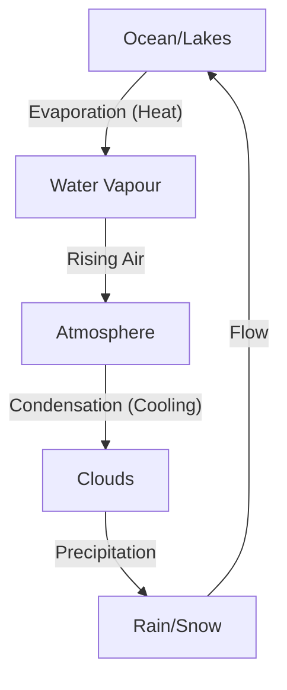

import Callout from '@/components/Callout.astro'

## Cloud Formation

We know that warm air rises. As air moves higher into the atmosphere, it gets **cooler**.

1.  **Evaporation:** Water from oceans, lakes, and rivers evaporates into the air as water vapour.
2.  **Cooling:** As this vapour rises, it reaches high altitudes where the air is cold.
3.  **Condensation:** The cold air causes the water vapour to condense into tiny water droplets.
4.  **Dust Particles:** These droplets usually form around tiny dust particles floating in the air.
5.  **Clouds:** Huge clusters of these tiny droplets float in the air and appear to us as **clouds**.

## Rain and Snow

*   When the tiny droplets in clouds join together, they become larger and heavier.
*   When they become too heavy to float, they fall down as **rain**.
*   If the temperature is extremely cold, the water droplets freeze and fall as **hail** or **snow**.

## The Water Cycle

This continuous journey of water is called the **Water Cycle**. It ensures that water is naturally recycled on Earth.

### The Cycle Steps
1.  **Groundwater/Surface Water:** Water exists in oceans, rivers, and lakes.
2.  **Evaporation:** Sun heats the water; it turns to vapour and rises.
3.  **Condensation:** Vapour cools to form clouds.
4.  **Precipitation:** Water falls back as rain/snow.
5.  **Collection:** Rainwater flows back into rivers and oceans, and the cycle repeats.

<Callout variant="warning">
**Importance:** Only a small portion of Earth's water is fresh and fit for use. The water cycle replenishes freshwater, but we must conserve it and prevent pollution.
</Callout>