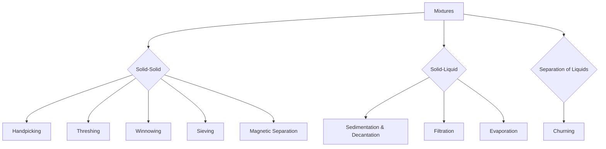

import Callout from '@/components/Callout.astro'

## Introduction

In our daily lives, we often come across mixtures of substances. Whether it's separating stones from rice before cooking, filtering tea leaves from tea, or churning milk to get butter, the act of **separation** is fundamental. 

This chapter follows the journey of Malli and Valli as they travel across India, observing how farmers, family members, and industries separate useful substances from unwanted ones.

### Why do we separate substances?
1.  **To remove harmful or non-useful components** (e.g., stones from rice).
2.  **To separate two different but useful components** (e.g., butter from curd).
3.  **To remove impurities** to get a pure substance (e.g., salt from seawater).

### Chapter Roadmap

The chapter covers the following key methods of separation:

1.  **Handpicking**: For visible impurities.
2.  **Threshing**: Separating grains from stalks.
3.  **Winnowing**: Using wind to separate lighter husk from heavier grains.
4.  **Sieving**: Separating particles of different sizes.
5.  **Sedimentation, Decantation, and Filtration**: Separating insoluble solids from liquids.
6.  **Evaporation**: Separating soluble solids from liquids.
7.  **Churning**: Separating butter from milk/curd.
8.  **Magnetic Separation**: Using magnets to extract magnetic materials.

<Callout variant="tip">
**Quick Fact:** Traditional methods like using a *soop* (bamboo tray) for winnowing are still widely used in Indian agriculture!
</Callout>

### Concept Map

