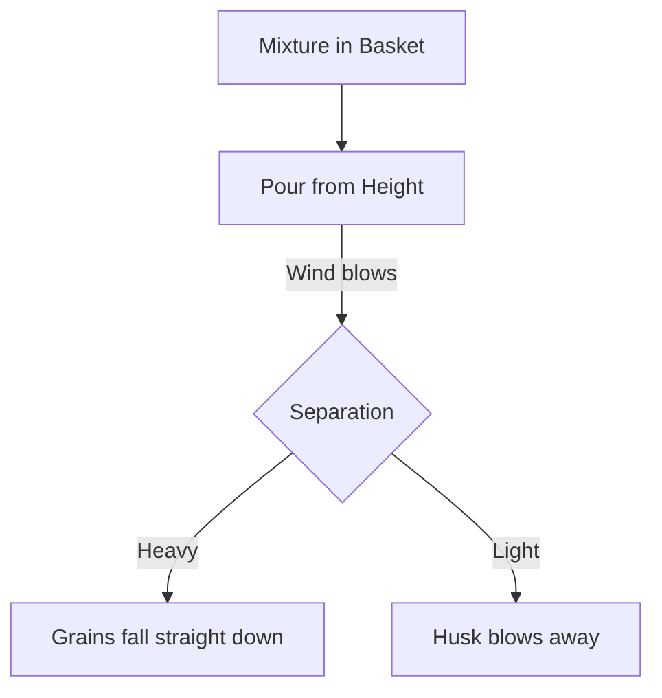

import Callout from '@/components/Callout.astro'

## Threshing

Once a crop like wheat or paddy is harvested, the stalks are dried in the sun. The grains are attached to these dry stalks. Plucking grains one by one (like picking mangoes) is impossible because there are thousands of grains!

**Definition:** The process of beating stalks to separate the grains from them is called **threshing**.

### Methods of Threshing
1.  **Manual:** Farmers hold a bundle of stalks and beat them against a hard surface (like a wooden log or rock). The impact loosens the grains.
2.  **Bullocks:** In traditional methods, bullocks trample over the stalks.
3.  **Machines:** Modern technological developments have led to **threshers**, machines that separate grains from stalks and husk quickly.

---

## Winnowing

After threshing, we get a mixture of grains and husk (the dry outer covering). We need to separate them. Since grains are heavier than husk, we use the property of **weight** and **wind**.

**Definition:** The method of separating heavier and lighter components of a mixture by wind or blowing air is called **winnowing**.

### The Process
1.  The farmer stands on a raised platform.
2.  The mixture is placed in a *soop* (winnowing basket) or plate.
3.  The farmer tilts the basket and lets the mixture slide down slowly.
4.  **The Wind acts:**
    *   The **heavy grains** fall vertically straight down to form a heap.
    *   The **light husk** is blown away by the wind and forms a heap at a distance.

<Callout variant="tip">
**Principle:** Winnowing relies on the difference in **weight** (density) of the two components. Air resistance affects the lighter particles more.
</Callout>

### Visualization of Winnowing

The separated husk is often used as fodder for cattle, while the grain is stored for food.