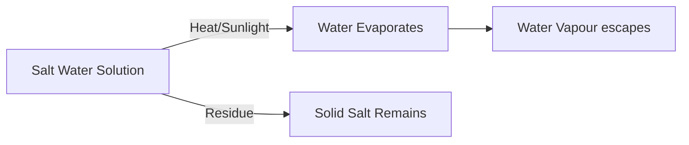

import Callout from '@/components/Callout.astro'

## Evaporation

When a solid dissolves in a liquid (like salt in water), we cannot use filtration or sedimentation because the particles are too small and mixed thoroughly.

To separate them, we heat the mixture.

**Definition:** The process in which a liquid gets converted into its vapour is called **evaporation**.

### The Process
1.  Heat the solution containing the dissolved solid.
2.  The water (solvent) boils and turns into steam (vapour).
3.  The solid (solute) cannot evaporate, so it is left behind in the container.

### Real-World Example: Making Salt
Common salt (namak) is obtained from **seawater**.
1.  Seawater is trapped in shallow pits (lagoons).
2.  It is exposed to sunlight and wind.
3.  The water slowly evaporates over a few days.
4.  Solid salt crystals are left behind.
5.  This crude salt is then purified for consumption.

<Callout variant="tip">
**Activity Reflection:** If you mix salt in water, filter it (salt passes through), and then boil it dry, you will see white residue in the vessel. That is the salt you recovered!
</Callout>

### Diagram: Evaporation Cycle

