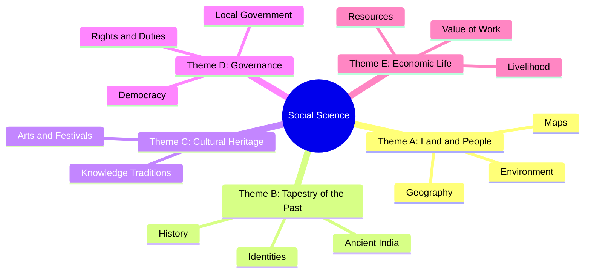

<<<FILE_START: index.mdx>>>
---
title: "Locating Places on the Earth"
description: "Introduction to maps, globes, and the coordinate system of latitudes and longitudes."
date: 2024-04-10
tags: ["geography", "maps", "latitudes", "longitudes", "social-science"]
order: 1
draft: false
---

import Callout from '@/components/Callout.astro'

## Introduction

In this chapter, we explore how humans represent the Earth and locate specific points on its surface. From simple city maps to the global grid of latitudes and longitudes, we learn the tools that make navigation and time-keeping possible.

### Why Social Science?
Before diving into geography, it is important to understand that Social Science is the study of human society. It helps us:
- Understand the world and our place in it.
- Learn how to live in peace and harmony.
- Protect our planet for future generations.

<Callout variant="info">
**The Multidisciplinary Approach:** Social Science is not just one subject. It combines History, Geography, Political Science, Economics, and more to provide a holistic view of human life.
</Callout>

## Chapter Summary

### Key Components of Maps
1. **Distance (Scale):** Relates distance on the map to actual distance on the ground.
2. **Direction:** Uses cardinal points (N, S, E, W) and intermediate directions (NE, SE, SW, NW).
3. **Symbols:** Representations of real-world features like roads, rivers, and buildings.

### The Global Grid
- **Latitudes:** Imaginary horizontal lines parallel to the Equator ($0^\circ$).
- **Longitudes:** Imaginary vertical lines (meridians) running from the North Pole to the South Pole.
- **Coordinates:** The intersection of a latitude and a longitude that defines a precise location.

## List of Topics
1. [Maps and Their Components](./topics/01-maps-and-components)
2. [Understanding the Globe and Coordinates](./topics/02-latitudes-and-longitudes)
3. [Time Zones and the International Date Line](./topics/03-time-zones-and-idl)

---

## Quick Formula Sheet

$$
\text{Map Scale Ratio} = \frac{\text{Distance on Map}}{\text{Distance on Ground}}
$$

$$
1^\circ \text{ Longitude} = 4 \text{ minutes of time}
$$

$$
15^\circ \text{ Longitude} = 1 \text{ hour of time}
$$

$$
\text{Total Longitude} = 360^\circ \text{ (Full Rotation in 24 hours)}
$$

<<<FILE_END>>>

<<<FILE_START: topics/01-maps-and-components.mdx>>>
---
title: "Maps and Their Components"
description: "Understanding how maps represent the world using scale, direction, and symbols."
date: 2024-04-10
tags: ["maps", "scale", "direction", "cartography"]
order: 2
draft: false
---

import Callout from '@/components/Callout.astro'

## What is a Map?

A map is a representation or a drawing of an area on a flat surface, viewed from the top. It can represent a small area like a village or a large area like the entire world.

### Types of Maps
- **Physical Maps:** Show natural features like mountains, rivers, and oceans.
- **Political Maps:** Show boundaries of countries, states, and cities.
- **Thematic Maps:** Focus on specific information, such as rainfall or road networks.

## Components of a Map

### 1. Distance (Scale)
Since we cannot draw the actual size of the Earth on paper, we use a **Scale**.
- **Example:** If $1 \text{ cm}$ on the map represents $500 \text{ m}$ on the ground, the scale is $1 \text{ cm} = 500 \text{ m}$.

### 2. Direction
Most maps use an arrow marked with 'N' to indicate North. From North, we can determine the other **Cardinal Directions**.

<svg width="200" height="200" viewBox="0 0 200 200">
  <!-- Cross lines -->
  <line x1="100" y1="20" x2="100" y2="180" stroke="currentColor" stroke-width="2" />
  <line x1="20" y1="100" x2="180" y2="100" stroke="currentColor" stroke-width="2" />
  <!-- Diagonal lines -->
  <line x1="45" y1="45" x2="155" y2="155" stroke="currentColor" stroke-width="1" stroke-dasharray="4" />
  <line x1="155" y1="45" x2="45" y2="155" stroke="currentColor" stroke-width="1" stroke-dasharray="4" />
  <!-- Labels -->
  <text x="100" y="15" text-anchor="middle" fill="currentColor" font-weight="bold">N</text>
  <text x="100" y="195" text-anchor="middle" fill="currentColor" font-weight="bold">S</text>
  <text x="190" y="105" text-anchor="middle" fill="currentColor" font-weight="bold">E</text>
  <text x="10" y="105" text-anchor="middle" fill="currentColor" font-weight="bold">W</text>
  <!-- Intermediate Labels -->
  <text x="160" y="40" text-anchor="middle" fill="currentColor" font-size="12">NE</text>
  <text x="40" y="40" text-anchor="middle" fill="currentColor" font-size="12">NW</text>
  <text x="160" y="170" text-anchor="middle" fill="currentColor" font-size="12">SE</text>
  <text x="40" y="170" text-anchor="middle" fill="currentColor" font-size="12">SW</text>
</svg>

### 3. Symbols
Symbols are used to show details like railway lines, bridges, or temples in a limited space.
- **PO:** Post Office
- **PS:** Police Station
- **RS:** Railway Station

<Callout variant="tip">
**Atlas:** A collection of maps bound together in a book is called an Atlas.
</Callout>

<<<FILE_END>>>

<<<FILE_START: topics/02-latitudes-and-longitudes.mdx>>>
---
title: "The Globe: Latitudes and Longitudes"
description: "How the coordinate system of the Earth works using imaginary lines."
date: 2024-04-10
tags: ["globe", "latitudes", "longitudes", "equator", "prime-meridian"]
order: 3
draft: false
---

import Callout from '@/components/Callout.astro'

## The Globe
A globe is a spherical model of the Earth. It represents the Earth more accurately than a flat map because the Earth is not flat; it is a sphere (slightly flattened at the poles).

## Parallels of Latitude
Latitudes are imaginary circles drawn parallel to the Equator.

- **Equator:** The largest circle, dividing the Earth into the Northern and Southern Hemispheres. It is marked as $0^\circ$.
- **North Pole:** $90^\circ \text{N}$
- **South Pole:** $90^\circ \text{S}$

<svg width="200" height="200" viewBox="0 0 200 200">
  <circle cx="100" cy="100" r="80" stroke="currentColor" fill="none" stroke-width="2" />
  <!-- Equator -->
  <ellipse cx="100" cy="100" rx="80" ry="20" stroke="currentColor" fill="none" />
  <text x="110" y="95" fill="currentColor" font-size="10">Equator (0°)</text>
  <!-- Latitudes -->
  <ellipse cx="100" cy="60" rx="69" ry="12" stroke="currentColor" fill="none" stroke-dasharray="2" />
  <ellipse cx="100" cy="140" rx="69" ry="12" stroke="currentColor" fill="none" stroke-dasharray="2" />
  <!-- Axis -->
  <line x1="100" y1="10" x2="100" y2="190" stroke="currentColor" stroke-width="1" />
  <text x="100" y="10" text-anchor="middle" fill="currentColor" font-size="10">North Pole</text>
</svg>

## Meridians of Longitude
Longitudes are semi-circles running from the North Pole to the South Pole.

- **Prime Meridian:** The $0^\circ$ longitude passing through Greenwich, London.
- **Calculation:** Longitudes go from $0^\circ$ to $180^\circ$ East and $0^\circ$ to $180^\circ$ West.
- **180° Longitude:** The point where East and West longitudes meet.

## Coordinates
The point where a latitude and a longitude cross is called a **Coordinate**.
- **Example:** Delhi is located at approximately $29^\circ \text{N}$ latitude and $77^\circ \text{E}$ longitude.

<Callout variant="info">
**Historical Note:** Long before the Greenwich Meridian, Indian astronomers used a Prime Meridian called **Madhya Rekhā**, which passed through the city of **Ujjayini** (modern-day Ujjain).
</Callout>

<<<FILE_END>>>

<<<FILE_START: topics/03-time-zones-and-idl.mdx>>>
---
title: "Time Zones and Time Calculation"
description: "Understanding how longitude determines local and standard time."
date: 2024-04-10
tags: ["time-zones", "IST", "GMT", "IDL"]
order: 4
draft: false
---

import Callout from '@/components/Callout.astro'

## Why does Time Change?
As the Earth rotates from **West to East**, different longitudes face the Sun at different times.

### The Math of Time
The Earth completes a $360^\circ$ rotation in 24 hours.
- $360^\circ \div 24 \text{ hours} = 15^\circ \text{ per hour}$.
- Therefore, $1^\circ$ change in longitude = **4 minutes**.

## Local Time vs. Standard Time
- **Local Time:** Determined by the position of the Sun at a specific longitude.
- **Standard Time:** A uniform time adopted by a country to avoid confusion.

### Indian Standard Time (IST)
India uses the $82.5^\circ \text{E}$ longitude as its standard meridian.
- IST is **5 hours 30 minutes ahead** of Greenwich Mean Time (GMT).

$$
\text{Time difference} = 82.5^\circ \times 4 \text{ min} = 330 \text{ min} = 5.5 \text{ hours}
$$

## International Date Line (IDL)
The IDL is located approximately at $180^\circ$ longitude.
- Crossing it from **East to West**: Add a day (Sunday becomes Monday).
- Crossing it from **West to East**: Subtract a day (Monday becomes Sunday).

<Callout variant="warning">
The International Date Line is not a straight line. It zig-zags to avoid crossing through countries, so that a single country doesn't have two different dates at the same time!
</Callout>

<<<FILE_END>>>

<<<FILE_START: solutions/ex-1.1.mdx>>>
---
title: "Questions, Activities and Projects"
description: "Step-by-step solutions to Chapter 1 exercises."
date: 2024-04-10
tags: ["solutions", "geography", "exercise"]
order: 5
draft: false
---

import Callout from '@/components/Callout.astro'

## Exercises

**Q1. Calculate the real distance from the estuary of the Narmada River to the estuary of the Ganga river (using scale 2.5 cm = 500 km).**
*Solution:*
1. Measure the distance on the map between the two points using a ruler (assume the measurement is approx. $7.5 \text{ cm}$ based on textbook context).
2. If $2.5 \text{ cm} = 500 \text{ km}$, then $1 \text{ cm} = 200 \text{ km}$.
3. Real Distance $= 7.5 \text{ cm} \times 200 \text{ km/cm} = 1500 \text{ km}$.

**Q2. Why is it 5:30 pm in India when it is 12 pm or noon in London?**
*Solution:*
London is at $0^\circ$ (GMT) and India's Standard Time is based on $82.5^\circ \text{E}$.
- Difference in longitude $= 82.5^\circ - 0^\circ = 82.5^\circ$.
- Since $1^\circ = 4$ minutes, $82.5 \times 4 = 330$ minutes.
- $330 \text{ minutes} = 5$ hours and $30$ minutes.
Since India is to the East, we add the time. So, $12:00 + 5:30 = 5:30 \text{ pm}$.

**Q3. Why do we need symbols and colours in the map?**
*Solution:*
Maps have limited space. We cannot draw actual buildings, trees, or railway tracks. Symbols and colours allow us to represent a vast amount of information clearly and concisely.

**Q4. Find out what you have in the eight directions from your home or school.**
*Solution:* (This is a student activity. Use a compass or a phone app to identify landmarks like a park to the North, a shop to the East, etc.)

**Q5. Difference between local time and standard time.**
*Solution:*
- **Local Time** is specific to a particular longitude based on the Sun's position. Every longitude has a different local time.
- **Standard Time** is a single time adopted for an entire region or country to ensure synchronization in transport, communication, and business. For example, India has one IST despite spanning nearly $30^\circ$ of longitude.

**Q6. Delhi ($29^\circ \text{N}$) and Bengaluru ($13^\circ \text{N}$) longitudes are almost the same ($77^\circ \text{E}$). How much will be the difference in local time?**
*Solution:*
Since local time depends on **longitude** and not latitude, and both cities are on the same longitude ($77^\circ \text{E}$), there will be **no difference** in their local time.

**Q7. True or False:**
1. All parallels of latitude have the same length. — **False** (They get smaller towards the poles).
2. The length of a meridian of longitude is half of that of the Equator. — **True** (Meridians are semi-circles).
3. The South Pole has a latitude of $90^\circ \text{S}$. — **True**.
4. In Assam, the local time and the IST are identical. — **False** (IST is based on $82.5^\circ \text{E}$, while Assam is further East).
5. Lines separating time zones are identical with meridians. — **False** (They follow political borders).
6. The Equator is also a parallel of latitude. — **True**.

<<<FILE_END>>>

<<<FILE_START: practice/solved-examples.mdx>>>
---
title: "Solved Examples & Practice"
description: "Additional practice including the crossword solution and logical problems."
date: 2024-04-10
tags: ["practice", "crossword", "geography"]
order: 6
draft: false
---

## Crossword Solution (Page 25)

Based on the clues provided in the textbook:

### Across
1. **SCALE** (Lets you squeeze a huge area into your map)
4. **GLOBE** (A convenient sphere)
5. **EQUATOR** (The longest parallel of latitude)
6. **GREENWICH** (The place the Prime Meridian is attached to)
8. **MAP** (So convenient to find your way)
10. **LATITUDE** (A measure of the distance from the Equator)

### Down
2. **LONGITUDE** (A measure of distance from the Prime Meridian)
3. **COORDINATES** (These two together allow us to locate a place)
6. **GRID** (What latitudes and longitudes together create)
7. **IST** (The time we all follow in India)
9. **POLE** (On top of the world)
11. **IDL** (Abbreviation for the line where day/date change)

---

## Logic Practice: Time Calculation

**Question:** If it is 10:00 AM at the Prime Meridian ($0^\circ$), what is the local time at $30^\circ \text{W}$?

**Step-by-Step Solution:**
1. **Identify Longitude Difference:** $30^\circ - 0^\circ = 30^\circ$.
2. **Convert to Time:** $15^\circ = 1$ hour, so $30^\circ = 2$ hours.
3. **Determine Direction:** $30^\circ \text{W}$ is to the West of the Prime Meridian.
4. **Calculate:** In the West, time is "behind."
   $$10:00 \text{ AM} - 2 \text{ hours} = 8:00 \text{ AM}$$.

**Answer:** The local time is 8:00 AM.

---

## Social Science Themes (From Introduction)

<<<FILE_END>>><<<FILE_START: index.mdx>>>
---
title: "Locating Places on the Earth"
description: "Introduction to maps, globes, and the coordinate system of latitudes and longitudes."
date: 2024-04-10
tags: ["geography", "maps", "latitudes", "longitudes", "social-science"]
order: 1
draft: false
---

import Callout from '@/components/Callout.astro'

## Introduction

In this chapter, we explore how humans represent the Earth and locate specific points on its surface. From simple city maps to the global grid of latitudes and longitudes, we learn the tools that make navigation and time-keeping possible.

### Why Social Science?
Before diving into geography, it is important to understand that Social Science is the study of human society. It helps us:
- Understand the world and our place in it.
- Learn how to live in peace and harmony.
- Protect our planet for future generations.

<Callout variant="info">
**The Multidisciplinary Approach:** Social Science is not just one subject. It combines History, Geography, Political Science, Economics, and more to provide a holistic view of human life.
</Callout>

## Chapter Summary

### Key Components of Maps
1. **Distance (Scale):** Relates distance on the map to actual distance on the ground.
2. **Direction:** Uses cardinal points (N, S, E, W) and intermediate directions (NE, SE, SW, NW).
3. **Symbols:** Representations of real-world features like roads, rivers, and buildings.

### The Global Grid
- **Latitudes:** Imaginary horizontal lines parallel to the Equator ($0^\circ$).
- **Longitudes:** Imaginary vertical lines (meridians) running from the North Pole to the South Pole.
- **Coordinates:** The intersection of a latitude and a longitude that defines a precise location.

## List of Topics
1. [Maps and Their Components](./topics/01-maps-and-components)
2. [Understanding the Globe and Coordinates](./topics/02-latitudes-and-longitudes)
3. [Time Zones and the International Date Line](./topics/03-time-zones-and-idl)

---

## Quick Formula Sheet

$$
\text{Map Scale Ratio} = \frac{\text{Distance on Map}}{\text{Distance on Ground}}
$$

$$
1^\circ \text{ Longitude} = 4 \text{ minutes of time}
$$

$$
15^\circ \text{ Longitude} = 1 \text{ hour of time}
$$

$$
\text{Total Longitude} = 360^\circ \text{ (Full Rotation in 24 hours)}
$$

<<<FILE_END>>>

<<<FILE_START: topics/01-maps-and-components.mdx>>>
---
title: "Maps and Their Components"
description: "Understanding how maps represent the world using scale, direction, and symbols."
date: 2024-04-10
tags: ["maps", "scale", "direction", "cartography"]
order: 2
draft: false
---

import Callout from '@/components/Callout.astro'

## What is a Map?

A map is a representation or a drawing of an area on a flat surface, viewed from the top. It can represent a small area like a village or a large area like the entire world.

### Types of Maps
- **Physical Maps:** Show natural features like mountains, rivers, and oceans.
- **Political Maps:** Show boundaries of countries, states, and cities.
- **Thematic Maps:** Focus on specific information, such as rainfall or road networks.

## Components of a Map

### 1. Distance (Scale)
Since we cannot draw the actual size of the Earth on paper, we use a **Scale**.
- **Example:** If $1 \text{ cm}$ on the map represents $500 \text{ m}$ on the ground, the scale is $1 \text{ cm} = 500 \text{ m}$.

### 2. Direction
Most maps use an arrow marked with 'N' to indicate North. From North, we can determine the other **Cardinal Directions**.

<svg width="200" height="200" viewBox="0 0 200 200">
  <!-- Cross lines -->
  <line x1="100" y1="20" x2="100" y2="180" stroke="currentColor" stroke-width="2" />
  <line x1="20" y1="100" x2="180" y2="100" stroke="currentColor" stroke-width="2" />
  <!-- Diagonal lines -->
  <line x1="45" y1="45" x2="155" y2="155" stroke="currentColor" stroke-width="1" stroke-dasharray="4" />
  <line x1="155" y1="45" x2="45" y2="155" stroke="currentColor" stroke-width="1" stroke-dasharray="4" />
  <!-- Labels -->
  <text x="100" y="15" text-anchor="middle" fill="currentColor" font-weight="bold">N</text>
  <text x="100" y="195" text-anchor="middle" fill="currentColor" font-weight="bold">S</text>
  <text x="190" y="105" text-anchor="middle" fill="currentColor" font-weight="bold">E</text>
  <text x="10" y="105" text-anchor="middle" fill="currentColor" font-weight="bold">W</text>
  <!-- Intermediate Labels -->
  <text x="160" y="40" text-anchor="middle" fill="currentColor" font-size="12">NE</text>
  <text x="40" y="40" text-anchor="middle" fill="currentColor" font-size="12">NW</text>
  <text x="160" y="170" text-anchor="middle" fill="currentColor" font-size="12">SE</text>
  <text x="40" y="170" text-anchor="middle" fill="currentColor" font-size="12">SW</text>
</svg>

### 3. Symbols
Symbols are used to show details like railway lines, bridges, or temples in a limited space.
- **PO:** Post Office
- **PS:** Police Station
- **RS:** Railway Station

<Callout variant="tip">
**Atlas:** A collection of maps bound together in a book is called an Atlas.
</Callout>

<<<FILE_END>>>

<<<FILE_START: topics/02-latitudes-and-longitudes.mdx>>>
---
title: "The Globe: Latitudes and Longitudes"
description: "How the coordinate system of the Earth works using imaginary lines."
date: 2024-04-10
tags: ["globe", "latitudes", "longitudes", "equator", "prime-meridian"]
order: 3
draft: false
---

import Callout from '@/components/Callout.astro'

## The Globe
A globe is a spherical model of the Earth. It represents the Earth more accurately than a flat map because the Earth is not flat; it is a sphere (slightly flattened at the poles).

## Parallels of Latitude
Latitudes are imaginary circles drawn parallel to the Equator.

- **Equator:** The largest circle, dividing the Earth into the Northern and Southern Hemispheres. It is marked as $0^\circ$.
- **North Pole:** $90^\circ \text{N}$
- **South Pole:** $90^\circ \text{S}$

<svg width="200" height="200" viewBox="0 0 200 200">
  <circle cx="100" cy="100" r="80" stroke="currentColor" fill="none" stroke-width="2" />
  <!-- Equator -->
  <ellipse cx="100" cy="100" rx="80" ry="20" stroke="currentColor" fill="none" />
  <text x="110" y="95" fill="currentColor" font-size="10">Equator (0°)</text>
  <!-- Latitudes -->
  <ellipse cx="100" cy="60" rx="69" ry="12" stroke="currentColor" fill="none" stroke-dasharray="2" />
  <ellipse cx="100" cy="140" rx="69" ry="12" stroke="currentColor" fill="none" stroke-dasharray="2" />
  <!-- Axis -->
  <line x1="100" y1="10" x2="100" y2="190" stroke="currentColor" stroke-width="1" />
  <text x="100" y="10" text-anchor="middle" fill="currentColor" font-size="10">North Pole</text>
</svg>

## Meridians of Longitude
Longitudes are semi-circles running from the North Pole to the South Pole.

- **Prime Meridian:** The $0^\circ$ longitude passing through Greenwich, London.
- **Calculation:** Longitudes go from $0^\circ$ to $180^\circ$ East and $0^\circ$ to $180^\circ$ West.
- **180° Longitude:** The point where East and West longitudes meet.

## Coordinates
The point where a latitude and a longitude cross is called a **Coordinate**.
- **Example:** Delhi is located at approximately $29^\circ \text{N}$ latitude and $77^\circ \text{E}$ longitude.

<Callout variant="info">
**Historical Note:** Long before the Greenwich Meridian, Indian astronomers used a Prime Meridian called **Madhya Rekhā**, which passed through the city of **Ujjayini** (modern-day Ujjain).
</Callout>

<<<FILE_END>>>

<<<FILE_START: topics/03-time-zones-and-idl.mdx>>>
---
title: "Time Zones and Time Calculation"
description: "Understanding how longitude determines local and standard time."
date: 2024-04-10
tags: ["time-zones", "IST", "GMT", "IDL"]
order: 4
draft: false
---

import Callout from '@/components/Callout.astro'

## Why does Time Change?
As the Earth rotates from **West to East**, different longitudes face the Sun at different times.

### The Math of Time
The Earth completes a $360^\circ$ rotation in 24 hours.
- $360^\circ \div 24 \text{ hours} = 15^\circ \text{ per hour}$.
- Therefore, $1^\circ$ change in longitude = **4 minutes**.

## Local Time vs. Standard Time
- **Local Time:** Determined by the position of the Sun at a specific longitude.
- **Standard Time:** A uniform time adopted by a country to avoid confusion.

### Indian Standard Time (IST)
India uses the $82.5^\circ \text{E}$ longitude as its standard meridian.
- IST is **5 hours 30 minutes ahead** of Greenwich Mean Time (GMT).

$$
\text{Time difference} = 82.5^\circ \times 4 \text{ min} = 330 \text{ min} = 5.5 \text{ hours}
$$

## International Date Line (IDL)
The IDL is located approximately at $180^\circ$ longitude.
- Crossing it from **East to West**: Add a day (Sunday becomes Monday).
- Crossing it from **West to East**: Subtract a day (Monday becomes Sunday).

<Callout variant="warning">
The International Date Line is not a straight line. It zig-zags to avoid crossing through countries, so that a single country doesn't have two different dates at the same time!
</Callout>

<<<FILE_END>>>

<<<FILE_START: solutions/ex-1.1.mdx>>>
---
title: "Questions, Activities and Projects"
description: "Step-by-step solutions to Chapter 1 exercises."
date: 2024-04-10
tags: ["solutions", "geography", "exercise"]
order: 5
draft: false
---

import Callout from '@/components/Callout.astro'

## Exercises

**Q1. Calculate the real distance from the estuary of the Narmada River to the estuary of the Ganga river (using scale 2.5 cm = 500 km).**
*Solution:*
1. Measure the distance on the map between the two points using a ruler (assume the measurement is approx. $7.5 \text{ cm}$ based on textbook context).
2. If $2.5 \text{ cm} = 500 \text{ km}$, then $1 \text{ cm} = 200 \text{ km}$.
3. Real Distance $= 7.5 \text{ cm} \times 200 \text{ km/cm} = 1500 \text{ km}$.

**Q2. Why is it 5:30 pm in India when it is 12 pm or noon in London?**
*Solution:*
London is at $0^\circ$ (GMT) and India's Standard Time is based on $82.5^\circ \text{E}$.
- Difference in longitude $= 82.5^\circ - 0^\circ = 82.5^\circ$.
- Since $1^\circ = 4$ minutes, $82.5 \times 4 = 330$ minutes.
- $330 \text{ minutes} = 5$ hours and $30$ minutes.
Since India is to the East, we add the time. So, $12:00 + 5:30 = 5:30 \text{ pm}$.

**Q3. Why do we need symbols and colours in the map?**
*Solution:*
Maps have limited space. We cannot draw actual buildings, trees, or railway tracks. Symbols and colours allow us to represent a vast amount of information clearly and concisely.

**Q4. Find out what you have in the eight directions from your home or school.**
*Solution:* (This is a student activity. Use a compass or a phone app to identify landmarks like a park to the North, a shop to the East, etc.)

**Q5. Difference between local time and standard time.**
*Solution:*
- **Local Time** is specific to a particular longitude based on the Sun's position. Every longitude has a different local time.
- **Standard Time** is a single time adopted for an entire region or country to ensure synchronization in transport, communication, and business. For example, India has one IST despite spanning nearly $30^\circ$ of longitude.

**Q6. Delhi ($29^\circ \text{N}$) and Bengaluru ($13^\circ \text{N}$) longitudes are almost the same ($77^\circ \text{E}$). How much will be the difference in local time?**
*Solution:*
Since local time depends on **longitude** and not latitude, and both cities are on the same longitude ($77^\circ \text{E}$), there will be **no difference** in their local time.

**Q7. True or False:**
1. All parallels of latitude have the same length. — **False** (They get smaller towards the poles).
2. The length of a meridian of longitude is half of that of the Equator. — **True** (Meridians are semi-circles).
3. The South Pole has a latitude of $90^\circ \text{S}$. — **True**.
4. In Assam, the local time and the IST are identical. — **False** (IST is based on $82.5^\circ \text{E}$, while Assam is further East).
5. Lines separating time zones are identical with meridians. — **False** (They follow political borders).
6. The Equator is also a parallel of latitude. — **True**.

<<<FILE_END>>>

<<<FILE_START: practice/solved-examples.mdx>>>
---
title: "Solved Examples & Practice"
description: "Additional practice including the crossword solution and logical problems."
date: 2024-04-10
tags: ["practice", "crossword", "geography"]
order: 6
draft: false
---

## Crossword Solution (Page 25)

Based on the clues provided in the textbook:

### Across
1. **SCALE** (Lets you squeeze a huge area into your map)
4. **GLOBE** (A convenient sphere)
5. **EQUATOR** (The longest parallel of latitude)
6. **GREENWICH** (The place the Prime Meridian is attached to)
8. **MAP** (So convenient to find your way)
10. **LATITUDE** (A measure of the distance from the Equator)

### Down
2. **LONGITUDE** (A measure of distance from the Prime Meridian)
3. **COORDINATES** (These two together allow us to locate a place)
6. **GRID** (What latitudes and longitudes together create)
7. **IST** (The time we all follow in India)
9. **POLE** (On top of the world)
11. **IDL** (Abbreviation for the line where day/date change)

---

## Logic Practice: Time Calculation

**Question:** If it is 10:00 AM at the Prime Meridian ($0^\circ$), what is the local time at $30^\circ \text{W}$?

**Step-by-Step Solution:**
1. **Identify Longitude Difference:** $30^\circ - 0^\circ = 30^\circ$.
2. **Convert to Time:** $15^\circ = 1$ hour, so $30^\circ = 2$ hours.
3. **Determine Direction:** $30^\circ \text{W}$ is to the West of the Prime Meridian.
4. **Calculate:** In the West, time is "behind."
   $$10:00 \text{ AM} - 2 \text{ hours} = 8:00 \text{ AM}$$.

**Answer:** The local time is 8:00 AM.

---

## Social Science Themes (From Introduction)

<<<FILE_END>>>
