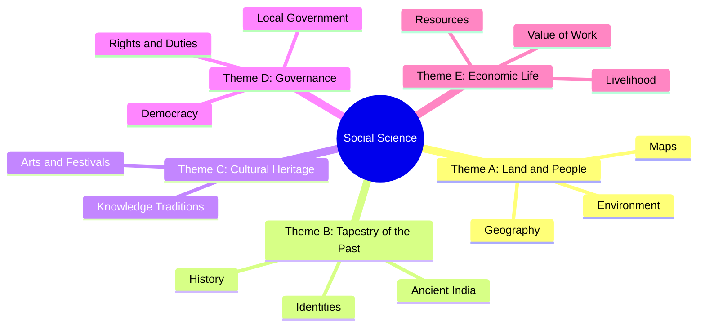

## Crossword Solution (Page 25)

Based on the clues provided in the textbook:

### Across
1. **SCALE** (Lets you squeeze a huge area into your map)
4. **GLOBE** (A convenient sphere)
5. **EQUATOR** (The longest parallel of latitude)
6. **GREENWICH** (The place the Prime Meridian is attached to)
8. **MAP** (So convenient to find your way)
10. **LATITUDE** (A measure of the distance from the Equator)

### Down
2. **LONGITUDE** (A measure of distance from the Prime Meridian)
3. **COORDINATES** (These two together allow us to locate a place)
6. **GRID** (What latitudes and longitudes together create)
7. **IST** (The time we all follow in India)
9. **POLE** (On top of the world)
11. **IDL** (Abbreviation for the line where day/date change)

---

## Logic Practice: Time Calculation

**Question:** If it is 10:00 AM at the Prime Meridian ($0^\circ$), what is the local time at $30^\circ \text{W}$?

**Step-by-Step Solution:**
1. **Identify Longitude Difference:** $30^\circ - 0^\circ = 30^\circ$.
2. **Convert to Time:** $15^\circ = 1$ hour, so $30^\circ = 2$ hours.
3. **Determine Direction:** $30^\circ \text{W}$ is to the West of the Prime Meridian.
4. **Calculate:** In the West, time is "behind."
   $$10:00 \text{ AM} - 2 \text{ hours} = 8:00 \text{ AM}$$.

**Answer:** The local time is 8:00 AM.

---

## Social Science Themes (From Introduction)

