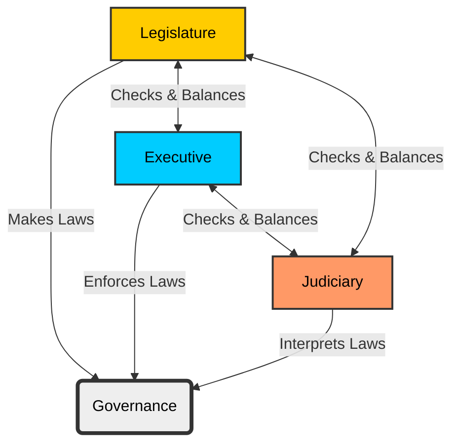

<<<FILE_START: index.mdx>>>
---
title: "Grassroots Democracy: Governance"
description: "An introduction to the concepts of Governance, Government, and the need for rules in society."
date: 2025-01-20
tags: ["civics", "governance", "democracy", "class-6"]
order: 1
draft: false
---

import Callout from '@/components/Callout.astro'

## Introduction

Human beings have lived in communities for a long time. When many people live together, disagreements and disorder can arise. To maintain order and harmony in society, rules become necessary.

Think about your daily life:
*   **Home:** You follow simple rules set by your parents.
*   **School:** Students and teachers follow specific rules.
*   **Traffic:** Drivers must obey traffic signals to avoid accidents.

<Callout variant="tip">
**The Big Question:** What would happen if no one followed these rules?
**Answer:** Society would not be able to function, leading to chaos and confusion.
</Callout>

### What is Governance?

The process of managing a society involves making decisions, creating rules, and ensuring they are followed.

*   **Governance:** The process of taking decisions, organizing society's life with different sets of rules, and ensuring that they are followed.
*   **Government:** The group of individuals or the system that makes the rules and ensures they are followed.
*   **Laws:** Some of the most important rules that are legally enforceable are called laws.

### Why do rules change?

Rules are not set in stone forever. Just as you might negotiate a rule at home or students might ask a school principal to change a regulation, citizens in a society also have a say in the laws governing them.

## Chapter Overview

In this chapter, we will explore:
1.  **The Three Organs of Government**: How the government functions.
2.  **The Three Levels of Government**: How power is distributed across the country.
3.  **Democracy**: The role of the people in governance.

<<<FILE_END>>>

<<<FILE_START: topics/01-three-organs.mdx>>>
---
title: "Three Organs of Government"
description: "Understanding the Legislature, Executive, and Judiciary."
date: 2025-01-20
tags: ["legislature", "executive", "judiciary", "civics"]
order: 2
draft: false
---

import Callout from '@/components/Callout.astro'

## The Structure of Government

A modern government is like a machine with three distinct parts, or "organs," that work together to ensuring society functions smoothly. In India, these three organs are the **Legislature**, the **Executive**, and the **Judiciary**.

### 1. The Legislature (Law-Makers)
The legislature is the organ responsible for making new laws (legislating). It is an assembly of elected representatives.
*   **Function:** Make, update, or remove laws.
*   **Example:** Passing a new law to fight cybercrime.

### 2. The Executive (Law-Implementers)
The executive is the organ that implements (executes) the laws.
*   **Composition:** Includes the Head of State (President), the Head of Government (Prime Minister/Chief Minister), ministers, and agencies like the police.
*   **Function:** Enforce laws and maintain order.
*   **Example:** The Cyber Police tracking down criminals based on the laws passed by the legislature.

### 3. The Judiciary (Law-Interpreters)
The judiciary is the system of courts.
*   **Function:** Decides if a law has been broken and determines punishments. It also checks if the Executive's actions are correct and if the Legislature's laws are fair.
*   **Example:** A court sentencing a cybercriminal to jail or a fine.

<Callout variant="tip">
**Separation of Powers:**
In a good governance system, these three organs are kept separate to provide a system of **checks and balances**. This prevents any single group from having too much power.
</Callout>

### Diagram: Separation of Powers

The following diagram illustrates how the three organs interact and balance each other within the framework of governance.

### Comparative Functions Table

The specific roles differ slightly between the **National (All India)** level and the **State** level.

| Feature | National Level (Central Govt) | State Level (State Govt) |
| :--- | :--- | :--- |
| **Legislature** | **Parliament**: Lok Sabha & Rajya Sabha | **State Assembly**: Vidhan Sabha (some states also have Vidhan Parishad) |
| **Executive** | **Nominal Head:** President **Real Head:** Prime Minister | **Nominal Head:** Governor **Real Head:** Chief Minister |
| **Judiciary** | **Supreme Court of India** | **High Courts** |

<Callout variant="info">
**Nominal Head:** This means "in name only." For example, the President of India has high status but the Prime Minister holds the actual executive power.
</Callout>

<<<FILE_END>>>

<<<FILE_START: topics/02-three-levels.mdx>>>
---
title: "Three Levels of Government"
description: "The hierarchy of governance: Local, State, and National."
date: 2025-01-20
tags: ["federalism", "levels of government", "civics"]
order: 3
draft: false
---

import Callout from '@/components/Callout.astro'

## The Tiered System

India is a vast country, so it is impossible to manage everything from one place. Therefore, the government operates at three distinct levels (or tiers).

### The Hierarchy

1.  **National Level (Central/Union Government):** Deals with matters concerning the entire country (e.g., defense, foreign affairs).
2.  **State Level (Regional Government):** Deals with matters concerning a specific state (e.g., state police, agriculture).
3.  **Local Level:** Deals with problems in towns or villages (e.g., local garbage collection, street lights).

  <svg width="400" height="320" viewBox="0 0 400 320" xmlns="http://www.w3.org/2000/svg">
    <!-- Definitions for text clarity -->
    <defs>
      
    </defs>

    <!-- Triangle Segments -->
    <!-- Top Tier: Central -->
    <path d="M200,20 L150,110 L250,110 Z" class="shape" />
    <text x="200" y="70" class="label">CENTRAL GOVERNMENT</text>
    <text x="200" y="90" class="desc">(National Level)</text>

    <!-- Middle Tier: State -->
    <path d="M150,110 L100,200 L300,200 L250,110 Z" class="shape" />
    <text x="200" y="160" class="label">STATE GOVERNMENT</text>
    <text x="200" y="180" class="desc">(Regional Level)</text>

    <!-- Bottom Tier: Local -->
    <path d="M100,200 L50,290 L350,290 L300,200 Z" class="shape" />
    <text x="200" y="250" class="label">LOCAL GOVERNMENT</text>
    <text x="200" y="270" class="desc">(Town/Village Level)</text>
  </svg>

### Real-World Example: Managing a Disaster

Imagine a heavy rain causes a flood. The response shows how levels interact:
*   **Minor Flood:** Local authorities (municipality/panchayat) handle drainage and relief.
*   **Severe Flood (District/State-wide):** The State Government steps in with rescue teams and funding.
*   **Massive Calamity:** The Central Government sends the Army and massive relief supplies.

### Division of Responsibilities

Different levels focus on different tasks to ensure efficiency.

| Area of Work | Central Government | State Government |
| :--- | :--- | :--- |
| **Security** | Defense, Atomic Energy | Police, Law and Order |
| **Economy** | Currency, Interstate Commerce | Agriculture, Irrigation |
| **Communication** | Foreign Affairs, Post & Telegraph | Public Health, Education* |
| **Policy** | National Policies | Implementation of Central Laws |

*\*Education is a subject where both Centre and State can make laws, but States manage day-to-day schooling infrastructure.*

<Callout variant="info">
**Mottos of India:**
*   **Government of India:** *Satyameva Jayate* ("Truth alone triumphs").
*   **Supreme Court:** *Yato Dharmastato Jayah* ("Where there is dharma, there is victory").
</Callout>

<<<FILE_END>>>

<<<FILE_START: topics/03-democracy.mdx>>>
---
title: "Democracy"
description: "Direct vs. Representative Democracy and the power of the people."
date: 2025-01-20
tags: ["democracy", "elections", "civics"]
order: 4
draft: false
---

import Callout from '@/components/Callout.astro'

## What is Democracy?

The word **democracy** comes from two Greek words:
*   *Dēmos* = People
*   *Kratos* = Rule or Power

Literally, it means **"Rule of the People."** It is a system where the citizens have a say in the decisions that affect their lives.

### Types of Democracy

#### 1. Direct Democracy
In this system, every citizen participates directly in decision-making.
*   **Example:** A class voting on where to go for a picnic. If 20 students raise hands for Place A and 10 for Place B, Place A wins. Every student's opinion is counted directly.

#### 2. Representative Democracy
In large countries like India (with 1.4 billion people), it is impossible for everyone to meet and vote on every single decision. Instead, people elect **representatives** to make decisions on their behalf.
*   **MLAs (Members of Legislative Assembly):** Elected at the State level.
*   **MPs (Members of Parliament):** Elected at the National level.
*   **Process:** Through elections, citizens vote for candidates. These elected members meet in assemblies to debate and pass laws.

<Callout variant="tip">
**Grassroots Democracy:**
This refers to a system that encourages the participation of ordinary citizens at the lowest level (the "grassroots"), ensuring that even the common person has a voice in governance.
</Callout>

### Democracy in India
India is the world's largest democracy. In 2024, there were approximately **970 million voters**.
*   **Universal Adult Franchise:** All Indian citizens above the age of 18 have the right to participate in elections.
*   **Role of Dialogue:** Democracy is not just about voting; it is about discussion, debate, and convincing others to reach the best solution.

<<<FILE_END>>>

<<<FILE_START: topics/04-apj-abdul-kalam.mdx>>>
---
title: "Dr. A.P.J. Abdul Kalam"
description: "The Missile Man of India and his views on leadership."
date: 2025-01-20
tags: ["biography", "inspiration", "history"]
order: 5
draft: false
---

import Callout from '@/components/Callout.astro'

## The People's President

**Dr. A.P.J. Abdul Kalam (1931–2015)** was a renowned scientist and the **11th President of India** (2002–2007).

### Biography
*   Born in a humble family in Rameswaram, Tamil Nadu.
*   Known as the **"Missile Man of India"** for his work on India's space and missile programs (ISRO/DRDO).
*   Despite holding the highest office in the country, he remained humble and deeply connected to the youth and students.

### Role as President
As the President, Dr. Kalam was the **Nominal Head** of the Executive. While the Prime Minister holds the real political power, Dr. Kalam showed that a nominal head could still inspire the nation, impact lives, and guide the country through moral leadership.

### Inspiring Thoughts

Dr. Kalam left behind many powerful quotes for students:

> **"Dream is not that which you see while sleeping; it is something that does not let you sleep."**

> **"If you fail, never give up because F.A.I.L. means 'First Attempt In Learning'."**

> **"To succeed in your mission, you must have single-minded devotion to your goal."**

<Callout variant="tip">
**Success Formula:**
According to Dr. Kalam, anything can be achieved if four things are followed:
1.  Having a great aim.
2.  Acquiring knowledge.
3.  Hard work.
4.  Perseverance.
</Callout>

<<<FILE_END>>>

<<<FILE_START: solutions/ex-1.1.mdx>>>
---
title: "Chapter Exercises"
description: "Solutions to the Questions, Activities, and Projects."
date: 2025-01-20
tags: ["solutions", "exercises", "civics"]
order: 6
draft: false
---

import Callout from '@/components/Callout.astro'

## Questions, Activities, and Projects

### Q1. Test yourself — What is the meaning of democracy? What is the difference between direct democracy and representative democracy?

**Answer:**
**Meaning of Democracy:**
Democracy means "Rule of the People" (derived from Greek *dēmos* and *kratos*). It is a system of governance where citizens have the power to participate in decision-making, either directly or through representatives.

**Difference between Direct and Representative Democracy:**

| Feature | Direct Democracy | Representative Democracy |
| :--- | :--- | :--- |
| **Definition** | Every citizen participates directly in making decisions. | Citizens elect representatives to make decisions on their behalf. |
| **Suitability** | Suitable for small groups (e.g., a classroom or a small village meeting). | Essential for large populations (e.g., a country like India). |
| **Example** | A class voting on a picnic destination by raising hands. | Citizens voting to elect MPs and MLAs who then make laws in Parliament/Assemblies. |

---

### Q2. Recall the three organs of government. What are their different roles?

**Answer:**
The three organs of government and their roles are:

1.  **Legislature (Law-Making Body):**
    *   **Role:** To make, modify, or remove laws.
    *   **Structure:** Consists of elected representatives (e.g., Parliament at the Centre, Legislative Assemblies in States).
2.  **Executive (Implementing Body):**
    *   **Role:** To implement (execute) the laws made by the legislature and maintain law and order.
    *   **Structure:** Includes the President, Prime Minister, Ministers, and administrative officers (police, IAS, etc.).
3.  **Judiciary (Justice System):**
    *   **Role:** To interpret laws, settle disputes, punish those who break the law, and ensure fairness.
    *   **Structure:** Consists of courts (Supreme Court, High Courts, Lower Courts).

---

### Q3. Why do we need three tiers of government?

**Answer:**
We need three tiers of government (Local, State, and National) for the following reasons:
1.  **Size and Population:** In a vast country like India, it is impossible for a single central government to manage the specific needs of every village and town effectively.
2.  **Efficiency:** Local problems (like water supply or garbage) are best understood and solved by local people/government. Regional issues (like state police or agriculture) are handled by the State. National issues (like defense or currency) require a central authority.
3.  **Decentralization:** It distributes power so that governance reaches the grassroots level, allowing ordinary citizens to participate more effectively in democracy.

---

### Q4. Project: Many of you will remember the lockdown that took place during the COVID-19 pandemic. Make a list of all the actions that were taken at that time? Which tiers of government were involved in managing the situation? What was the role of each of the organs of government?

**Answer:**
*Note: This is an activity-based question. Below is a structured response students can use as a reference.*

**Actions taken during COVID-19:**
*   Announcement of nationwide lockdown.
*   Restriction on travel (trains, flights, buses stopped).
*   Closing of schools, colleges, and offices.
*   Setting up quarantine centers and hospitals.
*   Police patrolling streets to enforce curfew.

**Tiers of Government Involved:**
1.  **Central Government:** Announced the national lockdown policy, provided guidelines, managed international travel, and supplied vaccines.
2.  **State Government:** Managed state hospitals, controlled state borders, and organized transport for migrant workers.
3.  **Local Government:** Sanitized streets, ensured garbage collection, and delivered essential food supplies to containment zones.

**Role of Organs:**
*   **Legislature:** Passed the *Epidemic Diseases (Amendment) Bill* to protect healthcare workers and grant powers to the government to combat the virus.
*   **Executive:** The Prime Minister and Chief Ministers made key announcements. Police (Executive) enforced the lockdown on the streets. Doctors (public health executive) treated patients.
*   **Judiciary:** Courts heard cases regarding the plight of migrant workers and ensured that the government provided necessary relief and oxygen supplies efficiently.

<<<FILE_END>>>

<<<FILE_START: practice/solved-examples.mdx>>>
---
title: "Solved Examples & Scenarios"
description: "Conceptual questions based on real-life scenarios discussed in the chapter."
date: 2025-01-20
tags: ["practice", "application", "civics"]
order: 7
draft: false
---

import Callout from '@/components/Callout.astro'

## Scenario 1: The Cybercrime Case
*Referenced from the "Three Organs of Government" section.*

**Question:** A group of criminals is stealing money online. Explain how the three organs of government intervene in this situation.

**Solution:**
1.  **The Legislature:** It must have previously passed a law (e.g., The Information Technology Act) that defines online theft as a crime and sets a punishment for it. Without this law, the act cannot be legally prosecuted.
2.  **The Executive:** The Cyber Police (part of the Executive) investigates the crime, tracks the digital footprint, and arrests the criminals. The prosecutors (lawyers for the state) present the case.
3.  **The Judiciary:** The case is brought to court. The judge hears the evidence from the police and the defense from the criminals. If found guilty, the Judiciary sentences them to jail or imposes a fine based on the law.

---

## Scenario 2: The Broken Streetlight
*Referenced from the "Three Levels of Government" section.*

**Question:** The streetlight in front of your house has stopped working. You need to get it fixed. Which level of government would you approach and why?

**Solution:**
You would approach the **Local Government** (Municipal Corporation in a city or Gram Panchayat in a village).
*   **Reason:** The Central Government handles national issues (like defense), and the State Government handles regional issues (like highways). Maintenance of local amenities like streetlights, garbage collection, and local water supply falls under the jurisdiction of the Local Government.

---

## Scenario 3: The Picnic Vote
*Referenced from the "Democracy" section.*

**Question:** A class of 40 students needs to decide the colour of their class T-shirt. 25 students vote for Blue, 10 for Red, and 5 for Green.
1.  Which colour wins?
2.  What type of democracy is this?

**Solution:**
1.  **Winner:** Blue wins because it received the majority of votes (25 out of 40).
2.  **Type:** This is an example of **Direct Democracy**. Every member of the community (the class) directly expressed their opinion, and the decision was made based on the direct count of these opinions, rather than electing a representative to choose the colour for them.

<<<FILE_END>>>
