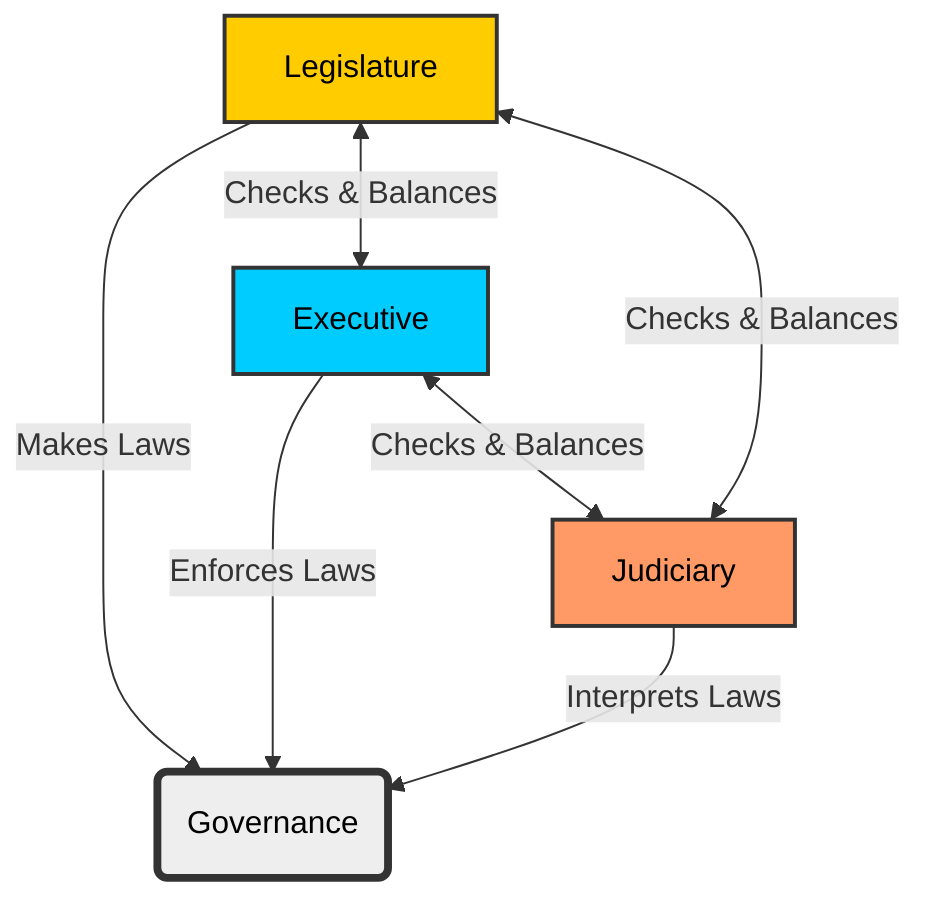

import Callout from '@/components/Callout.astro'

## The Structure of Government

A modern government is like a machine with three distinct parts, or "organs," that work together to ensuring society functions smoothly. In India, these three organs are the **Legislature**, the **Executive**, and the **Judiciary**.

### 1. The Legislature (Law-Makers)
The legislature is the organ responsible for making new laws (legislating). It is an assembly of elected representatives.
*   **Function:** Make, update, or remove laws.
*   **Example:** Passing a new law to fight cybercrime.

### 2. The Executive (Law-Implementers)
The executive is the organ that implements (executes) the laws.
*   **Composition:** Includes the Head of State (President), the Head of Government (Prime Minister/Chief Minister), ministers, and agencies like the police.
*   **Function:** Enforce laws and maintain order.
*   **Example:** The Cyber Police tracking down criminals based on the laws passed by the legislature.

### 3. The Judiciary (Law-Interpreters)
The judiciary is the system of courts.
*   **Function:** Decides if a law has been broken and determines punishments. It also checks if the Executive's actions are correct and if the Legislature's laws are fair.
*   **Example:** A court sentencing a cybercriminal to jail or a fine.

<Callout variant="tip">
**Separation of Powers:**
In a good governance system, these three organs are kept separate to provide a system of **checks and balances**. This prevents any single group from having too much power.
</Callout>

### Diagram: Separation of Powers

The following diagram illustrates how the three organs interact and balance each other within the framework of governance.

### Comparative Functions Table

The specific roles differ slightly between the **National (All India)** level and the **State** level.

| Feature | National Level (Central Govt) | State Level (State Govt) |
| :--- | :--- | :--- |
| **Legislature** | **Parliament**: Lok Sabha & Rajya Sabha | **State Assembly**: Vidhan Sabha (some states also have Vidhan Parishad) |
| **Executive** | **Nominal Head:** President / **Real Head:** Prime Minister | **Nominal Head:** Governor / **Real Head:** Chief Minister |
| **Judiciary** | **Supreme Court of India** | **High Courts** |

<Callout variant="info">
**Nominal Head:** This means "in name only." For example, the President of India has high status but the Prime Minister holds the actual executive power.
</Callout>
