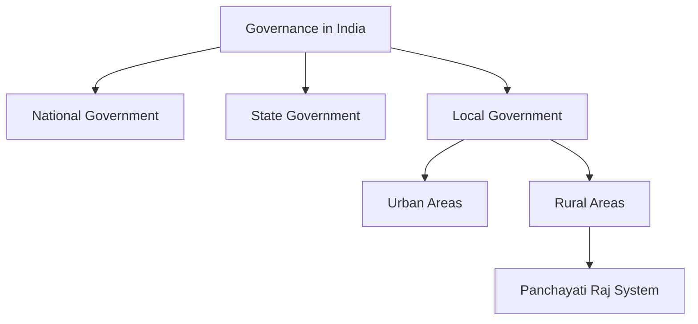

import Callout from '@/components/Callout.astro'

# Grassroots Democracy – Part 2
## Local Government in Rural Areas

> "The real India lives in its villages." – **M.K. Gandhi**

India is a land of vast diversity and size, home to about 600,000 villages. With a population exceeding 1.4 billion, two-thirds of whom live in rural areas, governing such a complex society requires a system that reaches every individual.

This chapter explores how government functions at the local level in rural India. We will look at how villagers make decisions about their daily lives—from water and roads to schools and disputes—without running to the State or National capital for every issue.

### The Big Questions

1.  **What are Panchayati Raj institutions?**
2.  **What are their functions?**
3.  **Why are they important in governance and democracy?**

<Callout variant="tip">
**Context:** In the previous chapter, we explored diversity. In this chapter, we see how that diverse population governs itself through **Grassroots Democracy**.
</Callout>

### Introduction: The Story of Lakshmanpur

Imagine a small village called **Lakshmanpur** in the foothills of the Himalayas.
*   **Population:** ~700 people (200 houses).
*   **Occupation:** Mostly farmers; some in armed forces or migrated to cities.
*   **Needs:** Water for fields, road repairs, school maintenance.

How do they solve their problems? They rely on a system of **Local Government** known as the **Panchayat**.

### Concept Map

This chapter focuses specifically on **Branch F: Rural Areas**.