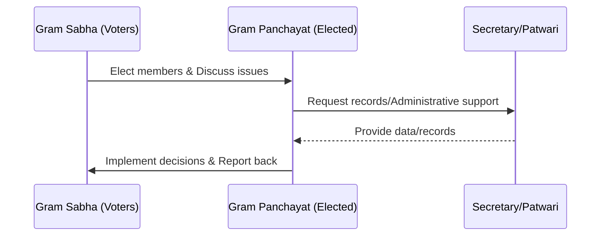

import Callout from '@/components/Callout.astro'

## The Foundation: Village Level

The base of the Panchayati Raj system is the **Gram Panchayat**. It is the institution closest to the people in rural areas.

### 1. The Gram Sabha (The Legislative Body)

Before a decision is made by the leaders, it is discussed by the people. This happens in the **Gram Sabha**.

*   **Who are the members?** All adults (18+) who are enrolled as voters in the village (or a group of neighboring villages).
*   **Function:** Men and women discuss matters related to their area, review the performance of the Panchayat, and approve plans.
*   **Significance:** It is a form of **direct democracy** where people participate directly.

### 2. The Gram Panchayat (The Executive Body)

The Gram Panchayat is the elected body responsible for implementing decisions.

*   **Election:** Members are elected directly by the Gram Sabha.
*   **Head of Panchayat:** The elected head is called the **Sarpanch** or **Pradhan**.
*   **Composition:**
    *   **Ward Members (Panchs):** Representatives from smaller divisions of the village called Wards.
    *   **Sarpanch:** The president of the Panchayat.

<Callout variant="warning">
**Important Trend:** In recent years, more and more women have become Sarpanchs, taking leadership roles in rural development.
</Callout>

### Administrative Support

The elected members are assisted by government-appointed officials who ensure the system runs smoothly.

| Official | Role |
| :--- | :--- |
| **Panchayat Secretary** | Performs administrative functions like calling meetings and maintaining records of proceedings. |
| **Patwari** | Maintains the villagers' land records and maps. In some cases, these maps are generations old. |

### Decision Flow

