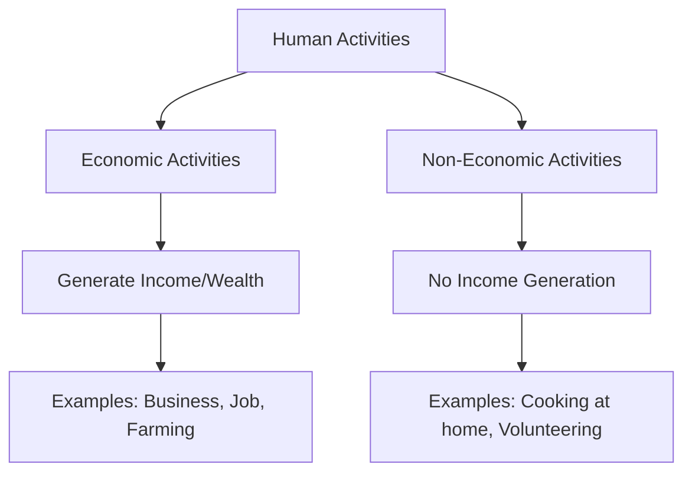

import Callout from '@/components/Callout.astro'

## Classification of Human Activities

Human activities can be broadly classified into two categories based on their purpose and end result: **Economic Activities** and **Non-Economic Activities**.

### 1. Economic Activities

**Economic activities** are those that involve money or are performed in exchange for money or **money's worth**. The primary motive is to earn a livelihood or profit.

<Callout variant="info">
**Key Definitions:**
*   **Market:** A place where people engage in the exchange of goods and services, usually for money.
*   **Fee:** A payment made to a professional (like a doctor or lawyer) for their advice or services.
*   **Money's Worth:** The monetary value a person places on an object based on the benefit they derive from it.
</Callout>

**Examples:**
*   A **pilot** flying a commercial plane for an airline.
*   A **shopkeeper** selling school bags and uniforms.
*   A **farmer** selling produce in the market.
*   A **lawyer** arguing a case for a fee.
*   A **truck driver** transporting goods.

### 2. Non-Economic Activities

**Non-economic activities** are those that **do not generate income or wealth**. These are performed out of feelings like love, gratitude, care, respect, or social duty.

**Examples:**
*   **Parents** cooking food for the family.
*   **Youth** taking care of grandparents.
*   **Volunteering** to teach neighborhood kids for free.
*   Family members helping renovate their own house.

<Callout variant="tip">
**Think About It:** If a teacher teaches in a school, she gets a salary (Economic). If the same teacher teaches her own child at home, she gets no money (Non-Economic). The **nature** of the activity is the same (teaching), but the **purpose** changes the classification.
</Callout>

### Summary Table

| Feature | Economic Activity | Non-Economic Activity |
| :--- | :--- | :--- |
| **Goal** | To earn money or wealth. | Personal satisfaction, social obligation, love. |
| **Reward** | Monetary (Money). | Psychological (Happiness, Gratitude). |
| **Example** | Doctor treating a patient in a hospital. | Doctor treating their own child at home. |