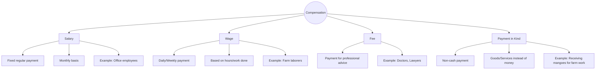

import Callout from '@/components/Callout.astro'

## Forms of Compensation

People engaged in economic activities receive payment in different ways. The method of payment often depends on the type of work and the agreement between the worker and the employer.

### 1. Salary
A **salary** is a fixed regular payment, generally paid monthly by an employer to an employee.
*   *Example:* Geeta Aunty (Pilot) receives a monthly salary.

### 2. Wage
A **wage** is often a daily or weekly payment made for manual labor or short-term work.
*   *Example:* Sahil, a farm labourer, earns a daily wage for tilling land.

### 3. Fee
A **fee** is a payment made to a person or organization in exchange for professional advice or specialized services.
*   *Example:* A tutor charging a weekly fee for classes; a lawyer's fee.

### 4. Payment in Kind
**Payment in kind** refers to a non-cash payment where goods or services are given instead of money.
*   *Example:* Sahil receiving a portion of his payment in the form of **mangoes** instead of cash.

---

## Value Addition

Economic activities involve transforming something into a more useful form. This process adds monetary value to the object.

### The Carpenter's Example
Let's look at Rajesh, a carpenter, to understand **Value Addition**.

1.  **Raw Material Cost:** Rajesh buys wood for **₹600**.
2.  **The Process:** He uses his tools, skill, time, and effort to build a chair.
3.  **Final Price:** He sells the chair for **₹1,000**.

$$
\text{Value Added} = \text{Selling Price} - \text{Cost of Raw Materials}
$$

$$
\text{Value Added} = \text{Rs.}1,000 - \text{Rs.}600 = \text{Rs.}400
$$

**What is the ₹400 for?**
It represents the monetary value of Rajesh's **skill, time, and effort**. By turning raw wood into a finished chair, he has "added value" to it.

<Callout variant="tip">
**Conclusion:** Economic activities create value at every stage of processing, transforming raw materials into useful goods.
</Callout>