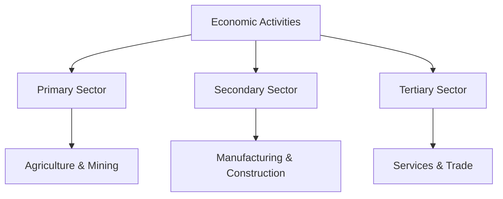
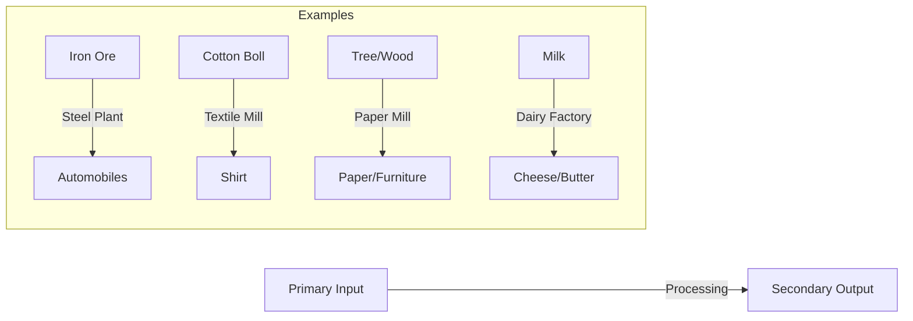
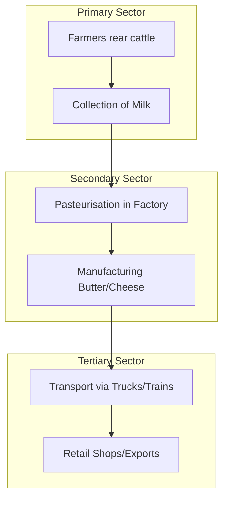

<<<FILE_START: index.mdx>>>
---
title: "Economic Activities Around Us"
description: "Overview of Chapter 14: Understanding how economic activities are classified into Primary, Secondary, and Tertiary sectors."
date: 2025-01-15
tags: ["economics", "social-science", "class-6", "chapter-14"]
order: 1
draft: false
---

import Callout from '@/components/Callout.astro'

## Introduction

In previous chapters, we learned to distinguish between **economic** and **non-economic** activities. Activities that create **monetary value** are called economic activities.

To understand the economy better, we classify these diverse activities—ranging from farming to software development—into specific groups called **sectors**. This chapter explores how these sectors function, how they are different, and how they rely on each other to bring prosperity to a nation.

<Callout variant="tip">
**Definition: Monetary Value**
The value of something that can be measured in terms of money. Activities generating this value are the root of economic growth.
</Callout>

> "The root of prosperity is economic activity, the lack of it brings material distress." — *Kauṭilya’s Arthaśhāstra*

### The Big Questions
1. How are economic activities classified?
2. What differentiates these activities to be grouped into sectors?
3. How are the three sectors interconnected?

### Chapter Roadmap

The chapter is divided into the following key topics:

1.  **[Primary Activities](./topics/01-economic-sectors-primary.mdx)**: Activities directly dependent on nature.
2.  **[Secondary Activities](./topics/02-secondary-sector.mdx)**: Activities involving processing and manufacturing.
3.  **[Tertiary Activities](./topics/03-tertiary-sector.mdx)**: The service sector that supports the others.
4.  **[Interdependence & Case Studies](./topics/04-interdependence-case-studies.mdx)**: How sectors work together, featuring the story of AMUL.

<<<FILE_END>>>
<<<FILE_START: topics/01-economic-sectors-primary.mdx>>>
---
title: "Primary Activities"
description: "Understanding the Primary Sector: Activities directly dependent on nature."
date: 2025-01-15
tags: ["primary-sector", "agriculture", "mining", "fishing"]
order: 2
draft: false
---

import Callout from '@/components/Callout.astro'

## Classification of Economic Sectors

Economic activities are diverse, but many share similar characteristics. Based on these similarities, we group them into three main **Economic Sectors**:
1.  **Primary Sector**
2.  **Secondary Sector**
3.  **Tertiary Sector**

This classification helps us understand the economic structure and prosperity of a nation.

## A. Primary Activities

The **Primary Sector** includes all economic activities where people are **directly dependent on nature** to produce goods. It is called "primary" because it forms the base for all other products that we subsequently make.

### Key Characteristics
*   **Source:** Direct extraction or utilization of natural resources.
*   **Nature:** Usually involves biological processes (plants/animals) or geological processes (mining).
*   **Output:** Raw materials (e.g., cotton, iron ore, wheat, milk).

### Common Examples

| Activity | Description |
| :--- | :--- |
| **Agriculture** | Cultivation of grains, vegetables, and fruits. |
| **Livestock Rearing** | Raising animals for milk, eggs, wool, or meat (e.g., dairy farming, poultry). |
| **Forestry** | Collecting wood, timber, or other forest produce. |
| **Fishing** | Catching fish from rivers, lakes, or oceans. |
| **Mining** | Extracting minerals like coal, iron ore, or petroleum from the earth. |

<Callout variant="info">
**Think About It:**
When a farmer grows cotton, it is a primary activity because the growth of the cotton plant depends mainly on natural factors like rainfall, sunshine, and climate.
</Callout>

### Visualizing Primary Activities

  <svg width="400" height="200" viewBox="0 0 400 200" xmlns="http://www.w3.org/2000/svg">
    <!-- Ground -->
    <rect x="0" y="150" width="400" height="50" fill="none" stroke="currentColor" stroke-width="2" />

    <!-- Tree (Forestry) -->
    <rect x="50" y="100" width="20" height="50" fill="none" stroke="currentColor" stroke-width="2" />
    <circle cx="60" cy="90" r="30" fill="none" stroke="currentColor" stroke-width="2" />
    <text x="40" y="190" font-family="sans-serif" font-size="12" fill="currentColor">Forestry</text>

    <!-- Crop (Agriculture) -->
    <path d="M150 150 Q150 120 130 110 M150 150 Q150 120 170 110" stroke="currentColor" stroke-width="2" fill="none"/>
    <text x="130" y="190" font-family="sans-serif" font-size="12" fill="currentColor">Farming</text>

    <!-- Mine Shaft (Mining) -->
    <rect x="250" y="150" width="60" height="40" fill="none" stroke="currentColor" stroke-width="2" stroke-dasharray="4"/>
    <path d="M260 150 L260 180 M280 150 L280 180" stroke="currentColor" stroke-width="2"/>
    <text x="250" y="140" font-family="sans-serif" font-size="12" fill="currentColor">Mining</text>

    <!-- Fish (Fishing) -->
    <path d="M350 160 Q370 160 380 170 Q370 180 350 180 L340 170 Z" stroke="currentColor" stroke-width="2" fill="none"/>
    <text x="340" y="190" font-family="sans-serif" font-size="12" fill="currentColor">Fishing</text>
  </svg>

<<<FILE_END>>>
<<<FILE_START: topics/02-secondary-sector.mdx>>>
---
title: "Secondary Activities"
description: "Understanding the Secondary Sector: Manufacturing, processing, and construction."
date: 2025-01-15
tags: ["secondary-sector", "manufacturing", "industry", "construction"]
order: 3
draft: false
---

import Callout from '@/components/Callout.astro'

## B. Secondary Activities

Economic activities in which people depend on the outputs of the primary sector and **transform** them to produce goods are known as **Secondary Activities** or the **Secondary Sector**.

This sector is often associated with **factories** and **industries**.

### Key Characteristics
*   **Process:** Adds value to raw materials by changing their form.
*   **Dependency:** Relies on the Primary Sector for inputs (raw materials).
*   **Location:** Often happens in factories, workshops, or construction sites.

<Callout variant="tip">
**Definition:** The Secondary Sector involves the processing of raw materials derived from the primary sector into products for sale or consumption.
</Callout>

### Types of Secondary Activities

1.  **Manufacturing:**
    *   Creating new products using machines and labor.
    *   *Examples:* Automobile factories (making cars), Textile factories (making clothes from cotton), Electronics (making mobile phones).

2.  **Processing:**
    *   Converting raw food items into consumable forms.
    *   *Examples:* Milling wheat into flour, extracting oil from groundnuts, processing tea leaves into tea powder.

3.  **Construction:**
    *   Building infrastructure.
    *   *Examples:* Building houses, roads, bridges, and dams.

4.  **Utilities:**
    *   Providing essential supplies.
    *   *Examples:* Water supply, electricity generation, and gas distribution.

### Flow of Transformation

The secondary sector acts as a bridge between raw nature and the final consumer product.

### Industrial Data (India 2022)
To understand the scale of the secondary sector, look at the automobile production numbers in India for the year 2022:
*   **Passenger Vehicles (Cars):** 45 Lakhs
*   **Commercial Vehicles (Trucks):** 10.3 Lakhs
*   **Three Wheelers:** 8.6 Lakhs
*   **Two Wheelers:** 2 Crores

This huge volume of production creates jobs and goods for the economy.

<<<FILE_END>>>
<<<FILE_START: topics/03-tertiary-sector.mdx>>>
---
title: "Tertiary Activities"
description: "Understanding the Tertiary Sector: The Service Sector."
date: 2025-01-15
tags: ["tertiary-sector", "services", "banking", "transport"]
order: 4
draft: false
---

import Callout from '@/components/Callout.astro'

## C. Tertiary Activities

The **Tertiary Sector**, also known as the **Service Sector**, consists of activities that provide support to the Primary and Secondary sectors. These activities do not produce a physical good (like wheat or a car) but provide a **service** that helps in the production or distribution process.

### Key Characteristics
*   **Support:** Facilitates the functioning of the other two sectors.
*   **Intangible:** You cannot "hold" a service like you hold a product, but you experience its value.
*   **Skill-based:** Often requires specialized skills (e.g., doctors, pilots, coders).

<Callout variant="tip">
**Role:** Activities involved in the provision of services which complement both primary and secondary sectors.
</Callout>

### Categories of Tertiary Activities

1.  **Trade and Logistics:**
    *   **Transportation:** Trucks, trains, ships, and planes moving goods from farms to factories and then to markets.
    *   **Warehousing:** Large buildings used to store goods before they are sold.
    *   **Retail:** Shops, vegetable vendors, and malls selling goods to consumers.

2.  **Professional Services:**
    *   Doctors, nurses, teachers, lawyers.
    *   Technicians repairing mobiles, mechanics fixing cars.

3.  **Financial & Communication Services:**
    *   **Banking:** Managing money for businesses and individuals.
    *   **Communication:** Internet services, mobile networks, software development.
    *   **Hospitality:** Hotels and restaurants.

### How it Connects

Imagine a farmer grows tomatoes (Primary).
1.  **Transport:** A truck driver (Tertiary) takes them to a factory.
2.  **Factory:** The factory makes ketchup (Secondary).
3.  **Advertising/Sales:** A marketing team (Tertiary) advertises it, and a shopkeeper (Tertiary) sells it to you.

Without the Tertiary sector, the tomatoes might rot on the farm, and the ketchup would never reach your table.

<<<FILE_END>>>
<<<FILE_START: topics/04-interdependence-case-studies.mdx>>>
---
title: "Interdependence & Case Studies"
description: "How the three sectors work together, featuring the AMUL case study."
date: 2025-01-15
tags: ["amul", "cooperative", "interdependence", "supply-chain"]
order: 5
draft: false
---

import Callout from '@/components/Callout.astro'

## Interdependence Among Sectors

No sector can survive alone. The Primary sector provides raw materials, the Secondary sector processes them, and the Tertiary sector moves and sells them. This relationship is called **interdependence**.

We will explore this through two fascinating stories: the story of AMUL and the story of Paper.

---

## Case Study 1: The AMUL Story (Dairy Cooperative)

**Location:** Anand, Gujarat
**Context:** Before 1946, farmers were exploited by **middlemen** who bought milk at low prices and sold it for high profits. Milk is perishable (spoils quickly), so farmers had no choice but to sell quickly.

### The Rise of the Cooperative
Under the advice of **Sardar Vallabhbhai Patel**, the farmers formed a **Cooperative**.
*   **Tribhuvandas Patel** (Lawyer/Freedom Fighter) and **Dr. Varghese Kurien** (Engineer) led this movement.
*   **Result:** Farmers stopped selling to middlemen and collectively managed their own milk collection, processing, and sale. This became **AMUL** (Anand Milk Union Limited).

<Callout variant="info">
**What is a Cooperative?**
A group of people who voluntarily come together to meet their economic and social needs. They own the organization and make decisions collectively.
</Callout>

### Sector Analysis of AMUL

The success of AMUL shows how all three sectors combine to create value:

1.  **Primary Sector (Production):**
    *   Farmers rearing cows and buffaloes.
    *   Milking the animals (Natural biological process).

2.  **Secondary Sector (Processing):**
    *   **Pasteurisation:** Heating milk to kill bacteria and preserve it.
    *   **Manufacturing:** Factories converting liquid milk into butter, ghee, cheese, and milk powder.

3.  **Tertiary Sector (Support):**
    *   **Logistics:** Trucks and trains transporting milk to cities.
    *   **Retail:** AMUL parlors and shops selling products.
    *   **Export:** Selling products to other countries.

---

## Case Study 2: From Tree to Textbook

The book you are reading right now is also a result of sector interdependence.

1.  **Primary:** **Forestry** workers cut down trees to get wood.
2.  **Tertiary:** Trucks **transport** the logs to the mill.
3.  **Secondary:** The mill **processes** wood into pulp and then into paper.
4.  **Secondary:** A printing press **prints** the text onto the paper.
5.  **Tertiary:** The books are sent to **bookstores** where you buy them.

### Recycling Awareness
Using paper judiciously is important.
*   Recycling **1 tonne** of paper saves **17 trees**.
*   It uses **70% less energy** than making new paper.

<Callout variant="tip">
**Activity:** Label the activities in your daily life. The bus driver taking you to school is in the *Tertiary* sector, but the fuel in the bus came from the *Primary* sector (oil drilling) and was refined in the *Secondary* sector (refinery).
</Callout>

<<<FILE_END>>>
<<<FILE_START: solutions/ex-14.1.mdx>>>
---
title: "Chapter 14 Solutions"
description: "Step-by-step answers to the exercises in Chapter 14."
date: 2025-01-15
tags: ["solutions", "class-6", "economics"]
order: 6
draft: false
---

import Callout from '@/components/Callout.astro'

## Questions, Activities, and Projects

### Q1. What is the primary sector? How is it different from the secondary sector? Give two examples.

**Answer:**

**Primary Sector:**
The primary sector includes all economic activities where people are directly dependent on nature to produce goods. It involves the extraction or utilization of natural resources like land, water, vegetation, and minerals.

**Difference from Secondary Sector:**
*   **Dependence:** The Primary sector relies on natural processes (biological or geological). The Secondary sector relies on the *output* of the primary sector as raw material.
*   **Activity:** Primary involves *extraction* or *harvesting*. Secondary involves *processing*, *manufacturing*, or *construction* to change the form of the material.

**Examples:**
1.  **Primary:** Fishing (extracting food from water bodies).
2.  **Secondary:** Canned Fish Factory (processing the fish for long-term storage).

---

### Q2. How does the secondary sector depend on the tertiary sector? Illustrate with a few examples.

**Answer:**
The secondary sector (manufacturing/industry) cannot function without the services provided by the tertiary sector.

1.  **Transportation:** Factories need trucks and trains to bring raw materials (like cotton or iron ore) to the factory and to take finished products (like clothes or cars) to the market.
2.  **Banking:** Factory owners need loans and banking services to buy machinery and pay workers.
3.  **Communication:** Industries need internet and phones to coordinate with suppliers and customers.
4.  **Power Supply:** Factories rely on electricity distribution (a utility service) to run machines.

**Example:**
An **automobile factory** (Secondary) needs **engineers** (Tertiary service) to design cars, **trucks** (Tertiary) to bring steel, and **dealerships** (Tertiary) to sell the final car to customers.

---

### Q3. Give an example of interdependence between primary, secondary and tertiary sectors. Show it using a flow diagram.

**Answer:**
**Example: The Cotton Shirt**

*   **Primary:** A farmer grows cotton plants and harvests cotton bolls (Natural process).
*   **Secondary:** The cotton is transported to a textile mill where it is spun into thread and woven into cloth, then stitched into a shirt (Manufacturing).
*   **Tertiary:** The shirts are transported to retail stores and sold to customers (Service).

**Flow Diagram:**

<<<FILE_END>>>
<<<FILE_START: practice/solved-examples.mdx>>>
---
title: "Practice: Classifying Activities"
description: "Additional solved examples to practice classifying economic activities."
date: 2025-01-15
tags: ["practice", "classification", "sectors"]
order: 7
draft: false
---

import Callout from '@/components/Callout.astro'

## Classify the following activities

Read the scenarios below and classify them into **Primary**, **Secondary**, or **Tertiary** sectors.

### Scenario 1: The Furniture Maker
**Activity:** A carpenter buys wood from a depot and builds a chair.
*   **Answer:** **Secondary Sector**.
*   **Reason:** The carpenter is transforming raw material (wood) into a finished good (chair). This is manufacturing/processing.

### Scenario 2: The Coal Miner
**Activity:** A worker digs underground to bring coal to the surface.
*   **Answer:** **Primary Sector**.
*   **Reason:** This involves the direct extraction of a natural resource (mineral) from the earth.

### Scenario 3: The Software Engineer
**Activity:** A person writes code for a new mobile app.
*   **Answer:** **Tertiary Sector**.
*   **Reason:** This is a service. No physical good is being extracted or manufactured directly; intellectual skill is being provided to support other functions.

### Scenario 4: The Baker
**Activity:** Baking a cake using flour, sugar, and eggs.
*   **Answer:** **Secondary Sector**.
*   **Reason:** The baker processes raw food ingredients (primary outputs) into a new product (cake).

### Scenario 5: The Call Center Employee
**Activity:** Answering customer queries over the phone.
*   **Answer:** **Tertiary Sector**.
*   **Reason:** This is a communication service supporting business operations.

---

## Visual Classification Exercise

Look at the supply chain of **Tomato Ketchup** and identify the sectors:

  <svg width="500" height="150" viewBox="0 0 500 150" xmlns="http://www.w3.org/2000/svg">
    <!-- Step 1 -->
    <circle cx="50" cy="50" r="30" fill="none" stroke="currentColor" stroke-width="2"/>
    <text x="50" y="55" text-anchor="middle" font-size="10" fill="currentColor">Tomato</text>
    <text x="50" y="95" text-anchor="middle" font-size="12" font-weight="bold" fill="currentColor">Primary</text>

    <!-- Arrow -->
    <path d="M90 50 L130 50" stroke="currentColor" stroke-width="2" marker-end="url(#arrow)"/>

    <!-- Step 2 -->
    <rect x="140" y="20" width="60" height="60" fill="none" stroke="currentColor" stroke-width="2"/>
    <text x="170" y="55" text-anchor="middle" font-size="10" fill="currentColor">Truck</text>
    <text x="170" y="95" text-anchor="middle" font-size="12" font-weight="bold" fill="currentColor">Tertiary</text>

    <!-- Arrow -->
    <path d="M210 50 L250 50" stroke="currentColor" stroke-width="2" marker-end="url(#arrow)"/>

    <!-- Step 3 -->
    <path d="M260 20 L320 20 L320 80 L260 80 Z" stroke="currentColor" stroke-width="2" fill="none"/>
    <text x="290" y="55" text-anchor="middle" font-size="10" fill="currentColor">Factory</text>
    <text x="290" y="95" text-anchor="middle" font-size="12" font-weight="bold" fill="currentColor">Secondary</text>

     <!-- Arrow -->
    <path d="M330 50 L370 50" stroke="currentColor" stroke-width="2" marker-end="url(#arrow)"/>

    <!-- Step 4 -->
    <rect x="380" y="20" width="60" height="60" rx="10" fill="none" stroke="currentColor" stroke-width="2"/>
    <text x="410" y="55" text-anchor="middle" font-size="10" fill="currentColor">Supermarket</text>
    <text x="410" y="95" text-anchor="middle" font-size="12" font-weight="bold" fill="currentColor">Tertiary</text>

    <defs>
      <marker id="arrow" markerWidth="10" markerHeight="10" refX="0" refY="3" orient="auto" markerUnits="strokeWidth">
        <path d="M0,0 L0,6 L9,3 z" fill="currentColor" />
      </marker>
    </defs>
  </svg>

<<<FILE_END>>>
