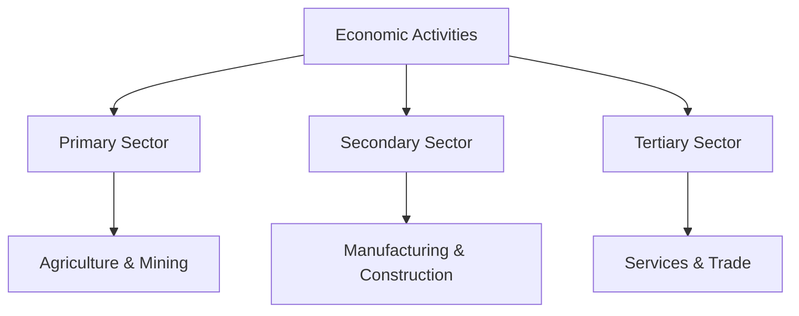

import Callout from '@/components/Callout.astro'

## Classification of Economic Sectors

Economic activities are diverse, but many share similar characteristics. Based on these similarities, we group them into three main **Economic Sectors**:
1.  **Primary Sector**
2.  **Secondary Sector**
3.  **Tertiary Sector**

This classification helps us understand the economic structure and prosperity of a nation.

## A. Primary Activities

The **Primary Sector** includes all economic activities where people are **directly dependent on nature** to produce goods. It is called "primary" because it forms the base for all other products that we subsequently make.

### Key Characteristics
*   **Source:** Direct extraction or utilization of natural resources.
*   **Nature:** Usually involves biological processes (plants/animals) or geological processes (mining).
*   **Output:** Raw materials (e.g., cotton, iron ore, wheat, milk).

### Common Examples

| Activity | Description |
| :--- | :--- |
| **Agriculture** | Cultivation of grains, vegetables, and fruits. |
| **Livestock Rearing** | Raising animals for milk, eggs, wool, or meat (e.g., dairy farming, poultry). |
| **Forestry** | Collecting wood, timber, or other forest produce. |
| **Fishing** | Catching fish from rivers, lakes, or oceans. |
| **Mining** | Extracting minerals like coal, iron ore, or petroleum from the earth. |

<Callout variant="info">
**Think About It:**
When a farmer grows cotton, it is a primary activity because the growth of the cotton plant depends mainly on natural factors like rainfall, sunshine, and climate.
</Callout>

### Visualizing Primary Activities

  <svg width="400" height="200" viewBox="0 0 400 200" xmlns="http://www.w3.org/2000/svg">
    {/* Ground */}
    <rect x="0" y="150" width="400" height="50" fill="none" stroke="currentColor" stroke-width="2" />

    {/* Tree (Forestry) */}
    <rect x="50" y="100" width="20" height="50" fill="none" stroke="currentColor" stroke-width="2" />
    <circle cx="60" cy="90" r="30" fill="none" stroke="currentColor" stroke-width="2" />
    <text x="40" y="190" font-family="sans-serif" font-size="12" fill="currentColor">Forestry</text>

    {/* Crop (Agriculture) */}
    <path d="M150 150 Q150 120 130 110 M150 150 Q150 120 170 110" stroke="currentColor" stroke-width="2" fill="none"/>
    <text x="130" y="190" font-family="sans-serif" font-size="12" fill="currentColor">Farming</text>

    {/* Mine Shaft (Mining) */}
    <rect x="250" y="150" width="60" height="40" fill="none" stroke="currentColor" stroke-width="2" stroke-dasharray="4"/>
    <path d="M260 150 L260 180 M280 150 L280 180" stroke="currentColor" stroke-width="2"/>
    <text x="250" y="140" font-family="sans-serif" font-size="12" fill="currentColor">Mining</text>

    {/* Fish (Fishing) */}
    <path d="M350 160 Q370 160 380 170 Q370 180 350 180 L340 170 Z" stroke="currentColor" stroke-width="2" fill="none"/>
    <text x="340" y="190" font-family="sans-serif" font-size="12" fill="currentColor">Fishing</text>
  </svg>

