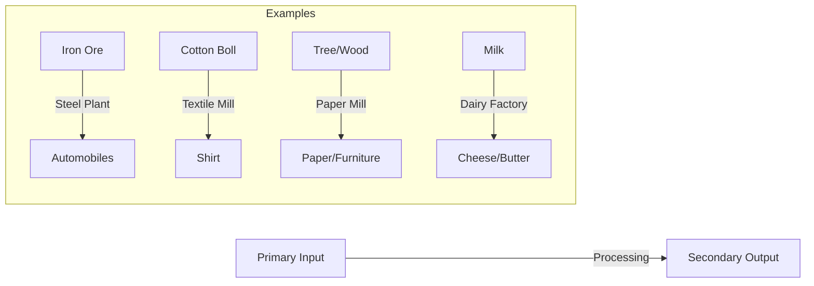

import Callout from '@/components/Callout.astro'

## B. Secondary Activities

Economic activities in which people depend on the outputs of the primary sector and **transform** them to produce goods are known as **Secondary Activities** or the **Secondary Sector**.

This sector is often associated with **factories** and **industries**.

### Key Characteristics
*   **Process:** Adds value to raw materials by changing their form.
*   **Dependency:** Relies on the Primary Sector for inputs (raw materials).
*   **Location:** Often happens in factories, workshops, or construction sites.

<Callout variant="tip">
**Definition:** The Secondary Sector involves the processing of raw materials derived from the primary sector into products for sale or consumption.
</Callout>

### Types of Secondary Activities

1.  **Manufacturing:**
    *   Creating new products using machines and labor.
    *   *Examples:* Automobile factories (making cars), Textile factories (making clothes from cotton), Electronics (making mobile phones).

2.  **Processing:**
    *   Converting raw food items into consumable forms.
    *   *Examples:* Milling wheat into flour, extracting oil from groundnuts, processing tea leaves into tea powder.

3.  **Construction:**
    *   Building infrastructure.
    *   *Examples:* Building houses, roads, bridges, and dams.

4.  **Utilities:**
    *   Providing essential supplies.
    *   *Examples:* Water supply, electricity generation, and gas distribution.

### Flow of Transformation

The secondary sector acts as a bridge between raw nature and the final consumer product.

### Industrial Data (India 2022)
To understand the scale of the secondary sector, look at the automobile production numbers in India for the year 2022:
*   **Passenger Vehicles (Cars):** 45 Lakhs
*   **Commercial Vehicles (Trucks):** 10.3 Lakhs
*   **Three Wheelers:** 8.6 Lakhs
*   **Two Wheelers:** 2 Crores

This huge volume of production creates jobs and goods for the economy.
