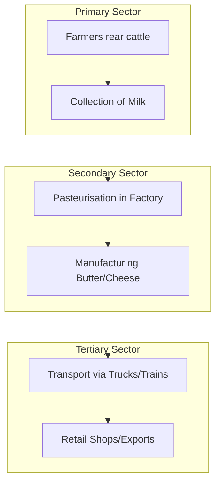

import Callout from '@/components/Callout.astro'

## Interdependence Among Sectors

No sector can survive alone. The Primary sector provides raw materials, the Secondary sector processes them, and the Tertiary sector moves and sells them. This relationship is called **interdependence**.

We will explore this through two fascinating stories: the story of AMUL and the story of Paper.

---

## Case Study 1: The AMUL Story (Dairy Cooperative)

**Location:** Anand, Gujarat
**Context:** Before 1946, farmers were exploited by **middlemen** who bought milk at low prices and sold it for high profits. Milk is perishable (spoils quickly), so farmers had no choice but to sell quickly.

### The Rise of the Cooperative
Under the advice of **Sardar Vallabhbhai Patel**, the farmers formed a **Cooperative**.
*   **Tribhuvandas Patel** (Lawyer/Freedom Fighter) and **Dr. Varghese Kurien** (Engineer) led this movement.
*   **Result:** Farmers stopped selling to middlemen and collectively managed their own milk collection, processing, and sale. This became **AMUL** (Anand Milk Union Limited).

<Callout variant="info">
**What is a Cooperative?**
A group of people who voluntarily come together to meet their economic and social needs. They own the organization and make decisions collectively.
</Callout>

### Sector Analysis of AMUL

The success of AMUL shows how all three sectors combine to create value:

1.  **Primary Sector (Production):**
    *   Farmers rearing cows and buffaloes.
    *   Milking the animals (Natural biological process).

2.  **Secondary Sector (Processing):**
    *   **Pasteurisation:** Heating milk to kill bacteria and preserve it.
    *   **Manufacturing:** Factories converting liquid milk into butter, ghee, cheese, and milk powder.

3.  **Tertiary Sector (Support):**
    *   **Logistics:** Trucks and trains transporting milk to cities.
    *   **Retail:** AMUL parlors and shops selling products.
    *   **Export:** Selling products to other countries.

---

## Case Study 2: From Tree to Textbook

The book you are reading right now is also a result of sector interdependence.

1.  **Primary:** **Forestry** workers cut down trees to get wood.
2.  **Tertiary:** Trucks **transport** the logs to the mill.
3.  **Secondary:** The mill **processes** wood into pulp and then into paper.
4.  **Secondary:** A printing press **prints** the text onto the paper.
5.  **Tertiary:** The books are sent to **bookstores** where you buy them.

### Recycling Awareness
Using paper judiciously is important.
*   Recycling **1 tonne** of paper saves **17 trees**.
*   It uses **70% less energy** than making new paper.

<Callout variant="tip">
**Activity:** Label the activities in your daily life. The bus driver taking you to school is in the *Tertiary* sector, but the fuel in the bus came from the *Primary* sector (oil drilling) and was refined in the *Secondary* sector (refinery).
</Callout>
