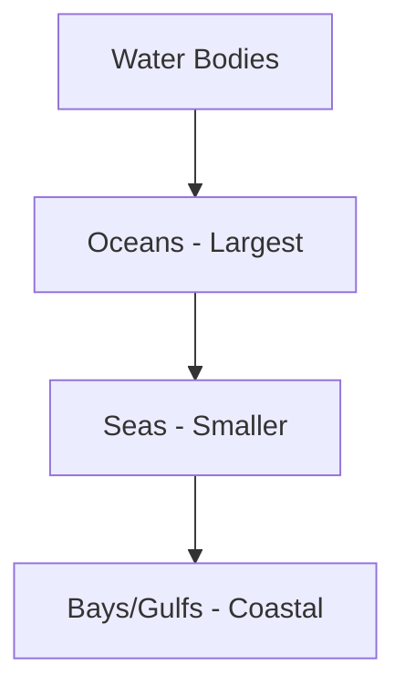

<<<FILE_START: index.mdx>>>
---
title: "Oceans and Continents"
description: "An overview of the Earth's major water bodies and landmasses, their distribution, and their impact on life."
date: 2024-04-10
tags: ["geography", "oceans", "continents", "earth"]
order: 1
draft: false
---

import Callout from '@/components/Callout.astro'

# Oceans and Continents

The Earth is often called the "Blue Planet" because nearly three-fourths of its surface is covered by water. This chapter explores the vast expanses of our oceans and the massive landmasses we call continents.

<Callout variant="info">
**The Big Questions:**
1. What are oceans and continents? What are their names and their distribution?
2. In what ways do oceans and continents impact life on Earth, including human life?
</Callout>

## Chapter Summary Sheet

### Basic Proportions
- **Water (Oceans):** Approximately $71\%$ (nearly $\frac{3}{4}$)
- **Land (Continents):** Approximately $29\%$ (a little over $\frac{1}{4}$)

### The Five Oceans (By Size)
1. **Pacific Ocean** (Largest)
2. **Atlantic Ocean**
3. **Indian Ocean**
4. **Southern Ocean**
5. **Arctic Ocean** (Smallest)

### The Seven Continents
- Asia (Largest)
- Africa
- North America
- South America
- Antarctica
- Europe
- Australia (Smallest)

### Key Terms
- **Marine:** Related to or found in the oceans and seas.
- **Flora:** The plant life of a particular region.
- **Fauna:** The animal life of a particular region.
- **Island:** A piece of land surrounded by water on all sides.

---

## List of Topics
1. [The Blue Planet & Basic Definitions](./topics/01-blue-planet)
2. [Distribution of Land and Water](./topics/02-distribution)
3. [The Five Oceans and Marine Life](./topics/03-five-oceans)
4. [Oceans and Natural Disasters](./topics/04-disasters)
5. [The Continents and Islands](./topics/05-continents-islands)
6. [Human Impact and Conservation](./topics/06-conservation)

<<<FILE_END>>>

<<<FILE_START: topics/01-blue-planet.mdx>>>
---
title: "The Blue Planet"
description: "Why Earth appears blue from space and the basic definitions of landmasses and water bodies."
date: 2024-04-10
tags: ["earth", "water", "landmass"]
order: 2
draft: false
---

import Callout from '@/components/Callout.astro'

## Earth from Space

When seen from outer space, the Earth appears mostly blue. This is because most of the Earth's surface is covered with water—almost three-fourths, in fact. This led early astronauts to lovingly call Earth the **'blue planet'**.

<Callout variant="tip">
**Key Definitions:**
- **Ocean:** The largest water bodies on the globe.
- **Landmass:** A large body of land.
- **Continent:** A large continuous expanse of land.
</Callout>

## The Role of Oceans and Continents
Both play a vital role in shaping the climate of the Earth. They affect:
- Weather patterns
- Plant and animal life (Flora and Fauna)
- Human history and culture

### Cultural Significance
In India, the emblem of the Indian Navy contains the motto *Sam noh Varunah*, which means "Be auspicious to us, O Varuna." Varuṇa is a Vedic deity associated with the oceans and the sky.

<svg width="200" height="100" viewBox="0 0 200 100" xmlns="http://www.w3.org/2000/svg">
  <rect x="10" y="10" width="180" height="80" rx="10" fill="none" stroke="currentColor" stroke-width="2" />
  <text x="100" y="45" text-anchor="middle" fill="currentColor" font-size="14" font-weight="bold">Sam noh Varunah</text>
  <text x="100" y="70" text-anchor="middle" fill="currentColor" font-size="10">"Be auspicious to us, O Varuna"</text>
</svg>

<<<FILE_END>>>

<<<FILE_START: topics/02-distribution.mdx>>>
---
title: "Distribution of Water and Land"
description: "Analyzing how land and water are spread across the Northern and Southern Hemispheres."
date: 2024-04-10
tags: ["hemispheres", "geography"]
order: 3
draft: false
---

import Callout from '@/components/Callout.astro'

## Hemispheric Distribution

Oceans and continents are not distributed equally between the Northern and Southern Hemispheres.

### Comparative Analysis
- **Northern Hemisphere:** Contains a significantly larger proportion of the Earth's total landmass.
- **Southern Hemisphere:** Is dominated by water, holding much more of the global ocean volume than the North.

<Callout variant="info">
While we use specific names for oceans, they are all interconnected. Seawater constantly flows across different oceans through currents.
</Callout>

## Extensions of Oceans
Oceans have smaller extensions that penetrate or border landmasses. These are known by various names:
1. **Sea:** A large body of salt water smaller than an ocean.
2. **Bay:** A broad inlet of the sea where the land curves inward.
3. **Gulf:** A deep inlet of the sea almost surrounded by land, with a narrow mouth.

<<<FILE_END>>>

<<<FILE_START: topics/03-five-oceans.mdx>>>
---
title: "The Five Oceans and Marine Life"
description: "Details about the five major oceans and the biological diversity they support."
date: 2024-04-10
tags: ["oceans", "marine-life", "flora", "fauna"]
order: 4
draft: false
---

import Callout from '@/components/Callout.astro'

## The Five Oceans

Although the global ocean is a single continuous body of water, it is conventionally divided into five parts:

| Rank | Ocean | Characteristics |
| :--- | :--- | :--- |
| 1 | **Pacific Ocean** | The largest of all oceans. |
| 2 | **Atlantic Ocean** | The second largest. |
| 3 | **Indian Ocean** | The third largest; bounded by Asia, Africa, and Australia. |
| 4 | **Southern Ocean** | Also known as the Antarctic Ocean; surrounds Antarctica. |
| 5 | **Arctic Ocean** | The smallest ocean, located around the North Pole. |

## Marine Life
The oceans host a rich diversity of life forms, categorized into Flora and Fauna.

- **Marine Flora:** Includes tiny plants called **algae** and various kinds of seaweeds.
- **Marine Fauna:** Consists of thousands of species, including:
    - Colourful fish and coral reefs.
    - Marine mammals like **Dolphins** and **Whales**.
    - Deep-sea creatures adapted to dark, high-pressure environments.

<Callout variant="tip">
**Did you know?**
More than half of the world's oxygen is produced by the oceans' flora (specifically phytoplankton and algae). This is why oceans are called 'the planet's lungs'.
</Callout>

<<<FILE_END>>>

<<<FILE_START: topics/04-disasters.mdx>>>
---
title: "Oceans and Natural Disasters"
description: "How oceans influence weather and cause natural phenomena like cyclones and tsunamis."
date: 2024-04-10
tags: ["tsunami", "cyclone", "disaster-management"]
order: 5
draft: false
---

import Callout from '@/components/Callout.astro'

## Oceans and Weather
Oceans are the primary source of the Earth's water cycle.
- **Rainfall:** Large masses of clouds form over oceans and bring rain to the continents.
- **Monsoons:** In India, the summer monsoon rains originate in the Indian Ocean. Without these rains, agriculture would suffer.

## Natural Disasters

### 1. Cyclones
Violent storms with extreme rainfall and very strong winds that originate over warm ocean waters. They cause widespread damage to coastal regions.

### 2. Tsunamis
A **Tsunami** is a huge and powerful wave generally caused by a strong earthquake or a volcanic eruption at the bottom of the ocean.

<Callout variant="warning">
**The 2004 Tsunami:**
On 26 December 2004, a powerful tsunami caused by an earthquake in Indonesia struck 14 countries, including India. More than two lakh people lost their lives.
</Callout>

## Disaster Management
To protect lives, countries use **Early Warning Systems**.
- **Indian Ocean Tsunami Warning System:** A collaborative network to detect underwater seismic activity.
- **NDMA:** In India, the *National Disaster Management Authority* handles disaster responses.

<<<FILE_END>>>

<<<FILE_START: topics/05-continents-islands.mdx>>>
---
title: "Continents and Islands"
description: "Understanding the major landmasses, how they are counted, and the definition of islands."
date: 2024-04-10
tags: ["continents", "islands", "geography"]
order: 6
draft: false
---

import Callout from '@/components/Callout.astro'

## Counting Continents
There is no single "correct" number of continents; it depends on how you group landmasses.

| Method | Continents Included |
| :--- | :--- |
| **7 Continents** | Africa, Antarctica, Asia, Australia, Europe, North America, South America |
| **6 Continents** | Africa, Antarctica, Australia, Eurasia, North America, South America |
| **4 Continents** | Africa-Eurasia, America, Antarctica, Australia |

<Callout variant="info">
The **Seven Continent** model is the most widely adopted and used in schools today.
</Callout>

## Relative Sizes of Continents
The following diagram represents the approximate relative sizes of the continents based on a grid system:

<svg width="400" height="300" viewBox="0 0 400 300" xmlns="http://www.w3.org/2000/svg">
  <!-- Asia (Large) -->
  <rect x="220" y="20" width="140" height="100" fill="none" stroke="currentColor" stroke-width="2" />
  <text x="290" y="70" text-anchor="middle" fill="currentColor">Asia</text>

  <!-- Africa -->
  <rect x="180" y="130" width="80" height="100" fill="none" stroke="currentColor" stroke-width="2" />
  <text x="220" y="180" text-anchor="middle" fill="currentColor">Africa</text>

  <!-- North America -->
  <rect x="20" y="20" width="80" height="80" fill="none" stroke="currentColor" stroke-width="2" />
  <text x="60" y="60" text-anchor="middle" fill="currentColor">N. America</text>

  <!-- South America -->
  <rect x="40" y="110" width="60" height="90" fill="none" stroke="currentColor" stroke-width="2" />
  <text x="70" y="155" text-anchor="middle" fill="currentColor">S. America</text>

  <!-- Antarctica -->
  <rect x="100" y="250" width="200" height="30" fill="none" stroke="currentColor" stroke-width="2" />
  <text x="200" y="270" text-anchor="middle" fill="currentColor">Antarctica</text>

  <!-- Europe -->
  <rect x="150" y="50" width="50" height="50" fill="none" stroke="currentColor" stroke-width="2" />
  <text x="175" y="80" text-anchor="middle" fill="currentColor">Europe</text>

  <!-- Australia -->
  <rect x="300" y="150" width="40" height="40" fill="none" stroke="currentColor" stroke-width="2" />
  <text x="320" y="175" text-anchor="middle" fill="currentColor">Australia</text>
</svg>

## Islands
An **Island** is a landmass surrounded by water on all sides that is smaller than a continent.

- **Largest Island:** Greenland.
- **India's Islands:** India has over 1,300 islands, including two major groups:
    1. **Andaman and Nicobar Islands** (Bay of Bengal)
    2. **Lakshadweep Islands** (Arabian Sea)

<Callout variant="tip">
**Dakshin Gangotri:** India's first scientific base station in Antarctica, established in 1983.
</Callout>

<<<FILE_END>>>

<<<FILE_START: topics/06-conservation.mdx>>>
---
title: "Oceans and Human Life"
description: "The importance of oceans to humanity and the threats they face from pollution."
date: 2024-04-10
tags: ["conservation", "pollution", "sustainability"]
order: 7
draft: false
---

import Callout from '@/components/Callout.astro'

## Why Oceans Matter
Oceans have deeply impacted humanity throughout history:
- **Migration & Trade:** Used as routes to reach new lands and exchange goods.
- **Food Source:** Provide fish and other seafood.
- **Oxygen:** Produce over $50\%$ of the world's oxygen supply.
- **Culture:** Nourished the myths and legends of coastal civilizations.

## Modern Threats
Human activities are putting the marine environment under severe stress:
1. **Plastic Pollution:** Millions of tonnes of plastic waste are thrown into oceans every year.
2. **Overfishing:** Excessive fishing leads to the decline of marine species.
3. **Chemical Pollution:** Waste from factories and ships.

<Callout variant="warning">
**World Oceans Day:** Celebrated on **June 8** to remind us of the critical role oceans play and our responsibility to protect them.
</Callout>

## The Olympic Connection
The five Olympic rings symbolise the gathering of sportspeople from the five inhabited continents:
- Africa
- America (North and South combined)
- Asia
- Australia
- Europe

<svg width="200" height="100" viewBox="0 0 200 100" xmlns="http://www.w3.org/2000/svg">
  <circle cx="40" cy="40" r="25" fill="none" stroke="blue" stroke-width="4" />
  <circle cx="100" cy="40" r="25" fill="none" stroke="black" stroke-width="4" />
  <circle cx="160" cy="40" r="25" fill="none" stroke="red" stroke-width="4" />
  <circle cx="70" cy="65" r="25" fill="none" stroke="yellow" stroke-width="4" />
  <circle cx="130" cy="65" r="25" fill="none" stroke="green" stroke-width="4" />
</svg>

<<<FILE_END>>>

<<<FILE_START: solutions/questions-activities.mdx>>>
---
title: "NCERT Solutions"
description: "Step-by-step solutions to the chapter exercises, including definitions and the crossword puzzle."
date: 2024-04-10
tags: ["solutions", "exercises"]
order: 8
draft: false
---

# Questions, Activities and Projects

## 1. Explain the following terms:

** (a) Continent:**
A continent is a large, continuous expanse of land on Earth. There are generally seven recognized continents: Asia, Africa, North America, South America, Antarctica, Europe, and Australia.

** (b) Ocean:**
An ocean is a vast body of salt water that covers almost three-fourths of the Earth's surface. The five major oceans are the Pacific, Atlantic, Indian, Southern, and Arctic oceans.

** (c) Island:**
An island is a piece of land that is completely surrounded by water on all sides but is smaller than a continent. Greenland is the world's largest island.

---

## 4. Solve this crossword

### Across
1. **Abundantly produced by the oceans:** OXYGEN
3. **A large expanse of landmass:** CONTINENT
6. **A large continent of which India is a part:** ASIA
8. **A major source of pollution of the oceans:** PLASTIC
10. **The coldest continent:** ANTARCTICA

### Down
2. **The largest island on Earth:** GREENLAND
4. **A huge destructive wave from the ocean:** TSUNAMI
5. **The smallest continent:** AUSTRALIA
7. **The largest body of water on the Earth:** PACIFIC
9. **A landmass (but not a continent) surrounded by the sea or ocean:** ISLAND

---

## Let's Explore - Grid Analysis (Page 36)

**Q. Name the largest continent and the smallest.**
- **Largest:** Asia
- **Smallest:** Australia

**Q. Which one is larger?**
- North America or South America? **North America**
- Africa or North America? **Africa**
- Antarctica or Australia? **Antarctica**

**Q. List of continents from smallest to largest:**
1. Australia
2. Europe
3. Antarctica
4. South America
5. North America
6. Africa
7. Asia

<<<FILE_END>>>

<<<FILE_START: practice/map-skills.mdx>>>
---
title: "Practice: Map Skills"
description: "Practical exercises for identifying and labeling oceans and continents on a world map."
date: 2024-04-10
tags: ["practice", "map-work"]
order: 9
draft: false
---

import Callout from '@/components/Callout.astro'

# Map Skills and Identification

## World Map Labeling
Using an outline map of the world, try to locate and label the following:

### Oceans
1. **Pacific Ocean:** Between Asia/Australia and the Americas.
2. **Atlantic Ocean:** Between the Americas and Europe/Africa.
3. **Indian Ocean:** South of India, between Africa and Australia.
4. **Southern Ocean:** Encircling Antarctica.
5. **Arctic Ocean:** At the very top (North Pole).

### Continents
- **Asia:** The largest landmass.
- **Africa:** Below Europe, between the Atlantic and Indian Oceans.
- **North America:** Top left of the map.
- **South America:** Below North America.
- **Antarctica:** The frozen continent at the bottom.
- **Europe:** Connected to the west of Asia.
- **Australia:** The island continent in the southeast.

<Callout variant="tip">
**Map Tip:**
Remember that the Pacific Ocean appears on both the far left and far right of a flat map because the Earth is a sphere!
</Callout>

## India's Coastal Features
On a map of India, identify:
- **Arabian Sea:** To the West.
- **Bay of Bengal:** To the East.
- **Lakshadweep Islands:** In the Arabian Sea.
- **Andaman and Nicobar Islands:** In the Bay of Bengal.

<<<FILE_END>>>
