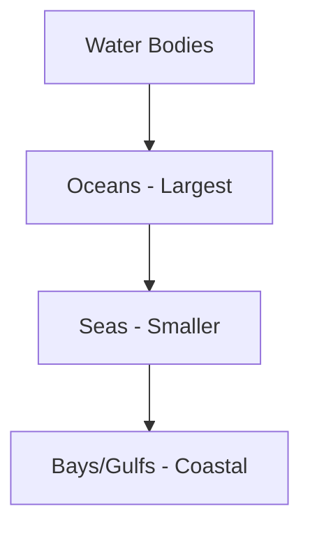

import Callout from '@/components/Callout.astro'

## Hemispheric Distribution

Oceans and continents are not distributed equally between the Northern and Southern Hemispheres.

### Comparative Analysis
- **Northern Hemisphere:** Contains a significantly larger proportion of the Earth's total landmass.
- **Southern Hemisphere:** Is dominated by water, holding much more of the global ocean volume than the North.

<Callout variant="info">
While we use specific names for oceans, they are all interconnected. Seawater constantly flows across different oceans through currents.
</Callout>

## Extensions of Oceans
Oceans have smaller extensions that penetrate or border landmasses. These are known by various names:
1. **Sea:** A large body of salt water smaller than an ocean.
2. **Bay:** A broad inlet of the sea where the land curves inward.
3. **Gulf:** A deep inlet of the sea almost surrounded by land, with a narrow mouth.

