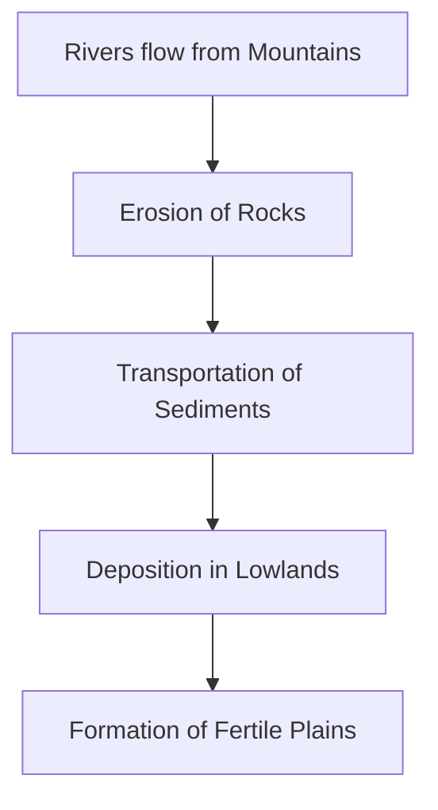

<<<FILE_START: index.mdx>>>
---
title: "Landforms and Life"
description: "An overview of the major landforms of Earth—mountains, plateaus, and plains—and their impact on human life and culture."
date: 2024-04-10
tags: ["Geography", "Landforms", "NCERT"]
order: 1
draft: false
---

import Callout from '@/components/Callout.astro'

## Introduction

The surface of our planet is not uniform. From the towering heights of the Himalayas to the vast, flat stretches of the Indo-Gangetic plains, Earth features diverse physical shapes known as **landforms**. These features take millions of years to form and significantly influence the climate, flora, fauna, and human lifestyles of a region.

  <svg viewBox="0 0 400 200" width="100%" height="200" xmlns="http://www.w3.org/2000/svg">
    <!-- Mountain -->
    <path d="M20 180 L80 40 L140 180 Z" stroke="currentColor" fill="none" stroke-width="2" />
    <path d="M60 85 L80 75 L100 85" stroke="currentColor" fill="none" stroke-width="2" />
    <text x="50" y="195" fill="currentColor" font-size="12">Mountain</text>

    <!-- Plateau -->
    <path d="M160 180 L180 100 L280 100 L300 180" stroke="currentColor" fill="none" stroke-width="2" />
    <text x="210" y="195" fill="currentColor" font-size="12">Plateau</text>

    <!-- Plain -->
    <line x1="320" y1="180" x2="390" y2="180" stroke="currentColor" stroke-width="2" />
    <text x="340" y="195" fill="currentColor" font-size="12">Plain</text>
  </svg>

### The Big Questions
1. What are the major types of landforms and their significance to life and culture?
2. What are the challenges and opportunities of life associated with each landform?

### Key Terms to Remember

| Term | Definition |
| :--- | :--- |
| **Altitude** | The height of an object above sea level. |
| **Precipitation** | Water reaching the ground as rain, snow, or hail. |
| **Terrain** | A stretch of land viewed through its physical features. |
| **Valley** | A low area between hills or mountains, often with a river. |
| **Confluence** | The meeting point of two or more rivers. |

---

## List of Topics
1. [Mountains: Peaks and Ranges](./topics/01-mountains)
2. [Plateaus: The Mineral Storehouses](./topics/02-plateaus)
3. [Plains: The Cradles of Civilization](./topics/03-plains)
4. [Deserts and Cultural Landscapes](./topics/04-deserts-and-culture)

<Callout variant="info">
**Fun Fact:** The Tibetan Plateau is often called the "Roof of the World" because its average altitude is a staggering 4,500 meters!
</Callout>

<<<FILE_END>>>

<<<FILE_START: topics/01-mountains.mdx>>>
---
title: "Mountains: Peaks and Ranges"
description: "Exploring mountain formations, environments, and the unique challenges of life on high altitudes."
date: 2024-04-10
tags: ["Mountains", "Geography", "Ecosystems"]
order: 2
draft: false
---

import Callout from '@/components/Callout.astro'

## Characteristics of Mountains

Mountains are landforms significantly higher than the surrounding landscape. They are typically characterized by:
*   A **broad base**.
*   **Steep slopes**.
*   A **narrow summit** (peak).

### Mountains vs. Hills
While both are elevations, **hills** are generally lower in height, have less steep slopes, and possess rounded tops compared to mountains.

### Mountain Ages
*   **Young Mountains:** These have tall, sharp peaks (e.g., The Himalayas).
*   **Old Mountains:** These are shorter and more rounded due to millions of years of erosion (e.g., The Aravalli Range).

  <svg viewBox="0 0 500 150" width="100%" height="150" xmlns="http://www.w3.org/2000/svg">
    <!-- Young Mountain -->
    <path d="M50 140 L100 20 L150 140 Z" stroke="currentColor" fill="none" stroke-width="2" />
    <text x="65" y="145" fill="currentColor" font-size="12">Young (Sharp Peak)</text>

    <!-- Old Mountain/Hill -->
    <path d="M300 140 Q375 50 450 140" stroke="currentColor" fill="none" stroke-width="2" />
    <text x="350" y="145" fill="currentColor" font-size="12">Old (Rounded)</text>
  </svg>

## Mountain Ecosystems

As altitude increases, the temperature drops, leading to distinct zones of life:

1.  **Montane Forests:** Lower slopes are covered with conifers like pines, firs, spruce, and deodar. These trees are tall and cone-shaped with needle-like leaves to allow snow to slide off.
2.  **High Altitude Vegetation:** At very high altitudes, trees disappear, giving way to grasses, **mosses**, and **lichens**.
3.  **Fauna:** Animals adapted to cold and rugged terrain include the Snow Leopard, Yak, Ibex, Himalayan Tahr, and Golden Eagle.

## Life in the Mountains

Mountain life is beautiful but challenging.

*   **Terrace Farming:** Because of steep slopes, farmers cut "steps" into the mountainside to create flat land for crops.
*   **Occupations:** Tourism, herding, and pilgrimages are major sources of income.
*   **Natural Hazards:** People must be resilient against:
    *   **Avalanches:** Sudden falls of snow/ice.
    *   **Landslides:** Collapse of earth or rock.
    *   **Cloudbursts:** Sudden, violent rainstorms leading to **flash floods**.

<Callout variant="tip">
**Cultural Connection:** Great poets like Kalidasa have celebrated the Himalayas, calling them the "Lord of Mountains" and a "living god" in works like *Kumarasambhava*.
</Callout>

<<<FILE_END>>>

<<<FILE_START: topics/02-plateaus.mdx>>>
---
title: "Plateaus: The Mineral Storehouses"
description: "Understanding plateaus, their formation, and why they are vital for the global economy."
date: 2024-04-10
tags: ["Plateaus", "Mining", "Geography"]
order: 3
draft: false
---

import Callout from '@/components/Callout.astro'

## What is a Plateau?

A **plateau** is an elevated flat-topped landform. It is like a "tableland" that rises sharply above the surrounding area on at least one side.

### Key Examples
*   **Tibetan Plateau:** The largest and highest in the world. It stretches nearly 2,500 km from east to west.
*   **Deccan Plateau:** Located in India, it is one of the oldest plateaus, formed by volcanic activity millions of years ago.

## Economic Significance

Plateaus are often called the **"Storehouses of Minerals"**. Because of their geological history, they contain huge deposits of valuable resources:
*   **African Plateau:** Famous for gold and diamonds.
*   **Chhota Nagpur Plateau (India):** Rich in iron, coal, and manganese.

## Features of Plateaus

1.  **Soil Quality:** Most plateaus have rocky, less fertile soil. However, **lava plateaus** (formed from volcanoes) have rich black soil which is excellent for farming.
2.  **Waterfalls:** Since plateaus have steep edges, rivers falling over these edges create spectacular waterfalls.
    *   **Victoria Falls:** Zambezi River (Africa).
    *   **Jog Falls:** Sharavati River (Karnataka, India).
    *   **Hundru Falls:** Subarnarekha River (Jharkhand, India).
    *   **Nohkalikai Falls:** Cherrapunji Plateau (Meghalaya, India).

  <svg viewBox="0 0 400 150" width="100%" height="150" xmlns="http://www.w3.org/2000/svg">
    <!-- Plateau Profile -->
    <path d="M20 130 L100 130 L120 40 L280 40 L300 130 L380 130" stroke="currentColor" fill="none" stroke-width="2" />
    <text x="170" y="30" fill="currentColor" font-size="14" font-weight="bold">Tableland</text>
    <path d="M280 40 L280 100" stroke="currentColor" fill="none" stroke-dasharray="4" />
    <text x="285" y="80" fill="currentColor" font-size="10">Steep Slope</text>
  </svg>

<Callout variant="info">
The **Deccan Plateau** was formed by volcanic eruptions where lava spread over vast areas and cooled down to form thick layers of rock.
</Callout>

<<<FILE_END>>>

<<<FILE_START: topics/03-plains.mdx>>>
---
title: "Plains: The Cradles of Civilization"
description: "How plains are formed and why they support the largest human populations on Earth."
date: 2024-04-10
tags: ["Plains", "Agriculture", "Civilization"]
order: 4
draft: false
---

import Callout from '@/components/Callout.astro'

## Formation of Plains

Most plains are formed by rivers. As rivers flow down from mountains, they erode rocks and carry sand and silt. This material, called **sediment**, is deposited along the river banks and in lower areas.

## Characteristics

*   **Flat Surface:** Generally not more than 300 meters above sea level.
*   **Fertility:** The deposited silt makes the land extremely fertile and ideal for agriculture.
*   **Navigation:** Due to the gentle slope, rivers in plains are easy to navigate by boat.

## Human Life in the Plains

Plains are the most densely populated regions in the world.
*   **Agriculture:** Major crops like rice, wheat, maize, and cotton are grown here.
*   **The Gangetic Plain:** Home to over 40 crore people (more than 1/4th of India's population).
*   **Culture:** Rivers in plains, such as the Ganga, are considered sacred. Their **sources** and **confluences** (meeting points) are sites for festivals and rituals.

### Challenges
*   **High Population:** Leads to pressure on resources.
*   **Pollution:** High industrial and domestic waste.
*   **Groundwater Depletion:** Excessive irrigation is causing water levels to drop.

<Callout variant="tip">
The first great civilizations (like the Indus Valley and Mesopotamian civilizations) all started in fertile river plains because of the easy access to water and food.
</Callout>

<<<FILE_END>>>

<<<FILE_START: topics/04-deserts-and-culture.mdx>>>
---
title: "Deserts and Cultural Landscapes"
description: "Exploring extreme landforms and ancient classifications of land."
date: 2024-04-10
tags: ["Deserts", "History", "Culture"]
order: 5
draft: false
---

import Callout from '@/components/Callout.astro'

## Deserts: The Dry Expanses

Deserts are landforms with very little precipitation. They can be categorized into two types:

1.  **Hot Deserts:** High temperatures (e.g., Sahara in Africa, Thar in India).
2.  **Cold Deserts:** Freezing temperatures (e.g., Gobi in Asia, Antarctica).

Despite the harsh conditions, humans have shown great **resilience**, adapting to these environments through unique cultural traditions, folk songs, and nomadic lifestyles.

---

## Ancient Perspectives: The Tamil Tiṇais

Ancient Indian culture had its own way of classifying land. In Tamil Sangam poetry, landscapes were divided into five **tiṇais**, each associated with a specific lifestyle and occupation.

### The Five Tiṇais

| Tiṇai | Landscape | Main Occupation |
| :--- | :--- | :--- |
| **Kuriñji** | Mountainous regions | Hunting and gathering |
| **Mullai** | Grassland and forests | Cattle rearing |
| **Marudam** | Fertile agricultural plains | Farming |
| **Neydal** | Coastal regions | Fishing and seafaring |
| **Pālai** | Arid, desert-like regions | Journeying and fighting |

<Callout variant="info">
These classifications show that even 2,000 years ago, people deeply understood the connection between the type of land and the way humans live.
</Callout>

<<<FILE_END>>>

<<<FILE_START: solutions/ex-3.1.mdx>>>
---
title: "Exercises: Questions, Activities and Projects"
description: "Complete solutions for Chapter 3: Landforms and Life."
date: 2024-04-10
tags: ["Solutions", "Geography", "Exam Prep"]
order: 6
draft: false
---

## Questions and Answers

### 1. In what type of landform is your town / village / city located?
*(Answers will vary based on your location. Use the guide below to identify your landform)*
*   **Mountains:** If you see steep slopes and high peaks.
*   **Plateaus:** If you are on high ground that is relatively flat on top.
*   **Plains:** If the land is flat and stretches for many kilometers.

### 2. Describe the three landforms you come across on the trip from Chhota Nagpur to Prayagraj to Almora.
1.  **Chhota Nagpur (Jharkhand):** This is a **Plateau**. It is a hilly upland rich in minerals.
2.  **Prayagraj (Uttar Pradesh):** This is located in the **Plains** (Gangetic Plain). The land is flat and very fertile.
3.  **Almora (Uttarakhand):** This is in the **Mountains** (Himalayas). It has high altitudes, steep slopes, and narrow valleys.

---

### 4. State whether true or false

*   **The Himalayas are young mountains with rounded tops.**
    *   **False.** (They have sharp peaks; rounded tops are for old mountains).
*   **Plateaus usually rise sharply at least on one side.**
    *   **True.**
*   **Mountains and hills belong to the same type of landform.**
    *   **True.** (Both are highlands).
*   **Mountains, plateaus and rivers in India have the same types of flora and fauna.**
    *   **False.** (They have very different ecosystems).
*   **Ganga is a tributary to the Yamuna.**
    *   **False.** (Yamuna is a tributary to the Ganga).
*   **Deserts have unique flora and fauna.**
    *   **True.**
*   **Melting snow feeds rivers.**
    *   **True.**
*   **Sediments from rivers deposited in the plains makes the land fertile.**
    *   **True.**
*   **All deserts are hot.**
    *   **False.** (There are cold deserts like the Gobi and Antarctica).

---

### 5. Match words in pairs

| Column A | Column B (Answer) |
| :--- | :--- |
| Mount Everest | climbing |
| rafting | river |
| camels | desert |
| plateau | roof of the world (Tibetan Plateau) |
| Gangetic plains | rice fields |
| waterway | Ganga |
| Mount Kilimanjaro | Africa |
| Yamuna | tributary |

<<<FILE_END>>>

<<<FILE_START: practice/solved-examples.mdx>>>
---
title: "Notable Figures and Interesting Facts"
description: "Extra information about mountain climbers and geographical records."
date: 2024-04-10
tags: ["Facts", "Personalities", "Geography"]
order: 7
draft: false
---

import Callout from '@/components/Callout.astro'

## Inspiring Personalities

### Bachendri Pal
Bachendri Pal is a legendary Indian mountaineer. In 1984, she became the **first Indian woman** to reach the summit of Mount Everest. She has led many all-women expeditions and was awarded the Padma Bhushan in 2019.

### Arunima Sinha
Arunima Sinha's story is one of incredible resilience. After losing a leg in an accident at age 22, she trained under Bachendri Pal and became the **first female amputee** to climb Mount Everest in 2013. She eventually climbed the highest peaks of every continent.

---

## Comparative Heights of Major Peaks

The following list compares the approximate heights of famous mountains mentioned in the chapter:

  <svg viewBox="0 0 400 220" width="100%" height="220" xmlns="http://www.w3.org/2000/svg">
    <!-- Everest -->
    <rect x="50" y="20" width="30" height="160" fill="currentColor" opacity="0.8" />
    <text x="45" y="195" fill="currentColor" font-size="10" transform="rotate(-45 45,195)">Everest (8849m)</text>

    <!-- Aconcagua -->
    <rect x="120" y="55" width="30" height="125" fill="currentColor" opacity="0.6" />
    <text x="115" y="195" fill="currentColor" font-size="10" transform="rotate(-45 115,195)">Aconcagua (6961m)</text>

    <!-- Kilimanjaro -->
    <rect x="190" y="75" width="30" height="105" fill="currentColor" opacity="0.4" />
    <text x="185" y="195" fill="currentColor" font-size="10" transform="rotate(-45 185,195)">Kilimanjaro (5895m)</text>

    <!-- Anamudi -->
    <rect x="260" y="150" width="30" height="30" fill="currentColor" opacity="0.2" />
    <text x="255" y="195" fill="currentColor" font-size="10" transform="rotate(-45 255,195)">Anamudi (2695m)</text>

    <!-- Base Line -->
    <line x1="30" y1="180" x2="350" y2="180" stroke="currentColor" stroke-width="2" />
  </svg>

## Sacred Landscapes
Many mountains are considered sacred by traditional communities:
*   **Mount Everest:** Called *Chomolungma* (Mother Goddess of the World) by Tibetans and *Sagarmatha* (Goddess of the Sky) by Nepalis.
*   **Mount Kailash:** Held sacred by Hindus, Buddhists, Jains, and followers of Bon.

<Callout variant="tip">
**Did you know?** The Ganga river is nearly 2,500 km long and its basin provides a livelihood for one of the largest concentrations of people in the world.
</Callout>

<<<FILE_END>>>
