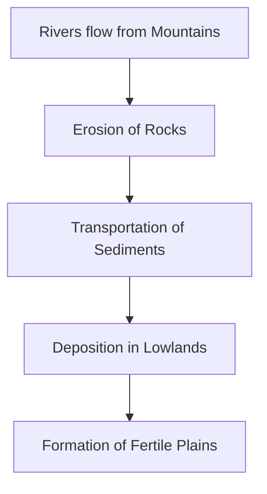

import Callout from '@/components/Callout.astro'

## Formation of Plains

Most plains are formed by rivers. As rivers flow down from mountains, they erode rocks and carry sand and silt. This material, called **sediment**, is deposited along the river banks and in lower areas.

## Characteristics

*   **Flat Surface:** Generally not more than 300 meters above sea level.
*   **Fertility:** The deposited silt makes the land extremely fertile and ideal for agriculture.
*   **Navigation:** Due to the gentle slope, rivers in plains are easy to navigate by boat.

## Human Life in the Plains

Plains are the most densely populated regions in the world.
*   **Agriculture:** Major crops like rice, wheat, maize, and cotton are grown here.
*   **The Gangetic Plain:** Home to over 40 crore people (more than 1/4th of India's population).
*   **Culture:** Rivers in plains, such as the Ganga, are considered sacred. Their **sources** and **confluences** (meeting points) are sites for festivals and rituals.

### Challenges
*   **High Population:** Leads to pressure on resources.
*   **Pollution:** High industrial and domestic waste.
*   **Groundwater Depletion:** Excessive irrigation is causing water levels to drop.

<Callout variant="tip">
The first great civilizations (like the Indus Valley and Mesopotamian civilizations) all started in fertile river plains because of the easy access to water and food.
</Callout>
