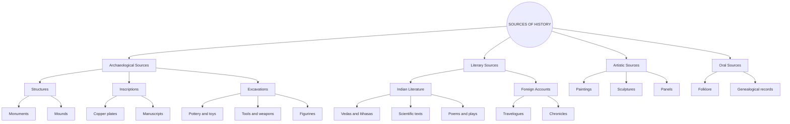

import Callout from '@/components/Callout.astro'

## How We Know the Past

Historians act like detectives. They use "sources"—clues left behind by people—to re-create history.

### Classification of Sources

## Types of Evidence

1.  **Archaeological:** Physical objects like coins, buildings, and tools found through digging (excavation).
2.  **Literary:** Written records. Before the printing press, these were **manuscripts** (handwritten on palm leaves or bark).
3.  **Inscriptions:** Writing carved on hard surfaces like stone or metal. People who study these are called **epigraphists**.
4.  **Scientific Data:** Modern historians also use genetics (DNA studies) and climate data to understand the past.

<Callout variant="info">
**Why use multiple sources?**
Sometimes sources contradict each other. Historians must cross-check different pieces of evidence to see if the "jigsaw pieces" match.
</Callout>
