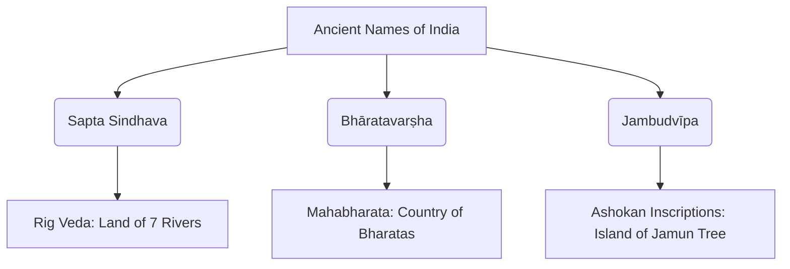

import Callout from '@/components/Callout.astro'

## Ancient Names in Literature

Ancient Indian texts do not just provide names but also describe the geography of the subcontinent.

### 1. Sapta Sindhava
The **Ṛig Veda**, India’s most ancient text (several thousand years old), refers to the northwest region as **'Sapta Sindhava'**, meaning the **'land of the seven rivers'**.
- The name is derived from **'Sindhu'**, which refers to the Indus River.

### 2. Bhāratavarṣha and Jambudvīpa
The **Mahābhārata** and later texts use terms that encompass the entire subcontinent:

- **Bhāratavarṣha:** Means "the country of the Bharatas." The *Bharatas* were a prominent Vedic group of people mentioned first in the Rig Veda.
- **Jambudvīpa:** Means "the island of the fruit of the jamun tree" (Indian Blackberry). Emperor Ashoka (c. 250 BCE) used this name in his inscriptions to describe his empire, which included modern-day India, Pakistan, Bangladesh, and parts of Afghanistan.

### 3. The Definition in the Viṣhṇu Purāṇa
The *Viṣhṇu Purāṇa* provides a clear geographical definition of the land:

> *"uttaram yat samudrasya himādreścaiva"*
> *"dakṣiṇam varṣam tad bhāratam nāma ..."*

> "The country that lies north of the ocean and south of the snowy mountains is called Bhārata."

  

    
"Ancient Indians knew their geography well, defining the land by the Himalayas in the North and the Seas in the South, East, and West."

  

### Mapping Ancient Regions
The Mahābhārata mentions several regions that we recognize today:
- **Kāshmīra:** Kashmir
- **Kurukṣhetra:** Parts of Haryana
- **Prāgjyotiṣha:** Assam
- **Kaccha:** Kutch
- **Kerala:** Kerala

