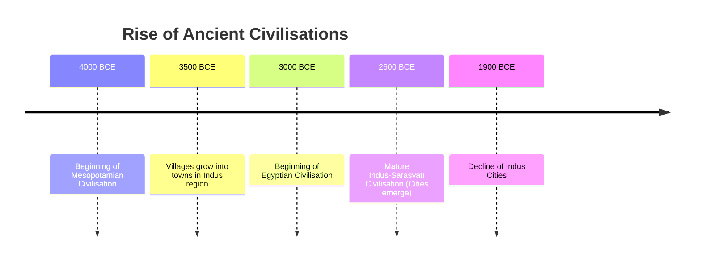

import Callout from '@/components/Callout.astro'

# The Beginnings of Indian Civilisation

The **Indus-Sarasvatī Civilisation** (also known as the Harappan Civilisation) represents India's first successful experiment with urban living. Around 4,600 years ago, complex cities emerged in the northwestern part of the Indian Subcontinent, characterized by remarkable town planning, advanced water management, and a peaceful, trade-oriented society.

## Chapter Overview

In this chapter, we will explore:
*   **What defines a civilisation** compared to early societies.
*   **Geography & Timeline:** Where and when did this civilisation flourish?
*   **Urban Engineering:** How did they build cities like Mohenjo-daro and Dholavira?
*   **Economy:** Agriculture, crafts, and international trade.
*   **Culture:** Art, scripts, and daily life.
*   **The Decline:** Why did the cities disappear?

## Timeline of Ancient Civilisations

The Harappan civilisation was contemporary with Mesopotamia and Egypt.

## Key Concepts

<Callout variant="tip">
**Civilisation:** An advanced stage of human society marked by government, urbanism (cities), specialized crafts, long-distance trade, writing, and productive agriculture capable of supporting non-farming populations.
</Callout>

<Callout variant="info">
**Nomenclature:**
*   **Harappan:** Named after **Harappa**, the first site excavated in 1920-21.
*   **Indus-Sarasvatī:** Named after the two major river systems (Indus and the now-dried Sarasvatī) along which most settlements were located.
</Callout>

Start your journey into the past by exploring the topics below.